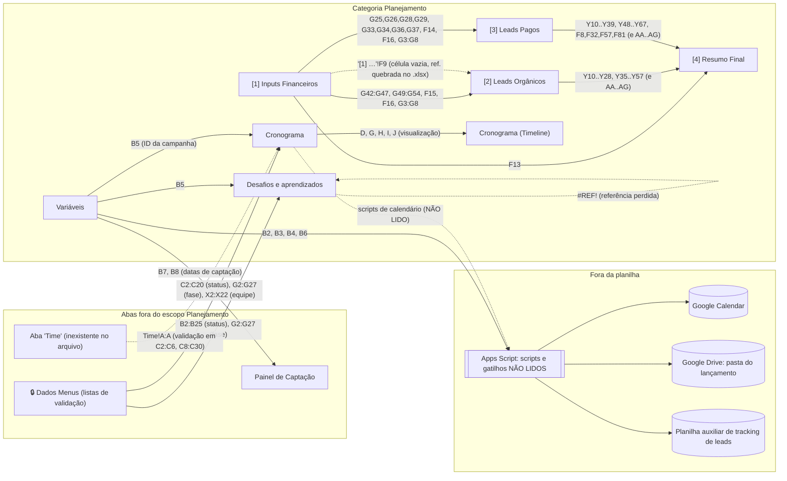

# Especificação técnica para reimplementação: Painel de Controle, categoria Planejamento

Documento gerado por varredura do arquivo `.xlsx` exportado do Google Sheets. Nada foi alterado na planilha. Tudo o que está aqui foi lido do arquivo; onde a fonte não permite leitura, o item está marcado como `NÃO LIDO`.

## Escopo

Abas da categoria **Planejamento**, conforme a aba índice `Abas` (coluna B = "Planejamento"):

| # | Nome original da aba (Google Sheets) | Nome no arquivo `.xlsx` exportado | Dimensão usada |
|---|---|---|---|
| 1 | `[1] Simulador Cenários: Inputs Financeiros` | `1 Simulador Cenários Inputs Fin` | B2:G54 |
| 2 | `[2] Simulador Cenários: Leads Orgânicos` | `2 Simulador Cenários Leads Orgâ` | B2:AG131 |
| 3 | `[3] Simulador Cenários: Leads Pagos` | `3 Simulador Cenários Leads Pago` | B2:AG101 |
| 4 | `[4] Simulador Cenários: Resumo Final` | `4 Simulador Cenários Resumo Fin` | C2:O94 |
| 5 | `Cronograma` | `Cronograma` | A1:K30 |
| 6 | `Cronograma (Timeline)` | `Cronograma (Timeline)` | sem células (apenas imagem) |
| 7 | `Variáveis` | `Variáveis` | A1:D8 |
| 8 | `Desafios e aprendizados` | `Desafios e aprendizados` | A1:G21 |

O exportador truncou os nomes das abas em 31 caracteres (limite do Excel). Todas as fórmulas do arquivo usam os nomes truncados, com uma exceção documentada na aba 2 (coluna L do bloco Área de Membros), que ainda usa o nome original `'[1] Simulador Cenários: Inputs Financeiros'`. Neste documento as fórmulas são transcritas **literalmente como estão no arquivo**; na reimplementação, as duas grafias apontam para a mesma aba 1.

## Convenções deste documento

* Notação de célula: `Aba!Célula`. Abas 1 a 4 são referidas como `'1'`, `'2'`, `'3'`, `'4'` no texto corrido; nas fórmulas literais aparece o nome completo do arquivo.
* Ícones da coluna B das abas do simulador, como estão na fonte: `✏️` marca campo de entrada manual, `🔒` marca campo bloqueado (calculado ou importado de outra aba).
* Coluna C das abas do simulador indica a unidade declarada na fonte: `%`, `R$` ou `#`. Em alguns campos a unidade declarada não corresponde ao conteúdo (por exemplo `'2'!C12` diz `R$` para um número de leads). Isso está registrado por campo e não foi corrigido.
* Operador `%` pós-fixo do Sheets: `X%` equivale a `X/100`. Ele aparece em fórmulas como `$F$9%`, e o efeito está descrito em cada regra que o usa.
* Literais `100%`, `70%` etc. em fórmulas valem `1`, `0.7` etc.
* Formatos de exibição lidos da fonte: `[$R$ -416]#,##0.00` (moeda, 2 casas), `[$R$ -416]#,##0` (moeda, 0 casas), `#,##0` (inteiro exibido, valor interno não arredondado), `0%`, `0.0%`, `0.00%`. Nenhuma fórmula arredonda o valor interno, exceto onde `ROUND` ou `TEXT` aparecem explicitamente.
* Comportamentos padrão do Google Sheets usados nas regras, referidos pelos códigos abaixo. Em cada regra só é descrito o que difere do padrão.
  * **V0**: célula vazia usada em aritmética vale `0`; em `SUM` é ignorada; em comparação (`=`, `<`) vale `0` quando comparada a número.
  * **VT**: texto não numérico em operando aritmético produz `#VALUE!`; texto numérico (por exemplo `"10"`) é convertido para número; `SUM` ignora células de texto.
  * **D0**: divisão por zero produz `#DIV/0!`.
  * **EP**: qualquer erro em uma entrada propaga para a célula dependente, salvo quando envolvida por `IFERROR`.
  * **NA**: `MATCH` sem correspondência produz `#N/A`, que propaga (EP).
* Dados dos casos de teste são **mascarados**: mantêm formato e ordem de grandeza da fonte, mas não são os valores da planilha. Foram obtidos aplicando as fórmulas literais a um conjunto de entradas fictícias (o conjunto completo está no apêndice A). Valores monetários estão em `R$` com 2 casas; percentuais como fração decimal (por exemplo `0.0475` = 4,75%).
* Locale: a planilha de origem está em português (pt-BR). Efeitos observados: `TEXT(x,"0.00")` renderiza com vírgula decimal (`3,50`); a regra de formatação condicional da aba Cronograma usa `LINHA()` (nome pt-BR de `ROW()`).
* Tipos SQL sugeridos: `NUMERIC(18,2)` para moeda, `NUMERIC(12,6)` para taxas e percentuais (fração), `NUMERIC(18,6)` para contagens fracionárias (leads e vendas não são arredondados na fonte), `INTEGER` para índices de cenário, `BOOLEAN` para caixas de seleção, `DATE` para datas, `TEXT` para rótulos.

## Modelo geral do simulador (abas 1 a 4)

As abas 1 a 4 não são tabelas de registros: são formulários em grade, em que cada linha é um campo e as colunas guardam ícone, unidade, rótulo e valores. Para atender ao requisito de "uma coluna por coluna da planilha", cada aba tem (a) um `CREATE TABLE` posicional, chaveado por número de linha, com uma coluna SQL por coluna da grade, e (b) um **mapa de campos** que dá nome normalizado a cada célula relevante. As regras de cálculo referem-se aos nomes do mapa de campos.

Fluxo em uma frase: a aba 1 recebe metas e custos e deriva metas de receita por canal; as abas 2 e 3 geram, por canal, 10 cenários de receita e uma escada de conversões, e o usuário escolhe (por caixa de seleção e por número de cenário) uma "combinação" por canal; a aba 4 soma as cinco combinações de orgânico e pago e compara a margem resultante com a meta.

---

# Aba 1: `[1] Simulador Cenários: Inputs Financeiros`

Formulário em grade, colunas B a G, linhas 2 a 54. Colunas A e H não têm conteúdo. Sem validação de dados, sem formatação condicional, sem células mescladas, sem congelamento de painéis.

## 1.1 Schema

```sql
CREATE TABLE sim1_inputs_financeiros (
    linha            INTEGER      NOT NULL,  -- número da linha na aba (2..54); chave posicional
    col_a            TEXT         NULL,      -- coluna A | sem cabeçalho | vazia na fonte
    icone_edicao     TEXT         NULL,      -- coluna B | sem cabeçalho | entrada manual: "✏️" (editável) ou "🔒" (bloqueado); título de seção quando D está vazio
    unidade          TEXT         NULL,      -- coluna C | sem cabeçalho | entrada manual: "%" ou "R$"; cabeçalho de subseção em C22, C30, C40, C48
    rotulo           TEXT         NULL,      -- coluna D | sem cabeçalho | entrada manual: rótulo do campo (com espaços de indentação preservados)
    percentual_e     NUMERIC(12,6) NULL,     -- coluna E | cabeçalho por subseção: nenhum | fração (0.2 = 20%); manual em E14, E24, E25, E28, E42:E47; calculada nas demais
    status_e         TEXT         NULL,      -- coluna E | mesmas células E22, E30, E40 | calculada: mensagem de distribuição (texto); modelada em coluna própria porque E mistura número e texto
    valor_f          NUMERIC(18,6) NULL,     -- coluna F | cabeçalho "Margem" em F12/F30/F40 | moeda ou fração; manual em F13, F16, F18; calculada nas demais
    valor_g          NUMERIC(18,6) NULL,     -- coluna G | cabeçalho "Receita" em G12/G30/G40 | moeda ou fração; manual em G3:G8, G23, G49:G54; calculada nas demais
    col_h            TEXT         NULL,      -- coluna H | sem cabeçalho | vazia na fonte
    PRIMARY KEY (linha)
);
```

### Mapa de campos

| Campo normalizado | Célula | Rótulo original (col. D) | Unid. (C) | Tipo | Origem |
|---|---|---|---|---|---|
| `pct_reembolso` | G3 | Reembolso | % | fração | manual (✏️) |
| `pct_marketplace` | G4 | Marketplace (Plataforma de Pagamento) | % | fração | manual (✏️) |
| `pct_imposto` | G5 | Imposto | % | fração | manual (✏️) |
| `pct_custo_produto` | G6 | Custos do Produto | % | fração | manual (✏️) |
| `pct_comissoes` | G7 | Comissões | % | fração | manual (✏️) |
| `pct_outros_custos` | G8 | Outros custos | % | fração | manual (✏️) |
| `pct_custos_total` | G9 | Total | % | fração | calculada (🔒) |
| `meta_margem_total` | F13 | Meta de Margem de Contribuição Total | R$ | moeda | manual (✏️) |
| `pct_check_margem` | E13 | (mesma linha) | | fração | calculada |
| `receita_meta_total` | G13 | (mesma linha, cabeçalho "Receita") | | moeda | calculada |
| `pct_margem_pagos` | E14 | Representatividade da Margem vinda dos leads pagos | R$ | fração | manual (✏️) |
| `meta_margem_pagos` | F14 | (mesma linha) | | moeda | calculada |
| `receita_meta_pagos` | G14 | (mesma linha) | | moeda | calculada |
| `pct_margem_organicos` | E15 | Representatividade da Margem vinda dos leads orgânicos | R$ | fração | calculada (🔒) |
| `meta_margem_organicos` | F15 | (mesma linha) | | moeda | calculada |
| `receita_meta_organicos` | G15 | (mesma linha) | | moeda | calculada |
| `ticket_medio` | F16 | Ticket Médio | R$ | moeda | manual (✏️) |
| `mc_alvo_organicos` | F17 | Meta de Margem de Contribuição leads orgânicos | % | fração | calculada (🔒) |
| `mc_alvo_pagos` | F18 | Meta de Margem de Contribuição leads pagos | % | fração | manual (✏️) |
| `mc_alvo_media` | F19 | Meta de Margem de Contribuição média | % | fração | calculada (🔒) |
| `status_dist_invest` | E22 | (linha de cabeçalho "Investimento") | | texto | calculada |
| `investimento_anuncios` | G23 | Investimento em Anúncios | R$ | moeda | manual (✏️) |
| `pct_check_invest` | E23 | (mesma linha) | | fração | calculada |
| `pct_invest_meta` | E24 | Investimento em Meta Ads | R$ | fração | manual (✏️) |
| `invest_meta` | G24 | (mesma linha) | | moeda | calculada |
| `pct_meta_quente` | E25 | Público quente (sob Meta) | R$ | fração | manual (✏️) |
| `invest_meta_quente` | G25 | (mesma linha) | | moeda | calculada |
| `pct_meta_frio` | E26 | Público frio (sob Meta) | R$ | fração | calculada (🔒) |
| `invest_meta_frio` | G26 | (mesma linha) | | moeda | calculada |
| `pct_invest_google` | E27 | Investimento em Google Ads | R$ | fração | calculada (🔒) |
| `invest_google` | G27 | (mesma linha) | | moeda | calculada |
| `pct_google_quente` | E28 | Público quente (sob Google) | R$ | fração | manual (✏️) |
| `invest_google_quente` | G28 | (mesma linha) | | moeda | calculada |
| `pct_google_frio` | E29 | Público frio (sob Google) | R$ | fração | calculada (🔒) |
| `invest_google_frio` | G29 | (mesma linha) | | moeda | calculada |
| `status_dist_metas_pagos` | E30 | (linha de cabeçalho "Metas financeiras") | | texto | calculada |
| `pct_check_metas_pagos` | E31 | Meta financeira Leads Pagos | R$ | fração | calculada |
| `meta_margem_pagos_ref` | F31 | (mesma linha) | | moeda | calculada (= F14) |
| `receita_meta_pagos_soma` | G31 | (mesma linha) | | moeda | calculada |
| `pct_meta_fin_meta` | E32 | Meta financeira Leads Meta Ads | R$ | fração | calculada (= E24) |
| `margem_meta_ads` | F32 | (mesma linha) | | moeda | calculada |
| `receita_meta_ads` | G32 | (mesma linha) | | moeda | calculada |
| `pct_meta_fin_meta_quente` | E33 | Meta financeira Meta Ads Público Quente | R$ | fração | calculada (= E25) |
| `margem_meta_quente` | F33 | (mesma linha) | | moeda | calculada |
| `receita_meta_quente` | G33 | (mesma linha) | | moeda | calculada |
| `pct_meta_fin_meta_frio` | E34 | Meta financeira Meta Ads Público Frio | R$ | fração | calculada |
| `margem_meta_frio` | F34 | (mesma linha) | | moeda | calculada |
| `receita_meta_frio` | G34 | (mesma linha) | | moeda | calculada |
| `pct_meta_fin_google` | E35 | Meta financeira Leads Google Ads | R$ | fração | calculada |
| `margem_google_ads` | F35 | (mesma linha) | | moeda | calculada |
| `receita_google_ads` | G35 | (mesma linha) | | moeda | calculada |
| `pct_meta_fin_google_quente` | E36 | Meta financeira Google Ads Público Quente | R$ | fração | calculada (= E28) |
| `margem_google_quente` | F36 | (mesma linha) | | moeda | calculada |
| `receita_google_quente` | G36 | (mesma linha) | | moeda | calculada |
| `pct_meta_fin_google_frio` | E37 | Meta financeira Google Ads Público Frio | R$ | fração | calculada |
| `margem_google_frio` | F37 | (mesma linha) | | moeda | calculada |
| `receita_google_frio` | G37 | (mesma linha) | | moeda | calculada |
| `status_dist_organicos` | E40 | (linha de cabeçalho "Metas financeiras") | | texto | calculada |
| `pct_check_organicos` | E41 | Meta financeira Leads Orgânicos | R$ | fração | calculada |
| `meta_margem_organicos_ref` | F41 | (mesma linha) | | moeda | calculada (= F15) |
| `receita_meta_organicos_soma` | G41 | (mesma linha) | | moeda | calculada |
| `pct_org_whatsapp` … `pct_org_area_membros` | E42:E47 | Meta financeira vinda de leads do WhatsApp / Email / Instagram / Telegram / YouTube / da Área de Membros | R$ | fração | manual (✏️) |
| `margem_org_<canal>` | F42:F47 | (mesmas linhas) | | moeda | calculada |
| `receita_org_<canal>` | G42:G47 | (mesmas linhas) | | moeda | calculada |
| `base_whatsapp` … `base_area_membros` | G49:G54 | Base de WhatsApp / Email / Instagram / Telegram / YouTube / Área de Membros | R$ (declarado) | contagem (formato General) | manual (✏️) |

Ordem dos canais orgânicos, usada em todo o simulador: 1 WhatsApp, 2 Email, 3 Instagram, 4 Telegram, 5 YouTube, 6 Área de Membros.

## 1.2 Regras de cálculo

### `pct_custos_total` (G9)

```
=SUM(G3:G8)
```
Entradas: `pct_reembolso`…`pct_outros_custos` (G3:G8, aba 1).
```
pct_custos_total: decimal = sum(pct_reembolso, pct_marketplace, pct_imposto, pct_custo_produto, pct_comissoes, pct_outros_custos)
```
Vazio: ignorado (V0). Texto: ignorado por `SUM` (VT). Div/0: não se aplica. Erro: EP. Arredondamento: nenhum; exibição `0.00%`.

### `pct_margem_organicos` (E15), `pct_check_margem` (E13)

```
=100%-E14
=SUM(E14:E15)
```
Entradas: `pct_margem_pagos` (E14).
```
pct_margem_organicos: decimal = 1 - pct_margem_pagos
pct_check_margem:     decimal = pct_margem_pagos + pct_margem_organicos   -- identicamente 1 para qualquer E14 numérico
```
Vazio: E14 vazio vale 0, logo E15 = 1. Texto: E15 = `#VALUE!`; E13 ignora o texto e soma só E15. Div/0: n/a. Erro: EP. Exibição `0%`.

### `meta_margem_pagos` (F14), `meta_margem_organicos` (F15)

```
=E14*F$13
=E15*F$13
```
Entradas: `pct_margem_pagos`, `pct_margem_organicos`, `meta_margem_total`.
```
meta_margem_pagos:     money = pct_margem_pagos * meta_margem_total
meta_margem_organicos: money = pct_margem_organicos * meta_margem_total
```
Vazio: V0. Texto: VT. Div/0: n/a. Erro: EP. Exibição `[$R$ -416]#,##0.00`, sem arredondamento interno.

### `mc_alvo_organicos` (F17)

```
=100%-G9
```
Entradas: `pct_custos_total`. `mc_alvo_organicos: decimal = 1 - pct_custos_total`. Vazio/Texto/Erro: V0, VT, EP. Exibição `0.00%`.

### `receita_meta_pagos` (G14), `receita_meta_organicos` (G15), `receita_meta_total` (G13)

```
=F14/F18
=F15/F17
=SUM(G14:G15)
```
Entradas: `meta_margem_pagos`, `mc_alvo_pagos` (F18, manual), `meta_margem_organicos`, `mc_alvo_organicos`.
```
receita_meta_pagos:     money = meta_margem_pagos / mc_alvo_pagos
receita_meta_organicos: money = meta_margem_organicos / mc_alvo_organicos
receita_meta_total:     money = receita_meta_pagos + receita_meta_organicos
```
Vazio: F18 vazio produz `#DIV/0!` em G14 (V0 + D0). Texto: VT. Div/0: `#DIV/0!` quando F18 = 0 ou quando G9 = 100% (F17 = 0). Erro: EP para G13, F19 e para as abas 2, 3 e 4. Exibição moeda 2 casas.

### `mc_alvo_media` (F19)

```
=F13/G13
```
`mc_alvo_media: decimal = meta_margem_total / receita_meta_total`. Div/0 quando G13 = 0 (por exemplo F13 = 0). Demais: V0, VT, EP. Exibição `0.00%`.

### Mensagens de distribuição (E22, E30, E40)

Fórmula literal de E22 (E30 e E40 são idênticas trocando `E23` por `E31` e `E41`):
```
=IFS(
    E23<100%, "⚠️ Falta distribuir " & ROUND((1-E23)*100, 0) & "%",
    E23=100%, "✅ 100%",
    E23>100%, "⛔️ Opa, passou de 100%! Reduzir " & ROUND((E23-1)*100, 0) & "%"
)
```
Entradas: `pct_check_invest` (E23), `pct_check_metas_pagos` (E31), `pct_check_organicos` (E41).
```
function status_distribuicao(total: decimal) -> text:
    if total < 1:  return "⚠️ Falta distribuir " + to_text(round_half_away_from_zero((1 - total) * 100, 0)) + "%"
    if total == 1: return "✅ 100%"
    if total > 1:  return "⛔️ Opa, passou de 100%! Reduzir " + to_text(round_half_away_from_zero((total - 1) * 100, 0)) + "%"
```
Vazio: total vazio vale 0, retorna "⚠️ Falta distribuir 100%". Texto: comparação texto vs número no Sheets não gera erro; qual ramo é escolhido para texto não é determinável pelo arquivo, `NÃO LIDO`; a reimplementação deve rejeitar texto. Div/0: n/a. Erro: EP. Arredondamento: `ROUND(...,0)`, meia unidade afastando-se de zero; a comparação `E23=100%` é exata em ponto flutuante (não há tolerância). Observação lida da fonte: E23 e E31 são somas de um percentual manual com o seu complemento (`100%-X`), portanto valem 1 para qualquer entrada numérica; só E41 pode diferir de 1.

### Distribuição do investimento (E23, E26, E27, E29, G24:G29)

```
E23: =SUM(E24,E27)      E27: =100%-E24      E26: =100%-E25      E29: =100%-E28
G24: =E24*G$23          G27: =E27*G$23
G25: =E25*G$24          G26: =E26*G$24
G28: =E28*G$27          G29: =E29*G$27
```
Entradas: `investimento_anuncios`, `pct_invest_meta`, `pct_meta_quente`, `pct_google_quente`.
```
pct_invest_google  = 1 - pct_invest_meta
pct_meta_frio      = 1 - pct_meta_quente
pct_google_frio    = 1 - pct_google_quente
pct_check_invest   = pct_invest_meta + pct_invest_google
invest_meta        = pct_invest_meta   * investimento_anuncios
invest_google      = pct_invest_google * investimento_anuncios
invest_meta_quente = pct_meta_quente   * invest_meta
invest_meta_frio   = pct_meta_frio     * invest_meta
invest_google_quente = pct_google_quente * invest_google
invest_google_frio   = pct_google_frio   * invest_google
```
V0, VT, EP; sem divisão. Exibição `0%` para E, moeda 2 casas para G.

### Metas financeiras de leads pagos (E31:G37)

```
E31: =SUM(E32,E35)     F31: =F14                G31: =SUM(G32,G35)
E32: =E24              F32: =E32*F31            G32: =SUM(G33:G34)
E33: =E25              F33: =E33*F$32           G33: =F33/$F$18
E34: =100%-E33         F34: =E34*F$32           G34: =F34/$F$18
E35: =100%-E32         F35: =E35*F$31           G35: =SUM(G36:G37)
E36: =E28              F36: =E36*F35            G36: =F36/$F$18
E37: =100%-E36         F37: =E37*F35            G37: =F37/$F$17
```
Entradas: `meta_margem_pagos` (F14), `pct_invest_meta`, `pct_meta_quente`, `pct_google_quente`, `mc_alvo_pagos` (F18), `mc_alvo_organicos` (F17).
```
margem_meta_ads       = pct_invest_meta * meta_margem_pagos
margem_meta_quente    = pct_meta_quente * margem_meta_ads
margem_meta_frio      = (1 - pct_meta_quente) * margem_meta_ads
margem_google_ads     = (1 - pct_invest_meta) * meta_margem_pagos
margem_google_quente  = pct_google_quente * margem_google_ads
margem_google_frio    = (1 - pct_google_quente) * margem_google_ads
receita_meta_quente   = margem_meta_quente   / mc_alvo_pagos
receita_meta_frio     = margem_meta_frio     / mc_alvo_pagos
receita_google_quente = margem_google_quente / mc_alvo_pagos
receita_google_frio   = margem_google_frio   / mc_alvo_organicos     -- literal: G37 divide por $F$17, não por $F$18
receita_meta_ads      = receita_meta_quente + receita_meta_frio
receita_google_ads    = receita_google_quente + receita_google_frio
receita_meta_pagos_soma = receita_meta_ads + receita_google_ads
```
Observação lida da fonte, sem correção: G33, G34 e G36 dividem por `$F$18` (meta de MC de pagos) e G37 divide por `$F$17` (meta de MC de orgânicos). Registrado em Lacunas (L1). Div/0 quando F18 = 0 (G33, G34, G36) ou F17 = 0 (G37). Demais: V0, VT, EP.

### Metas financeiras de leads orgânicos (E41:G47)

```
E41: =SUM(E42:E47)     F41: =F15     G41: =SUM(G42:G47)
F42: =E42*F$41  …  F47: =E47*F$41
G42: =F42/$F$17 …  G47: =F47/$F$17
```
Entradas: `pct_org_<canal>` (E42:E47), `meta_margem_organicos` (F15), `mc_alvo_organicos` (F17).
```
for canal in [whatsapp, email, instagram, telegram, youtube, area_membros]:
    margem_org_<canal>  = pct_org_<canal> * meta_margem_organicos
    receita_org_<canal> = margem_org_<canal> / mc_alvo_organicos
pct_check_organicos          = sum(pct_org_<canal>)
receita_meta_organicos_soma  = sum(receita_org_<canal>)
```
Div/0 quando F17 = 0. Demais: V0, VT, EP. Exibição: E `0.00%`, F e G moeda 2 casas.

## 1.3 Dependências

Todas internas à planilha, salvo indicação.

| Origem | Destino | Tipo |
|---|---|---|
| `'1'!G3:G8` | `'1'!G9`, `'2'!V18,V22:V26`, `'3'!V18,V22:V26` | referência entre abas, interna |
| `'1'!F13` | `'4'!E4`, `'4'!G2:O2`, `'4'!G3:O3` | interna |
| `'1'!F14` | `'3'!W4`, `'3'!Y2:AG2` (passo 2), `'3'!Y3:AG3` | interna |
| `'1'!F15` | `'2'!W4`, `'2'!Y2:AG2`, `'2'!AA3:AG3` | interna |
| `'1'!F16` | todas as fórmulas de vendas e leads das abas 2 e 3 (`/'1 Simulador Cenários Inputs Fin'!$F$16`) | interna |
| `'1'!F9` (célula vazia) | `'2'!L117,L119,…,L131` via nome `'[1] Simulador Cenários: Inputs Financeiros'!$F$9` | interna no Google Sheets; no `.xlsx` a aba com esse nome não existe (referência quebrada) |
| `'1'!G42:G47` | `'2'!F6, F27, F48, F69, F91, F113` | interna |
| `'1'!G49:G54` | `'2'!F7, F28, F49, F70, F92, F114` | interna |
| `'1'!G33, G34, G36, G37` | `'3'!F7, F31, F56, F80` | interna |
| `'1'!G25, G26, G28, G29` | `'3'!F8, F32, F57, F81` | interna |

Sem IMPORTRANGE, IMPORTDATA, intervalos nomeados, validação de dados, formatação condicional ou gatilhos de Apps Script legíveis nesta aba. Scripts: a aba `Scripts` (fora do escopo) e a aba `Variáveis` indicam que existem scripts de automação; nenhum gatilho está registrado no arquivo (`NÃO LIDO`).

## 1.4 Casos de teste (dados mascarados)

### Cadeia margem → receita (G14, G15, G13, F17, F19)

| G3:G8 (frações) | F13 | E14 | F18 | Saída G9 | F17 | F14 | F15 | G14 | G15 | G13 | F19 |
|---|---|---|---|---|---|---|---|---|---|---|---|
| 0.04, 0.09, 0.12, 0.06, 0.03, 0.01 | 250000.00 | 0.25 | 0.30 | 0.35 | 0.65 | 62500.00 | 187500.00 | 208333.33 | 288461.54 | 496794.87 | 0.503226 |
| idem | 250000.00 | 0.00 | 0.30 | 0.35 | 0.65 | 0.00 | 250000.00 | 0.00 | 384615.38 | 384615.38 | 0.650000 |
| idem | 250000.00 | 0.25 | 0.00 | 0.35 | 0.65 | 62500.00 | 187500.00 | `#DIV/0!` | 288461.54 | `#DIV/0!` | `#DIV/0!` |
| 0.25, 0.25, 0.25, 0.125, 0.0625, 0.0625 | 100000.00 | 0.50 | 0.20 | 1.00 | 0.00 | 50000.00 | 50000.00 | 250000.00 | `#DIV/0!` | `#DIV/0!` | `#DIV/0!` |

(Na última linha os percentuais somam exatamente 1 em ponto flutuante binário; com valores como 0.10 + 0.20 + 0.70 a soma pode resultar em 0.9999999999999999 e F17 em 1e-16, sem `#DIV/0!`. A reimplementação deve decidir se compara com tolerância.)

### Investimento (G24:G29) e metas de pagos (F32:G37)

| G23 | E24 | E25 | E28 | G24 | G25 | G26 | G27 | G28 | G29 | F32 | F33 | F34 | F35 | F36 | F37 | G33 | G34 | G36 | G37 (÷F17) | G31 |
|---|---|---|---|---|---|---|---|---|---|---|---|---|---|---|---|---|---|---|---|---|
| 100000.00 | 0.40 | 0.80 | 0.75 | 40000.00 | 32000.00 | 8000.00 | 60000.00 | 45000.00 | 15000.00 | 25000.00 | 20000.00 | 5000.00 | 37500.00 | 28125.00 | 9375.00 | 66666.67 | 16666.67 | 93750.00 | 14423.08 | 191506.41 |
| 100000.00 | 1.00 | 0.80 | 0.75 | 100000.00 | 80000.00 | 20000.00 | 0.00 | 0.00 | 0.00 | 62500.00 | 50000.00 | 12500.00 | 0.00 | 0.00 | 0.00 | 166666.67 | 41666.67 | 0.00 | 0.00 | 208333.33 |
| 50000.00 | 0.40 | 0.80 | 0.75 | 20000.00 | 16000.00 | 4000.00 | 30000.00 | 22500.00 | 7500.00 | 25000.00 | 20000.00 | 5000.00 | 37500.00 | 28125.00 | 9375.00 | 66666.67 | 16666.67 | 93750.00 | 14423.08 | 191506.41 |

(Linhas 1 e 3 mostram que F32:G37 não dependem de G23. Com F14 = 62500.00, F18 = 0.30, F17 = 0.65; se G37 dividisse por F18 o valor seria 31250.00.)

### Orgânicos (E41, F42:G47) e mensagem E40

| E42:E47 | E41 | E40 | F42 | G42 | G43 | G44 | G45 | G41 |
|---|---|---|---|---|---|---|---|---|
| 0.40, 0.30, 0.15, 0.05, 0.05, 0.05 | 1.00 | `✅ 100%` | 75000.00 | 115384.62 | 86538.46 | 43269.23 | 14423.08 | 288461.54 |
| 0.40, 0.30, 0.15, 0.05, 0.03, 0.00 | 0.93 | `⚠️ Falta distribuir 7%` | 75000.00 | 115384.62 | 86538.46 | 43269.23 | 14423.08 | 268269.23 |
| 0.50, 0.30, 0.15, 0.05, 0.05, 0.05 | 1.10 | `⛔️ Opa, passou de 100%! Reduzir 10%` | 93750.00 | 144230.77 | 86538.46 | 43269.23 | 14423.08 | 317307.69 |
| (vazias) | 0.00 | `⚠️ Falta distribuir 100%` | 0.00 | 0.00 | 0.00 | 0.00 | 0.00 | 0.00 |

(F15 = 187500.00, F17 = 0.65 em todas as linhas.)

---

# Aba 2: `[2] Simulador Cenários: Leads Orgânicos`

Grade B2:AG131. Duas regiões: à esquerda (B:S), seis **blocos de canal** com estrutura idêntica; à direita (U:AG), o **resumo financeiro e de marketing** de cinco "combinações". Sem validação de dados, sem células mescladas, sem painéis congelados. Colunas A, E, G, T e AH sem conteúdo.

Posição dos blocos (linha inicial `r0`):

| Bloco | Canal | `r0` | Linhas do bloco | Célula de meta (import.) | Célula de base (import.) | Linha de receita | Linhas de leads (com caixa H) | Linhas de vendas |
|---|---|---|---|---|---|---|---|---|
| 1 | WhatsApp | 6 | 6..24 | F6 ← `'1'!G42` | F7 ← `'1'!G49` | 8 | 9, 11, 13, 15, 17, 19, 21, 23 | 10, 12, 14, 16, 18, 20, 22, 24 |
| 2 | Email | 27 | 27..45 | F27 ← `'1'!G43` | F28 ← `'1'!G50` | 29 | 30, 32, …, 44 | 31, 33, …, 45 |
| 3 | Instagram | 48 | 48..66 | F48 ← `'1'!G44` | F49 ← `'1'!G51` | 50 | 51, 53, …, 65 | 52, 54, …, 66 |
| 4 | Telegram | 69 | 69..87 | F69 ← `'1'!G45` | F70 ← `'1'!G52` | 71 | 72, 74, …, 86 | 73, 75, …, 87 |
| 5 | YouTube | 91 | 91..109 | F91 ← `'1'!G46` | F92 ← `'1'!G53` | 93 | 94, 96, …, 108 | 95, 97, …, 109 |
| 6 | Área de Membros | 113 | 113..131 | F113 ← `'1'!G47` | F114 ← `'1'!G54` | 115 | 116, 118, …, 130 | 117, 119, …, 131 |

Dentro de um bloco, os campos de entrada ficam sempre nos mesmos deslocamentos a partir de `r0`:

| Deslocamento | Célula (bloco 1) | Rótulo original (col. D) | Unid. (C) | Ícone (B) | Origem |
|---|---|---|---|---|---|
| r0 | F6 | Meta de Receita Leads vindos do WhatsApp | # | 🔒 | importada de `'1'!G42` |
| r0+1 | F7 | Base WhatsApp | # | 🔒 | importada de `'1'!G49` |
| r0+2 | F8 | Conversão média em vendas | % | ✏️ | manual |
| r0+3 | F9 | Variação cenários conversão em vendas | % | ✏️ | manual |
| r0+4 | F10 | Variação cenários 1 → 10 | % | ✏️ | manual |
| r0+5 | F11 | Taxa de captação média da base | % | ✏️ | manual |
| r0+6 | F12 | Nº médio de leads captados por campanha | R$ (declarado; é contagem) | 🔒 | calculada |
| r0+7 | F13 | Faixa de variação de leads captados | % | ✏️ | manual |
| r0+8 … r0+11 | D14:D17 | (legendas calculadas das faixas) | | 🔒 | calculada |

Nos blocos 2 a 6 os rótulos são os mesmos, trocando o nome do canal na linha `r0` ("Meta de Receita Leads vindos do Email", "Base Email", etc.; bloco 6: "…vindos da Área de Membros", "Base Área de Membros"). O título `I{r0}` é "ANÁLISE DE CENÁRIOS WHATSAPP" / "EMAIL" / "INSTAGRAM" / "TELEGRAM" / "YOUTUBE" / "ÁREA DE MEMBROS". `I{r0+1}` = "Cenários" e `J{r0+1}:S{r0+1}` = 1, 2, …, 10 (constantes). `I{r0+2}` = "Receita".

## 2.1 Schema

```sql
CREATE TABLE sim2_leads_organicos (
    linha              INTEGER       NOT NULL,  -- linha na aba (2..131)
    col_a              TEXT          NULL,      -- A | sem cabeçalho | vazia
    icone_edicao       TEXT          NULL,      -- B | sem cabeçalho | manual: "✏️" ou "🔒"
    unidade            TEXT          NULL,      -- C | sem cabeçalho | manual: "#", "%", "R$"
    rotulo             TEXT          NULL,      -- D | sem cabeçalho | manual (rótulos) ou calculada (legendas D14:D17 e equivalentes)
    col_e              TEXT          NULL,      -- E | vazia
    valor_f            NUMERIC(18,6) NULL,      -- F | sem cabeçalho | importada (r0, r0+1), manual (r0+2..r0+5, r0+7) ou calculada (r0+6)
    col_g              TEXT          NULL,      -- G | vazia
    seleciona_conv     BOOLEAN       NULL,      -- H | sem cabeçalho | manual: caixa de seleção nas linhas de leads (uma por bloco deve estar TRUE); H14 contém " " (espaço) na fonte
    conversao          NUMERIC(12,6) NULL,      -- I | cabeçalho "Cenários"/"Receita" nas linhas r0+1/r0+2 | calculada: escada de conversão nas linhas de leads
    cenario_01         NUMERIC(18,6) NULL,      -- J | cabeçalho "1" (linha r0+1) | calculada: receita (linha r0+2), leads (linhas ímpares do bloco) ou vendas (pares)
    cenario_02         NUMERIC(18,6) NULL,      -- K | cabeçalho "2" | calculada
    cenario_03         NUMERIC(18,6) NULL,      -- L | cabeçalho "3" | calculada
    cenario_04         NUMERIC(18,6) NULL,      -- M | cabeçalho "4" | calculada
    cenario_05         NUMERIC(18,6) NULL,      -- N | cabeçalho "5" | calculada
    cenario_06         NUMERIC(18,6) NULL,      -- O | cabeçalho "6" | calculada
    cenario_07         NUMERIC(18,6) NULL,      -- P | cabeçalho "7" | calculada
    cenario_08         NUMERIC(18,6) NULL,      -- Q | cabeçalho "8" | calculada
    cenario_09         NUMERIC(18,6) NULL,      -- R | cabeçalho "9" | calculada
    cenario_10         NUMERIC(18,6) NULL,      -- S | cabeçalho "10" | calculada
    col_t              TEXT          NULL,      -- T | vazia
    unidade_resumo     TEXT          NULL,      -- U | sem cabeçalho | manual: "R$", "%", "#"
    pct_custo_resumo   NUMERIC(12,6) NULL,      -- V | sem cabeçalho | importada de '1'!G3:G8 nas linhas 18, 22..26
    rotulo_resumo      TEXT          NULL,      -- W | sem cabeçalho | manual: rótulos do resumo
    sel_comb1          INTEGER       NULL,      -- X | cabeçalho "✏️" (X10) | manual: nº do cenário (1..10) escolhido para a Combinação 1, linhas 11..16
    val_comb1          NUMERIC(18,6) NULL,      -- Y | cabeçalho "Combinação 1" (Y8) | calculada
    sel_comb2          INTEGER       NULL,      -- Z | "✏️" (Z10) | manual
    val_comb2          NUMERIC(18,6) NULL,      -- AA | "Combinação 2" | calculada
    sel_comb3          INTEGER       NULL,      -- AB | "✏️" | manual
    val_comb3          NUMERIC(18,6) NULL,      -- AC | "Combinação 3" | calculada
    sel_comb4          INTEGER       NULL,      -- AD | "✏️" | manual
    val_comb4          NUMERIC(18,6) NULL,      -- AE | "Combinação 4" | calculada
    sel_comb5          INTEGER       NULL,      -- AF | "✏️" | manual
    val_comb5          NUMERIC(18,6) NULL,      -- AG | "Combinação 5   " (com espaços no original) | calculada
    col_ah             TEXT          NULL,      -- AH | vazia
    PRIMARY KEY (linha)
);
```

Y3:AG3 (barras) e Y4:AG4 (texto `0%                          100%`) são texto na coluna de valor; modelar como `TEXT` à parte se necessário.

### Mapa de campos do resumo (colunas U:AG)

Para cada combinação `k` (1..5) há um par de colunas: seleção `X, Z, AB, AD, AF` e valor `Y, AA, AC, AE, AG`. Abaixo, nomes para a Combinação 1 (coluna Y); as outras seguem o mesmo padrão com a coluna correspondente.

| Campo normalizado | Célula | Rótulo original (W) | Unid. (U) | Origem |
|---|---|---|---|---|
| `meta_mc_organicos` | W4 | Meta de Margem de Contribuição Orgânica (W3) | | importada `'1'!F15` |
| `atingimento_meta_k` | Y2 | | | calculada (fração) |
| `barra_meta_k` | Y3 | | | calculada (texto) |
| `gap_meta_k` | Y5 | | | calculada (R$) |
| `receita_bruta_k` | Y10 | Receita bruta leads orgânicos | R$ | calculada |
| `sel_cenario_<canal>_k` | X11:X16 | Receita WhatsApp / Email / Instagram / Telegram / YouTube / Área de Membros | | manual (inteiro 1..10 ou vazio) |
| `receita_<canal>_k` | Y11:Y16 | idem | R$ | calculada |
| `pct_reembolso` | V18 | (-) Reembolso | R$ | importada `'1'!$G$3` |
| `reembolso_k` | Y18 | | | calculada |
| `receita_tributavel_k` | Y20 | Receita tributável | R$ | calculada |
| `pct_marketplace`, `pct_imposto`, `pct_custo_produto`, `pct_comissoes`, `pct_outros` | V22:V26 | (-) Marketplace, (-) Imposto, (-) Custo de Produto, (-) Comissões, (-) Outros Custos | R$ | importadas `'1'!$G$4:$G$8` |
| `deducao_<custo>_k` | Y22:Y26 | idem | | calculadas |
| `mc_organicos_k` | Y28 | Margem de Contribuição Leads Orgânicos | R$ | calculada |
| `mc_organicos_pct_k` | Y29 | Margem de Contribuição Leads Orgânicos | % | calculada |
| `vendas_totais_k` | Y33 | Nº de Vendas Totais Leads Orgânicos | # | calculada |
| `leads_totais_k` | Y34 | Nº de Leads Orgânicos Totais | # | calculada |
| `vendas_<canal>_k` | Y35, Y39, Y43, Y47, Y51, Y55 | Nº de Vendas WhatsApp / Email / Instagram / Telegram / YouTube / Área de Membros | # | calculadas |
| `leads_<canal>_k` | Y36, Y40, Y44, Y48, Y52, Y56 | Nº de Leads … | # | calculadas (fórmula de matriz) |
| `conversao_<canal>_k` | Y37, Y41, Y45, Y49, Y53, Y57 | Conversão … | % | calculadas |

## 2.2 Regras de cálculo

Nas fórmulas literais abaixo, `r0` refere-se à tabela de blocos. A primeira célula de cada padrão é transcrita literalmente; as demais células do mesmo padrão são listadas.

### `meta_receita_canal` (F{r0}) e `base_canal` (F{r0+1}): importação

```
F6:   ='1 Simulador Cenários Inputs Fin'!G42
F7:   ='1 Simulador Cenários Inputs Fin'!G49
```
Demais: F27 ← G43, F28 ← G50, F48 ← G44, F49 ← G51, F69 ← G45, F70 ← G52, F91 ← G46, F92 ← G53, F113 ← G47, F114 ← G54 (todas referências diretas, sem `$`). Comportamento: cópia do valor; erro na origem propaga (EP). Exibição: F{r0} moeda 2 casas; F{r0+1} `#,##0`.

### `leads_medios_campanha` (F{r0+6})

```
F12:  =F11*F7
```
Demais: F33 `=F32*F28`, F54 `=F53*F49`, F75 `=F74*F70`, F97 `=F96*F92`, F119 `=F118*F114`.
```
leads_medios_campanha: number = taxa_captacao * base_canal
```
V0, VT, EP. Exibição `#,##0` (valor interno não arredondado). Usado só pelas legendas D e pela formatação condicional.

### Série de receita por cenário (linha r0+2, colunas J:S)

```
J8:   =70%*F6
K8:   =J8*(1+$F10)
```
`L8:S8` seguem o padrão de K8 (`=K8*(1+$F10)` … `=R8*(1+$F10)`). Blocos 2..6: `J29 =70%*F27`, `K29 =J29*(1+$F31)`; `J50 =70%*F48`, `K50 =J50*(1+$F52)`; `J71 =70%*F69`, `K71 =J71*(1+$F73)`; `J93 =70%*F91`, `K93 =J93*(1+$F95)`; `J115 =70%*F113`, `K115 =J115*(1+$F117)`.

Entradas: `meta_receita_canal` (F{r0}), `variacao_1_10` (F{r0+4}).
```
receita[1]: money = 0.7 * meta_receita_canal
for n in 2..10:
    receita[n]: money = receita[n-1] * (1 + variacao_1_10)
```
Vazio: meta vazia → série toda 0; variação vazia → série constante. Texto: VT. Div/0: n/a. Erro: EP para toda a linha e para tudo abaixo. Arredondamento: nenhum; exibição `[$R$ -416]#,##0` (J8:S8 no bloco 1 e J115:S115 com `[$R$ -416]#,##0.00` em J115). Constante `70%` embutida na fórmula (não parametrizada).

### Escada de conversão (coluna I, linhas de leads)

```
I9:   =IF($F$8<0,0,$F$8)
I11:  =IF((I9-$F$9%)<0,0,I9-$F$9%)
```
`I13, I15, …, I23` seguem I11 referindo-se à célula duas linhas acima. Blocos 2..6: `I30 =IF($F$29<0,0,$F$29)`, `I32 =IF((I30-$F$30%)<0,0,I30-$F$30%)`; `I51`/`I53` com `$F$50`/`$F$51`; `I72`/`I74` com `$F$71`/`$F$72`; `I94`/`I96` com `$F$93`/`$F$94`; `I116`/`I118` com `$F$115`/`$F$116`.

Entradas: `conversao_media` (F{r0+2}), `variacao_conversao` (F{r0+3}).
```
passo: decimal = variacao_conversao / 100          -- operador % pós-fixo: "$F$9%" = F9/100
conv[1]: decimal = max(conversao_media, 0)
for i in 2..8:
    conv[i]: decimal = max(conv[i-1] - passo, 0)
```
Observação lida da fonte: F{r0+3} é exibido como percentual (`0.00%`), portanto um valor exibido "25,00%" (0.25) produz passo de 0.0025, isto é, 0,25 ponto percentual por degrau, e não 25% relativo. Vazio: V0 (conv = 0 em toda a escada). Texto: VT. Erro: EP. Exibição `0.00%`.

### Vendas por cenário (linhas pares do bloco, colunas J:S)

```
J10:  =IFERROR((J$8/'1 Simulador Cenários Inputs Fin'!$F$16),0)
```
Mesmo padrão em todas as linhas de vendas de todos os blocos (referência de linha fixa na linha de receita do bloco: `J$8`, `J$29`, `J$50`, `J$71`, `J$93`, `J$115`), **exceto** a coluna L do bloco 6:
```
L117: =IFERROR((L$115/'[1] Simulador Cenários: Inputs Financeiros'!$F$9),0)
```
(idem L119, L121, L123, L125, L127, L129, L131). `'1'!F9` é uma célula vazia; no arquivo exportado a aba com esse nome não existe. Em ambos os casos o resultado é `0` por `IFERROR`. Registrado em Lacunas (L2).

Entradas: `receita[n]` (linha r0+2), `ticket_medio` (`'1'!F16`).
```
vendas[i][n]: number = receita[n] / ticket_medio    -- igual para todas as 8 linhas i do bloco
on error (ticket_medio = 0 ou vazio, texto, erro herdado): 0
```
Div/0: coberto por `IFERROR` → 0. Vazio: ticket vazio → 0. Texto: → 0 (o `#VALUE!` é capturado). Erro herdado: → 0 (o erro **não** propaga; a célula vira 0 silenciosamente). Exibição `#,##0` (valor fracionário mantido).

### Leads necessários por cenário (linhas ímpares do bloco, colunas J:S)

```
J9:   =IFERROR((J10/$I9),0)
```
Mesmo padrão nas 480 células de leads (8 linhas × 10 colunas × 6 blocos): numerador é a célula de vendas imediatamente abaixo, denominador é a conversão da própria linha (`$I`).
```
leads[i][n]: number = vendas[i][n] / conv[i]
on error (conv[i] = 0): 0
```
Div/0 → 0 por `IFERROR`. Vazio, texto, erro herdado → 0. Exibição `#,##0`.

### Legendas das faixas (D{r0+8}:D{r0+11})

```
D14:  ="# Leads < "&TEXT(($F$12*(1-2.5*$F$13)),"0")
D15:  =TEXT(($F$12*(1-2.5*$F$13)),"0")&" < # Leads < "&TEXT(($F$12*(1+2.5*$F$13)),"0")
D16:  =TEXT(($F$12*(1+2.5*$F$13)),"0")&" < # Leads < "&TEXT(($F$12*(1+5*$F$13)),"0")
D17:  ="# Leads > "&TEXT(($F$12*(1+5*$F$13)),"0")
```
Blocos 2..6: D35:D38 com `$F$33`/`$F$34`; D56:D59 com `$F$54`/`$F$55`; D77:D80 com `$F$75`/`$F$76`; D99:D102 com `$F$97`/`$F$98`; D121:D124 com `$F$119`/`$F$120`.
```
lo  = leads_medios_campanha * (1 - 2.5 * faixa)
mid = leads_medios_campanha * (1 + 2.5 * faixa)
hi  = leads_medios_campanha * (1 + 5 * faixa)
legenda1 = "# Leads < " + fmt0(lo)
legenda2 = fmt0(lo) + " < # Leads < " + fmt0(mid)
legenda3 = fmt0(mid) + " < # Leads < " + fmt0(hi)
legenda4 = "# Leads > " + fmt0(hi)
-- fmt0 = TEXT(x,"0"): inteiro, arredondamento de meia unidade afastando-se de zero, sem separador de milhar
```
V0, VT (`TEXT` de texto não numérico → `#VALUE!`), EP.

### Formatação condicional das faixas de leads

Aplicada às linhas de leads de cada bloco (bloco 1: `J9:S9, J11:S11, …, J23:S23`), com os limiares do próprio bloco (bloco 1: `$F$12`, `$F$13`; bloco 2: `$F$33`, `$F$34`; …; bloco 6: `$F$119`, `$F$120`). Quatro regras `cellIs`, em ordem de prioridade:

| Prioridade | Condição (bloco 1) | Preenchimento |
|---|---|---|
| 1 | `< $F$12*(1-2.5*$F$13)` | `#CFE2F3` (azul claro) |
| 2 | entre `$F$12*(1-2.5*$F$13)` e `$F$12*(1+2.5*$F$13)` | `#D9EAD3` (verde claro), fonte `#000000` |
| 3 | entre `$F$12*(1+2.5*$F$13)` e `$F$12*(1+5*$F$13)` | `#FFF2CC` (amarelo claro) |
| 4 | `> $F$12*(1+5*$F$13)` | `#F4CCCC` (vermelho claro) |

`between` no Sheets é inclusivo nos dois limites; as regras 2 e 3 compartilham o limite `mid`, e prevalece a de menor prioridade (regra 2). A regra 1 usa `<` estrito e a 4 `>` estrito.

### Meta, atingimento, barra e gap (W4, Y2, Y3, Y5 e equivalentes)

```
W4:   ='1 Simulador Cenários Inputs Fin'!F15
Y2:   =Y28/'1 Simulador Cenários Inputs Fin'!$F$15
Y5:   =Y28-$W4
Y3:   =REPT("█", 

ROUND(

(IF((Y28/$W$4)>100%,100%,Y28/$W$4) * 12)
,0)
)
AA3:  =REPT("█", 

ROUND(

(IF((AA28/'1 Simulador Cenários Inputs Fin'!$F$15)>100%,100%,AA28/'1 Simulador Cenários Inputs Fin'!$F$15) * 12)
,0)
)
```
AA2, AC2, AE2, AG2 seguem Y2 com AA28, AC28, AE28, AG28. AA5…AG5 seguem Y5. AC3, AE3, AG3 seguem AA3. Y3 usa `$W$4` e AA3:AG3 usam `'1'!$F$15` diretamente; W4 é cópia de `'1'!F15`, logo o valor é o mesmo.

Entradas: `mc_organicos_k` (Y28), `meta_mc_organicos` (`'1'!F15`).
```
atingimento_meta_k: decimal = mc_organicos_k / meta_mc_organicos
gap_meta_k:         money   = mc_organicos_k - meta_mc_organicos
barra_meta_k:       text    = repeat("█", round_half_away_from_zero(min(atingimento_meta_k, 1) * 12, 0))
```
Div/0 quando `'1'!F15` = 0 (Y2, Y3 → `#DIV/0!`; Y5 fica numérico). `REPT` com contagem negativa (margem negativa) → `#VALUE!` no Sheets (não há `IFERROR` nesta aba; compare com a aba 3). Vazio/texto: V0, VT. Exibição: Y2 `0%`, Y5 moeda 2 casas. Formatação condicional: Y3 fonte verde `#0B8043` se `$Y$2>=100%`, vermelha `#C53929` se `$Y$2<=70%` (mesmo para AA3 com `$AA$2`, etc.); Y5:AG5 fonte verde se `>0`, vermelha se `<0`.

### Receita por canal na combinação (Y11:Y16 e equivalentes): seleção de cenário

```
Y11:  =IFS(
X11="",0,
X11=1,$J8,
X11=2,$K8,
X11=3,$L8,
X11=4,$M8,
X11=5,$N8,
X11=6,$O8,
X11=7,$P8,
X11=8,$Q8,
X11=9,$R8,
X11=10,$S8)
```
Y12 usa a linha 29, Y13 a linha 50, Y14 a linha 71, Y15 a linha 93, Y16 a linha 115. As colunas AA, AC, AE, AG usam a seleção da coluna imediatamente à esquerda (Z, AB, AD, AF) e as mesmas linhas.

Descrito como operação de conjunto: `SELECT receita[n] FROM serie_receita WHERE bloco = canal AND n = sel_cenario_<canal>_k`.
```
receita_<canal>_k: money =
    if sel is empty:            0
    elif sel in 1..10:          receita_<canal>[sel]
    else:                       #N/A            -- IFS sem condição verdadeira
```
Vazio → 0 (tratado explicitamente). Texto ou número fora de 1..10 (inclusive 1.5) → `#N/A`, que propaga para Y10, Y18…Y28, Y2, Y3, Y5 e para a aba 4. Não há validação de dados na coluna X. Exibição moeda 2 casas.

### Receita bruta e cadeia de deduções (Y10, Y18, Y20, Y22:Y26, Y28, Y29)

```
Y10:  =SUM(Y11:Y16)
V18:  ='1 Simulador Cenários Inputs Fin'!$G$3
Y18:  =$V18*Y$10
Y20:  =Y10-Y18
V22:  ='1 Simulador Cenários Inputs Fin'!$G$4      (V23←$G$5, V24←$G$6, V25←$G$7, V26←$G$8)
Y22:  =$V22*Y$20                                   (Y23:Y26 idem com $V23..$V26; AA..AG idem)
Y28:  =Y20-SUM(Y22:Y26)
Y29:  =Y28/Y10
```
```
receita_bruta_k      = Σ receita_<canal>_k (6 canais)
reembolso_k          = pct_reembolso * receita_bruta_k
receita_tributavel_k = receita_bruta_k - reembolso_k
deducao_marketplace_k = pct_marketplace   * receita_tributavel_k
deducao_imposto_k     = pct_imposto       * receita_tributavel_k
deducao_produto_k     = pct_custo_produto * receita_tributavel_k
deducao_comissoes_k   = pct_comissoes     * receita_tributavel_k
deducao_outros_k      = pct_outros        * receita_tributavel_k
mc_organicos_k        = receita_tributavel_k - Σ deducoes
mc_organicos_pct_k    = mc_organicos_k / receita_bruta_k
```
Y29: Div/0 quando `receita_bruta_k` = 0 (todas as seleções vazias). Demais: V0, VT, EP. Exibição moeda 2 casas; Y29 `0.00%` (formatação condicional Y28:AG29: fonte verde `#0B8043` se `>0`, vermelha `#CC0000` se `<0`).

### Vendas, leads e conversão por canal (Y35:Y57 e equivalentes)

```
Y35:  =Y11/'1 Simulador Cenários Inputs Fin'!$F$16
Y36:  =INDEX($I$9:$S$24, MATCH(TRUE, $H$9:$H$24, 0), MATCH(X11, $I$7:$S$7, 0))       (fórmula de matriz, ref. Y36)
Y37:  =IFERROR((Y35/Y36),0)
Y33:  =SUM(Y35,Y39,Y43,Y47,Y51,Y55)
Y34:  =SUM(Y36,Y40,Y44,Y48,Y52,Y56)
```
Demais canais (Combinação 1): Y39 `=Y12/'1'!$F$16`, Y40 `=INDEX($I$30:$S$45, MATCH(TRUE, $H$30:$H$45, 0), MATCH(X12, $I$28:$S$28, 0))`, Y41 `=IFERROR((Y39/Y40),0)`; Y43/Y44/Y45 com Y13, `$I$51:$S$66`, `$H$51:$H$66`, X13, `$I$49:$S$49`; Y47/Y48/Y49 com Y14, `$I$72:$S$87`, `$H$72:$H$87`, X14, `$I$70:$S$70`; Y51/Y52/Y53 com Y15, `$I$94:$S$109`, `$H$94:$H$109`, X15, `$I$92:$S$92`; Y55/Y56/Y57 com Y16, `$I$116:$S$131`, `$H$116:$H$131`, X16, `$I$114:$S$114`. Colunas AA..AG: mesma estrutura com Z..AF na seleção.

Leads como operação de conjunto: `SELECT leads[i][n] FROM linhas_de_leads WHERE bloco = canal AND seleciona_conv[i] = TRUE (primeira ocorrência) AND n = sel_cenario_<canal>_k`. Detalhe do `INDEX`: o intervalo começa na coluna I e na primeira linha de leads; `MATCH(TRUE, H…, 0)` devolve a posição da primeira caixa marcada dentro do intervalo de 16 linhas (linhas de leads e de vendas alternadas), e essa posição aplicada ao intervalo `I:S` devolve a própria linha marcada (linha de leads). `MATCH(sel, I{r0+1}:S{r0+1}, 0)` devolve a posição do cenário: a coluna I contém o texto "Cenários", logo o cenário `n` está na posição `n+1`, isto é, na coluna `J+(n-1)`.
```
vendas_<canal>_k    = receita_<canal>_k / ticket_medio
leads_<canal>_k     = leads[i*][sel]  onde i* = primeiro i com seleciona_conv[i] = TRUE
conversao_<canal>_k = vendas_<canal>_k / leads_<canal>_k, ou 0 em erro/div0
vendas_totais_k     = Σ vendas_<canal>_k
leads_totais_k      = Σ leads_<canal>_k
```
Comportamentos: nenhuma caixa marcada no bloco → `#N/A` em leads (NA), conversão vira 0 por `IFERROR`, `leads_totais_k` vira `#N/A` e propaga para a aba 4 (linhas 56..62 e 48). Seleção vazia → `MATCH("",…)` → `#N/A` no mesmo caminho. Mais de uma caixa marcada → usa a primeira (menor linha). Ticket vazio ou 0 → `#DIV/0!` em vendas (sem `IFERROR` aqui), conversão 0, `vendas_totais_k` erro. Marcar uma caixa em linha de vendas não é possível (só as linhas de leads têm caixa). Exibição `#,##0` (vendas e leads fracionários mantidos internamente), conversão `0.00%`.

## 2.3 Dependências

| Origem | Destino | Tipo |
|---|---|---|
| `'1'!G42:G47`, `'1'!G49:G54` | `'2'!F{r0}`, `'2'!F{r0+1}` (6 blocos) | referência entre abas, interna |
| `'1'!$F$16` | `'2'` todas as linhas de vendas (J:S) e Y35, Y39, Y43, Y47, Y51, Y55 (e AA..AG) | interna |
| `'[1] Simulador Cenários: Inputs Financeiros'!$F$9` | `'2'!L117, L119, L121, L123, L125, L127, L129, L131` | interna no Sheets (célula vazia); quebrada no `.xlsx` |
| `'1'!F15`, `'1'!$F$15` | `'2'!W4`, `'2'!Y2:AG2`, `'2'!AA3:AG3` | interna |
| `'1'!$G$3:$G$8` | `'2'!V18, V22:V26` | interna |
| `'2'!Y10, Y18, Y20, Y22:Y26, Y28` (e AA..AG) | `'4'!G11, G14, G16, G18:G22, G24, G35` (e I, K, M, O) | interna |
| `'2'!Y35:Y57` (e AA..AG) | `'4'!G41:G46, G49:G54, G57:G62` (e I, K, M, O) | interna |
| `'2'!$F$12,$F$13` (e pares de cada bloco) | formatação condicional das linhas de leads do bloco | interna, formatação condicional com fórmula |
| `'2'!$Y$2` … `$AG$2` | formatação condicional de Y3 … AG3 | interna |
| `'2'!X11:X16, Z11:Z16, AB11:AB16, AD11:AD16, AF11:AF16` | `'2'!Y11:Y16` (IFS) e `'2'!Y36, Y40, … (MATCH)` | interna |
| `'2'!H9:H24` (e faixas H de cada bloco) | `'2'!Y36, Y40, Y44, Y48, Y52, Y56` (e AA..AG) | interna |

Sem IMPORTRANGE/IMPORTDATA, sem intervalos nomeados, sem validação de dados, sem gatilhos de Apps Script legíveis.

## 2.4 Casos de teste (dados mascarados)

Entradas do bloco WhatsApp usadas abaixo, salvo indicação: F6 = 115384.62 (de `'1'!G42`), F7 = 25000, F8 = 0.04, F9 = 0.20, F10 = 0.10, F11 = 0.12, F13 = 0.10, `'1'!F16` = 1200.00, caixa marcada em H13.

### Série de receita, vendas e leads (bloco 1)

| Célula | Entradas | Saída esperada |
|---|---|---|
| J8 | F6 = 115384.62 | 80769.23 |
| K8 | J8, F10 = 0.10 | 88846.15 |
| L8 | K8, F10 | 97730.77 |
| S8 | R8, F10 | 190449.62 |
| J10 | J8, ticket 1200.00 | 67.307692 |
| N10 | N8 = 118254.23 | 98.545192 |
| J9 | J10, I9 = 0.04 | 1682.692308 |
| N13 | N14 = 98.545192, I13 = 0.036 | 2737.366453 |
| J10 | ticket = 0 | 0 |
| J9 | I9 = 0 (F8 = 0) | 0 |

### Escada de conversão

| Célula | F8 | F9 | Saída |
|---|---|---|---|
| I9 | 0.04 | 0.20 | 0.04 |
| I11 | 0.04 | 0.20 | 0.038 |
| I13 | 0.04 | 0.20 | 0.036 |
| I23 | 0.04 | 0.20 | 0.026 |
| I30 (Email) | F29 = 0.04 | F30 = 0.30 | 0.04 |
| I32 (Email) | | | 0.037 |
| I53 (Instagram) | F50 = 0.02 | F51 = 0.25 | 0.0175 |
| I11 | -0.01 | 0.20 | 0 (I9 = 0, I11 = 0) |

### Legendas e nº médio de leads

| Bloco | F{r0+5} | F{r0+1} | F{r0+7} | F{r0+6} | D{r0+8} | D{r0+9} | D{r0+10} | D{r0+11} |
|---|---|---|---|---|---|---|---|---|
| 1 | 0.12 | 25000 | 0.10 | 3000 | `# Leads < 2250` | `2250 < # Leads < 3750` | `3750 < # Leads < 4500` | `# Leads > 4500` |
| 6 | 0.06 | 6000 | 0.10 | 360 | `# Leads < 270` | `270 < # Leads < 450` | `450 < # Leads < 540` | `# Leads > 540` |
| 2 | 0.05 | 50000 | 0.10 | 2500 | `# Leads < 1875` | `1875 < # Leads < 3125` | `3125 < # Leads < 3750` | `# Leads > 3750` |

### Bloco 6, coluna L (anomalia)

| Célula | Entradas | Saída |
|---|---|---|
| L115 | J115 = 10096.15, F117 = 0.10 | 12216.35 |
| K117 | K115 = 11105.77, ticket 1200 | 9.254808 |
| L117 | L115 = 12216.35, `'[1]…'!$F$9` (vazio) | 0 |
| L116 | L117 = 0, I116 = 0.04 | 0 |
| K116 | K117, I116 = 0.04 | 231.370192 |

### Seleção de cenário e cadeia de margem (Combinação 1)

Seleções X11:X16 = 4, 3, 2, 1, 5, 6. Séries: WhatsApp M8 = 107503.85; Email L29 = 73298.08; Instagram K50 = 33317.31; Telegram J71 = 10096.15; YouTube N93 = 20935.38 (F95 = 0.20); Área de Membros O115 = 16259.96. `'1'!G3:G8` = 0.04, 0.09, 0.12, 0.06, 0.03, 0.01; `'1'!F15` = 187500.00.

| Célula | Saída |
|---|---|
| Y11 … Y16 | 107503.85, 73298.08, 33317.31, 10096.15, 20935.38, 16259.96 |
| Y10 | 261410.73 |
| Y18 | 10456.43 |
| Y20 | 250954.30 |
| Y22, Y23, Y24, Y25, Y26 | 22585.89, 30114.52, 15057.26, 7528.63, 2509.54 |
| Y28 | 173158.46 |
| Y29 | 0.6624 |
| Y2 | 0.923512 |
| Y3 | `███████████` (11 blocos) |
| Y5 | -14341.54 |
| Y11 com X11 vazio | 0 |
| Y11 com X11 = 11 | `#N/A` |

Outras combinações (mesmas entradas de bloco): AA28 = 212357.11, AA2 = 1.132571, AA3 = 12 blocos, AA5 = 24857.11; AC2 = 1.004446 → 12 blocos; AE2 = 0.859556 → 10 blocos; AG2 = 0.775772 → 9 blocos, AG5 = -42042.69.

### Vendas, leads e conversão (Combinação 1)

Caixas marcadas: bloco 1 H13, bloco 2 H32, bloco 3 H57, bloco 4 H72, bloco 5 H102, bloco 6 H120.

| Canal | Vendas (Y35…) | Leads (Y36…) | Conversão (Y37…) | Detalhe do INDEX |
|---|---|---|---|---|
| WhatsApp | Y35 = 89.586538 | Y36 = 2488.514957 | Y37 = 0.036 | linha 13 (H13), coluna M (X11 = 4) |
| Email | Y39 = 61.081731 | Y40 = 1650.857588 | Y41 = 0.037 | linha 32, coluna L (X12 = 3) |
| Instagram | Y43 = 27.764423 | Y44 = 2221.153846 | Y45 = 0.0125 | linha 57, coluna K (X13 = 2) |
| Telegram | Y47 = 8.413462 | Y48 = 210.336538 | Y49 = 0.04 | linha 72, coluna J (X14 = 1) |
| YouTube | Y51 = 17.446154 | Y52 = 969.230769 | Y53 = 0.018 | linha 102, coluna N (X15 = 5) |
| Área de Membros | Y55 = 13.549964 | Y56 = 423.436373 | Y57 = 0.032 | linha 120, coluna O (X16 = 6) |
| Totais | Y33 = 217.842272 | Y34 = 7963.530073 | | |
| WhatsApp, Combinação 2 (Z11 = 6) | AA35 = 108.399712 | AA36 = 3011.103098 | AA37 = 0.036 | linha 13, coluna O |
| WhatsApp sem caixa marcada | 89.586538 | `#N/A` | 0 | Y34 → `#N/A` |

---

# Aba 3: `[3] Simulador Cenários: Leads Pagos`

Grade B2:AG101. Mesma organização da aba 2: à esquerda (B:S) quatro **blocos de fonte paga**; à direita (U:AG) o resumo de cinco combinações. Sem validação de dados, sem células mescladas, sem painéis congelados. Colunas A, G, T e AH sem conteúdo.

| Bloco | Fonte | `r0` (linha do título em B) | Linhas | Meta de receita (import.) | Verba (import.) | Linha de receita | Linhas de CPL máximo (com caixa H) | Linhas de leads |
|---|---|---|---|---|---|---|---|---|
| 1 | Meta Ads Público Quente | 6 | 6..28 | F7 ← `'1'!G33` | F8 ← `'1'!$G$25` | 8 | 9, 11, …, 27 (10 linhas) | 10, 12, …, 28 |
| 2 | Meta Ads Público Frio | 30 | 30..52 | F31 ← `'1'!$G$34` | F32 ← `'1'!$G$26` | 32 | 33, 35, …, 51 | 34, 36, …, 52 |
| 3 | Google Ads Público Quente | 55 | 55..77 | F56 ← `'1'!G36` | F57 ← `'1'!G28` | 57 | 58, 60, …, 76 | 59, 61, …, 77 |
| 4 | Google Ads Público Frio | 79 | 79..101 | F80 ← `'1'!G37` | F81 ← `'1'!G29` | 81 | 82, 84, …, 100 | 83, 85, …, 101 |

Campos por deslocamento a partir de `r0` (rótulos do bloco 1; nos demais muda o nome da fonte e "quente"/"Frio"):

| Desloc. | Célula (bloco 1) | Rótulo original (D) | Unid. (C) | Ícone (B) | Origem |
|---|---|---|---|---|---|
| r0 | B6 | Setup Meta Ads Público Quente (título, em B) | | | |
| r0+1 | F7 | Meta de receita Meta Ads Público Quente | R$ | 🔒 | importada |
| r0+2 | F8 | Verba Meta Ads Público Quente | R$ | 🔒 | importada |
| r0+3 | E9 / F9 | Captação | R$ | ✏️ | E manual (fração); F calculada |
| r0+4 | E10 / F10 | Remarketing | R$ | 🔒 | E e F calculadas |
| r0+5 | F11 | Conversão média em Vendas do público quente | % | ✏️ | manual |
| r0+6 | F12 | Variação cenários conversão | % | ✏️ | manual |
| r0+7 | F13 | Variação cenários de Receita 1 → 10 | % | ✏️ | manual |
| r0+8 | F14 | CPL Quente Médio Histórico Meta Ads | R$ | ✏️ | manual |
| r0+9 | F15 | Faixa de variação de preço do CPL quente | % | ✏️ | manual |
| r0+10 … r0+13 | D16:D19 | (legendas calculadas) | | 🔒 | calculada |

Rótulos dos outros blocos: bloco 2 "Conversão média em Vendas do público Frio", "CPL Frio Médio Histórico Meta", "Faixa de variação de preço do CPL Frio"; bloco 3 "…público quente", "CPL Quente Médio Histórico Google Ads", "…CPL Quente"; bloco 4 "…público Frio", "CPL Frio Médio Histórico Google Ads", "…CPL Frio". Títulos `I{r0}`: "ANÁLISE DE CENÁRIOS PÚBLICO QUENTE META ADS", "… PÚBLICO FRIO META ADS", "… PÚBLICO QUENTE GOOGLE ADS", "… PÚBLICO FRIO GOOGLE ADS". `I{r0+1}` = "Cenários", `J{r0+1}:S{r0+1}` = 1..10, `I{r0+2}` = "Receita".

## 3.1 Schema

```sql
CREATE TABLE sim3_leads_pagos (
    linha              INTEGER       NOT NULL,  -- linha na aba (2..101)
    col_a              TEXT          NULL,      -- A | vazia
    icone_edicao       TEXT          NULL,      -- B | sem cabeçalho | manual: "✏️", "🔒" ou título de bloco ("Setup …")
    unidade            TEXT          NULL,      -- C | sem cabeçalho | manual: "R$", "%"
    rotulo             TEXT          NULL,      -- D | sem cabeçalho | manual, ou calculada nas legendas (D16:D19, D40:D43, D65:D68, D89:D92)
    pct_verba          NUMERIC(12,6) NULL,      -- E | sem cabeçalho | manual em E{r0+3} (Captação), calculada em E{r0+4} (Remarketing)
    valor_f            NUMERIC(18,6) NULL,      -- F | sem cabeçalho | importada (r0+1, r0+2), calculada (r0+3, r0+4), manual (r0+5..r0+9)
    col_g              TEXT          NULL,      -- G | vazia
    seleciona_conv     BOOLEAN       NULL,      -- H | sem cabeçalho | manual: caixa nas linhas de CPL máximo (uma TRUE por bloco)
    conversao          NUMERIC(12,6) NULL,      -- I | "Cenários"/"Receita" em r0+1/r0+2 | calculada nas linhas de CPL
    cenario_01         NUMERIC(18,6) NULL,      -- J | cabeçalho "1" (linha r0+1) | calculada: receita (r0+2), CPL máximo (linhas ímpares do bloco) ou leads (pares)
    cenario_02         NUMERIC(18,6) NULL,      -- K | "2" | calculada
    cenario_03         NUMERIC(18,6) NULL,      -- L | "3" | calculada
    cenario_04         NUMERIC(18,6) NULL,      -- M | "4" | calculada
    cenario_05         NUMERIC(18,6) NULL,      -- N | "5" | calculada
    cenario_06         NUMERIC(18,6) NULL,      -- O | "6" | calculada
    cenario_07         NUMERIC(18,6) NULL,      -- P | "7" | calculada
    cenario_08         NUMERIC(18,6) NULL,      -- Q | "8" | calculada
    cenario_09         NUMERIC(18,6) NULL,      -- R | "9" | calculada
    cenario_10         NUMERIC(18,6) NULL,      -- S | "10" | calculada
    col_t              TEXT          NULL,      -- T | vazia
    unidade_resumo     TEXT          NULL,      -- U | sem cabeçalho | manual: "R$", "%", "#"
    pct_custo_resumo   NUMERIC(12,6) NULL,      -- V | sem cabeçalho | importada de '1'!G3:G8 nas linhas 18, 22..26
    rotulo_resumo      TEXT          NULL,      -- W | sem cabeçalho | manual
    sel_comb1          INTEGER       NULL,      -- X | "✏️" em X11 e X14 | manual: nº do cenário em X12, X13, X15, X16
    pct_mc_comb1       NUMERIC(12,6) NULL,      -- X | mesma coluna, linhas 40 e 41 | calculada: percentual de margem (X40, X41); coluna própria porque X mistura inteiro e fração
    val_comb1          NUMERIC(18,6) NULL,      -- Y | "Combinação 1" (Y8) | calculada
    sel_comb2          INTEGER       NULL,      -- Z | "✏️" | manual
    pct_mc_comb2       NUMERIC(12,6) NULL,      -- Z | linhas 40 e 41 | calculada
    val_comb2          NUMERIC(18,6) NULL,      -- AA | "Combinação 2" | calculada
    sel_comb3          INTEGER       NULL,      -- AB | "✏️" | manual
    pct_mc_comb3       NUMERIC(12,6) NULL,      -- AB | linhas 40 e 41 | calculada
    val_comb3          NUMERIC(18,6) NULL,      -- AC | "Combinação 3" | calculada
    sel_comb4          INTEGER       NULL,      -- AD | "✏️" | manual
    pct_mc_comb4       NUMERIC(12,6) NULL,      -- AD | linhas 40 e 41 | calculada
    val_comb4          NUMERIC(18,6) NULL,      -- AE | "Combinação 4" | calculada
    sel_comb5          INTEGER       NULL,      -- AF | "✏️" | manual
    pct_mc_comb5       NUMERIC(12,6) NULL,      -- AF | linhas 40 e 41 | calculada
    val_comb5          NUMERIC(18,6) NULL,      -- AG | "Combinação 5   " (com espaços no original) | calculada
    col_ah             TEXT          NULL,      -- AH | vazia
    PRIMARY KEY (linha)
);
```
Y3:AG3 (barras) e Y4:AG4 (texto `0%                          100%`) são texto na coluna de valor; modelar como `TEXT` à parte se necessário.

### Mapa de campos do resumo (Combinação 1, coluna Y; demais combinações idem em AA, AC, AE, AG)

| Campo normalizado | Célula | Rótulo original (W) | Unid. (U) | Origem |
|---|---|---|---|---|
| `meta_mc_pagos` | W4 | Meta de Margem de Contribuição dos Leads Pagos (W3) | | importada `'1'!F14` |
| `atingimento_meta_k` / `barra_meta_k` / `gap_meta_k` | Y2 / Y3 / Y5 | | | calculadas |
| `receita_bruta_pagos_k` | Y10 | Receita bruta leads pagos | R$ | calculada |
| `receita_meta_k` | Y11 | Receita Meta | R$ | calculada |
| `sel_meta_quente_k`, `receita_meta_quente_k` | X12, Y12 | Receita Meta Ads Público Quente | R$ | manual / calculada |
| `sel_meta_frio_k`, `receita_meta_frio_k` | X13, Y13 | Receita Meta Ads Público Frio | R$ | manual / calculada |
| `receita_google_k` | Y14 | Receita Google | R$ | calculada |
| `sel_google_quente_k`, `receita_google_quente_k` | X15, Y15 | rótulo literal na fonte: "Receita Meta Ads Público Quente" (linha do Google) | R$ | manual / calculada |
| `sel_google_frio_k`, `receita_google_frio_k` | X16, Y16 | rótulo literal na fonte: "Receita Meta Ads Público Frio" (linha do Google) | R$ | manual / calculada |
| `pct_reembolso`, `reembolso_k`, `receita_tributavel_k`, deduções | V18, Y18, Y20, V22:V26, Y22:Y26 | como na aba 2 | | |
| `receita_liquida_k` | Y28 | Receita líquida | R$ | calculada |
| `trafego_total_k` | Y30 | (-) Tráfego | R$ | calculada |
| `trafego_meta_k` | Y31 | Tráfego Meta | R$ | calculada |
| `trafego_meta_quente`, `trafego_meta_frio` | Y32, Y33 | Tráfego Meta Ads Público Quente / Frio | R$ | calculadas (= `$F$8`, `$F$32`) |
| `trafego_google_k` | Y34 | Tráfego Google | R$ | calculada |
| `trafego_google_quente`, `trafego_google_frio` | Y35, Y36 | Tráfego Google Ads Público Quente / Frio | R$ | calculadas (= `$F$57`, `$F$81`) |
| `pct_trafego_k` | Y37 | (-) Tráfego | % | calculada |
| `mc_pagos_k` | Y39 | Margem de Contribuição Leads Pagos | R$ | calculada |
| `mc_meta_k`, `pct_mc_meta_k` | Y40, X40 | Margem de Contribuição Leads Pagos Meta | R$ | calculadas |
| `mc_google_k`, `pct_mc_google_k` | Y41, X41 | Margem de Contribuição Leads Pagos Google | R$ | calculadas |
| `mc_pagos_pct_k` | Y42 | Margem de Contribuição Leads Pagos | % | calculada |
| `vendas_totais_pagos_k` | Y46 | Nº de Vendas Totais Leads Pagos | # | calculada |
| `vendas_meta_k` | Y47 | Nº de vendas Meta Ads (quente + frio) | # | calculada |
| `vendas_meta_quente_k`, `cpl_max_meta_quente_k`, `leads_meta_quente_k`, `conv_meta_quente_k` | Y48, Y49, Y50, Y51 | Nº de Vendas / CPL Max / Nº de Leads / Conversão Meta público quente | #, R$, #, % | calculadas |
| `vendas_meta_frio_k`, `cpl_max_meta_frio_k`, `leads_meta_frio_k`, `conv_meta_frio_k` | Y53, Y54, Y55, Y56 | … Meta público frio | | calculadas |
| `vendas_google_k` | Y58 | Nº de vendas Google Ads (quente + frio) | # | calculada |
| `vendas_google_quente_k`, `cpl_max_google_quente_k`, `leads_google_quente_k`, `conv_google_quente_k` | Y59, Y60, Y61, Y62 | … Google Ads público quente | | calculadas |
| `vendas_google_frio_k`, `cpl_max_google_frio_k`, `leads_google_frio_k`, `conv_google_frio_k` | Y64, Y65, Y66, Y67 | … Google Ads público frio | | calculadas |

## 3.2 Regras de cálculo

### Importações (F{r0+1}, F{r0+2})

```
F7:   ='1 Simulador Cenários Inputs Fin'!G33
F8:   ='1 Simulador Cenários Inputs Fin'!$G$25
F31:  ='1 Simulador Cenários Inputs Fin'!$G$34
F32:  ='1 Simulador Cenários Inputs Fin'!$G$26
F56:  ='1 Simulador Cenários Inputs Fin'!G36
F57:  ='1 Simulador Cenários Inputs Fin'!G28
F80:  ='1 Simulador Cenários Inputs Fin'!G37
F81:  ='1 Simulador Cenários Inputs Fin'!G29
```
Cópia direta; EP. Exibição moeda 2 casas.

### Divisão da verba em captação e remarketing (E{r0+3}:F{r0+4})

```
F9:   =F$8*E9        E10: =100%-E9        F10: =F$8*E10
F33:  =F$32*E33      E34: =100%-E33       F34: =F$32*E34
F58:  =E58*F$57      E59: =100%-E58       F59: =E59*F$57
F82:  =E82*F$81      E83: =100%-E82       F83: =E83*F$81
```
Entradas: `verba` (F{r0+2}), `pct_captacao` (E{r0+3}, manual).
```
verba_captacao   = verba * pct_captacao
pct_remarketing  = 1 - pct_captacao
verba_remarketing = verba * pct_remarketing
```
V0, VT, EP. Exibição: E `0.0%`, F moeda 2 casas. `verba_remarketing` não é usada por nenhuma outra fórmula (observado).

### Série de receita (linha r0+2, J:S)

```
J8:   =(70%)*F7
K8:   =J8*(1+$F$13)
J32:  =(70%)*F31        K32: =J32*(1+$F$37)
J57:  =(70%)*F56        K57: =J57*(1+$F$62)
J81:  =(70%)*F80        K81: =J81*(1+$F$62)
```
L:S seguem K em cada bloco. Observação lida da fonte: o bloco 4 (`K81:S81`) usa `$F$62` (variação do bloco 3) e não `$F$86`; a célula F86 não é referenciada por nenhuma fórmula. Registrado em Lacunas (L4).
```
receita[1] = 0.7 * meta_receita_fonte
receita[n] = receita[n-1] * (1 + variacao_receita_ref)   -- ref = F13, F37, F62, F62 para os blocos 1..4
```
V0, VT, EP. Exibição `[$R$ -416]#,##0`.

### Escada de conversão (coluna I, linhas de CPL)

```
I9:   =$F$11          I11: =I9-$F$12%       (I13..I27 idem, duas linhas acima)
I33:  =$F$35          I35: =I33-$F$12%      (I37..I51 idem)
I58:  =$F$60          I60: =I58-$F$61%      (I62..I76 idem)
I82:  =$F$84          I84: =I82-$F$61%      (I86..I100 idem)
```
Observações lidas da fonte: (a) diferente da aba 2, **não há** truncamento em zero, a escada pode ficar negativa; (b) o bloco 2 usa `$F$12` (variação do bloco 1) e o bloco 4 usa `$F$61` (variação do bloco 3); as células F36 e F85 não são referenciadas por nenhuma fórmula. Registrado em Lacunas (L4).
```
passo = variacao_conversao_ref / 100        -- operador % pós-fixo
conv[1] = conversao_media
conv[i] = conv[i-1] - passo, i = 2..10     -- sem limite inferior
```
V0, VT, EP. Exibição `0.00%`.

### CPL máximo por cenário (linhas ímpares, J:S) e leads por cenário (linhas pares, J:S)

```
J9:   =($F$9)/((J$8/'1 Simulador Cenários Inputs Fin'!$F$16)/$I9)
J10:  =(J$8/'1 Simulador Cenários Inputs Fin'!$F$16)/$I9
J33:  =IFERROR(($F$33)/((J$32/'1 Simulador Cenários Inputs Fin'!$F$16)/$I33),0)
J34:  =IFERROR((J$32/'1 Simulador Cenários Inputs Fin'!$F$16)/$I33,0)
J58:  =($F$58)/((J$57/'1 Simulador Cenários Inputs Fin'!$F$16)/$I58)
J59:  =(J$57/'1 Simulador Cenários Inputs Fin'!$F$16)/$I58
J82:  =($F$82)/((J$81/'1 Simulador Cenários Inputs Fin'!$F$16)/$I82)
J83:  =(J$81/'1 Simulador Cenários Inputs Fin'!$F$16)/$I82
```
Padrão repetido nas 10 linhas de cada tipo por bloco (100 células de CPL e 100 de leads por bloco). Só o bloco 2 usa `IFERROR`.

Entradas: `verba_captacao` (F{r0+3}), `receita[n]`, `ticket_medio` (`'1'!F16`), `conv[i]`.
```
vendas_impl[i][n] = receita[n] / ticket_medio           -- não materializado na grade
leads[i][n]       = vendas_impl[i][n] / conv[i]
cpl_max[i][n]     = verba_captacao / leads[i][n]
```
Div/0: ticket = 0 ou `conv[i]` = 0 → `#DIV/0!` nos blocos 1, 3 e 4 (propaga para Y49, Y50, Y60, Y61, Y65, Y66 e para a aba 4); no bloco 2 → 0. `leads = 0` (receita 0) → `cpl_max` = `#DIV/0!` (bloco 2: 0). `conv[i]` negativo → leads e CPL negativos, sem erro. Vazio: V0. Texto: VT. Exibição: CPL `[$R$ -416]#,##0.00`, leads `#,##0`.

### Legendas de faixa de CPL (D{r0+10}:D{r0+13})

```
D16:  ="CPL < R$"&TEXT(($F$14*(1-2.5*$F$15)),"0.00")
D17:  ="R$ "&TEXT(($F$14*(1-2.5*$F$15)),"0.00"&" < CPL < R$ "&TEXT(($F$14*(1+2.5*$F$15)),"0.00"))
D18:  ="R$ "&TEXT(($F$14*(1+2.5*$F$15)),"0.00"&" < CPL < R$ "&TEXT(($F$14*(1+5*$F$15)),"0.00"))
D19:  ="CPL > R$"&TEXT(($F$14*(1+5*$F$15)),"0.00")
```
Blocos 2..4: D40:D43 com `$F$38`/`$F$39`; D65:D68 com `$F$63`/`$F$64`; D89:D92 com `$F$87`/`$F$88`.
```
lo = cpl_medio * (1 - 2.5*faixa);  mid = cpl_medio * (1 + 2.5*faixa);  hi = cpl_medio * (1 + 5*faixa)
D16 = "CPL < R$" + fmt2(lo)         -- fmt2 = TEXT(x,"0.00"), vírgula decimal no locale pt-BR, meia unidade afastando-se de zero
D19 = "CPL > R$" + fmt2(hi)
```
D17 e D18: pela parentização literal, o segundo `TEXT(...)` está **dentro do argumento de formato** do primeiro `TEXT` (`"0.00"&" < CPL < R$ "&TEXT(mid,"0.00")` é a string de formato). O texto resultante é um artefato do motor de formatação: os dígitos de `fmt2(mid)` entram no padrão de formato de `lo`, e os zeros são tratados como posições de dígito. O valor exibido não é determinável a partir do arquivo para entradas arbitrárias; `NÃO LIDO`. Registrado em Lacunas (L3). A intenção aparente (não confirmada) seria `"R$ " & fmt2(lo) & " < CPL < R$ " & fmt2(mid)`.
V0, VT, EP.

### Formatação condicional das faixas de CPL

Aplicada às linhas de CPL de cada bloco, com os limiares do bloco (bloco 1 `$F$14`/`$F$15`, bloco 2 `$F$38`/`$F$39`, bloco 3 `$F$63`/`$F$64`, bloco 4 `$F$87`/`$F$88`). A ordem de cores é **invertida** em relação à aba 2:

| Prioridade | Condição | Preenchimento |
|---|---|---|
| 1 | `< cpl_medio*(1-2.5*faixa)` | `#F4CCCC` |
| 2 | entre `lo` e `mid` (inclusivo) | `#FFF2CC` |
| 3 | entre `mid` e `hi` (inclusivo) | `#D9EAD3` |
| 4 | bloco 1, 2, 4: `> hi`; bloco 3: `>= hi` (`greaterThanOrEqual`) | `#CFE2F3` |

Bloco 3 aplica também fonte `#000000` nas quatro regras.

### Meta, atingimento, barra e gap (W4, Y2, Y3, Y5)

```
W4:   ='1 Simulador Cenários Inputs Fin'!F14
Y2:   =Y39/'1 Simulador Cenários Inputs Fin'!$F$14
Y5:   =Y39-$W4
Y3:   =IFERROR(REPT("█", 

ROUND(

(IF((Y39/'1 Simulador Cenários Inputs Fin'!$F$14)>100%,100%,Y39/'1 Simulador Cenários Inputs Fin'!$F$14) * 12)
,0)
),0)
```
AA2..AG2, AA3..AG3, AA5..AG5 idem com AA39..AG39. Igual à aba 2, com duas diferenças: a base é `mc_pagos_k` (Y39) e a meta é `'1'!F14`; e Y3 tem `IFERROR(...,0)`: margem negativa (contagem negativa em `REPT`) ou meta 0 produzem o número `0`, não erro. Formatação condicional idem aba 2 (Y3 verde se `$Y$2>=100%`, vermelha se `$Y$2<=70%`; Y5:AG5 verde `>0`, vermelha `<0`).

### Receita das combinações (Y10:Y16)

```
Y10:  =SUM(Y11,Y14)
Y11:  =SUM(Y12:Y13)
Y12:  =IFS(
X12="",0,
X12=1,$J8,
X12=2,$K8,
X12=3,$L8,
X12=4,$M8,
X12=5,$N8,
X12=6,$O8,
X12=7,$P8,
X12=8,$Q8,
X12=9,$R8,
X12=10,$S8)
Y13:  (idem com X13 e linha 32)
Y14:  =SUM(Y15:Y16)
Y15:  (idem com X15 e linha 57)
Y16:  (idem com X16 e linha 81)
```
Semântica igual à aba 2 (`SELECT receita[n] WHERE bloco = fonte AND n = sel`). Vazio → 0; fora de 1..10 → `#N/A` propagado.

### Cadeia de deduções e tráfego (Y18:Y37)

```
Y18:  =$V18*Y$10          Y20: =Y10-Y18          Y22..Y26: =$V22*Y$20 … =$V26*Y$20
Y28:  =Y20-SUM(Y22:Y26)
Y30:  =SUM(Y31,Y34)       Y31: =SUM(Y32:Y33)     Y32: =$F$8      Y33: =$F$32
Y34:  =SUM(Y35:Y36)       Y35: =$F$57            Y36: =$F$81
Y37:  =Y30/Y10
```
V18, V22:V26 importados de `'1'!$G$3:$G$8` como na aba 2. Y32:Y36 são constantes por combinação (mesmo valor em Y, AA, AC, AE, AG).
```
receita_liquida_k = receita_tributavel_k - Σ deduções          -- mesma cadeia da aba 2
trafego_total     = verba_meta_quente + verba_meta_frio + verba_google_quente + verba_google_frio
pct_trafego_k     = trafego_total / receita_bruta_pagos_k       -- #DIV/0! se receita 0
```

### Margem de contribuição dos leads pagos (Y39:Y42, X40:X41)

```
Y40:  =Y11-($V18*Y11)-($V22*(Y11-($V18*Y11)))-($V23*(Y11-($V18*Y11)))-($V24*(Y11-($V18*Y11)))-($V25*(Y11-($V18*Y11)))-($V26*(Y11-($V18*Y11)))-Y31
Y41:  =Y14-($V18*Y14)-($V22*(Y14-($V18*Y14)))-($V23*(Y14-($V18*Y14)))-($V24*(Y14-($V18*Y14)))-($V25*(Y14-($V18*Y14)))-($V26*(Y14-($V18*Y14)))-Y34
Y39:  =SUM(Y40:Y41)
X40:  =Y40/Y11
X41:  =Y41/Y14
Y42:  =Y39/Y10
```
```
function mc_fonte(receita: money, trafego: money) -> money:
    tributavel = receita - pct_reembolso * receita
    return tributavel - (pct_marketplace + pct_imposto + pct_custo_produto + pct_comissoes + pct_outros) * tributavel - trafego
mc_meta_k   = mc_fonte(receita_meta_k,   trafego_meta)
mc_google_k = mc_fonte(receita_google_k, trafego_google)
mc_pagos_k  = mc_meta_k + mc_google_k
pct_mc_meta_k = mc_meta_k / receita_meta_k;  pct_mc_google_k = mc_google_k / receita_google_k;  mc_pagos_pct_k = mc_pagos_k / receita_bruta_pagos_k
```
`mc_pagos_k` é algebricamente igual a `receita_liquida_k - trafego_total` (Y28 - Y30). Div/0 em X40, X41, Y42 quando a receita correspondente é 0. Formatação condicional: Y39:AG39 fonte verde `#0B8043` se `>0`, vermelha `#CC0000` se `<0`; Y38:Y41 (e AA..AG) verde `#6AA84F` se `>0`, vermelha `#C53929` se `<0`.

### Resumo de marketing (Y46:Y67)

```
Y46:  =SUM(Y48,Y59)
Y47:  =SUM(Y48,Y53)
Y48:  =Y12/'1 Simulador Cenários Inputs Fin'!$F$16
Y49:  =INDEX($I$9:$S$28, MATCH(TRUE, $H$9:$H$28, 0), MATCH(X12, $I$7:$S$7, 0))         (matriz)
Y50:  =INDEX($I$10:$S$28, MATCH(TRUE, $H$9:$H$28, 0), MATCH(X12, $I$7:$S$7, 0))        (matriz)
Y51:  =Y48/Y50
Y53:  =Y13/'1 Simulador Cenários Inputs Fin'!$F$16
Y54:  =INDEX($I$33:$S$52, MATCH(TRUE, $H$33:$H$52, 0), MATCH(X13, $I$31:$S$31, 0))     (matriz)
AA54: =INDEX($I$9:$S$30, MATCH(TRUE, $H$9:$H$30, 0), MATCH(Z16, $I$7:$S$7, 0))         (matriz; AC54, AE54, AG54 idem com AB16, AD16, AF16)
Y55:  =INDEX($I$34:$S$52, MATCH(TRUE, $H$33:$H$52, 0), MATCH(X13, $I$31:$S$31, 0))     (matriz)
AA55: =INDEX($I$10:$S$30, MATCH(TRUE, $H$9:$H$30, 0), MATCH(Z16, $I$7:$S$7, 0))        (matriz; AC55, AE55, AG55 idem)
Y56:  =Y53/Y55
Y58:  =SUM(Y59,Y64)
Y59:  =Y15/'1 Simulador Cenários Inputs Fin'!$F$16
Y60:  =INDEX($I$58:$S$77, MATCH(TRUE, $H$58:$H$77, 0), MATCH(X15, $I$56:$S$56, 0))     (matriz)
Y61:  =INDEX($I$59:$S$77, MATCH(TRUE, $H$58:$H$77, 0), MATCH(X15, $I$56:$S$56, 0))     (matriz)
Y62:  =Y59/Y61
Y64:  =Y16/'1 Simulador Cenários Inputs Fin'!$F$16
Y65:  =INDEX($I$82:$S$101, MATCH(TRUE, $H$82:$H$101, 0), MATCH(X16, $I$80:$S$80, 0))   (matriz)
Y66:  =INDEX($I$83:$S$101, MATCH(TRUE, $H$82:$H$101, 0), MATCH(X16, $I$80:$S$80, 0))   (matriz)
Y67:  =Y64/Y66
```
AA..AG seguem Y com Z..AF, exceto as anomalias em AA54:AG54 e AA55:AG55.

Como operação de conjunto: `cpl_max_<fonte>_k = SELECT cpl_max[i][n] WHERE bloco = fonte AND seleciona_conv[i] = TRUE (primeira) AND n = sel_<fonte>_k`; `leads_<fonte>_k` idem sobre `leads[i][n]` (o intervalo do `INDEX` começa uma linha abaixo, na primeira linha de leads, e a posição vinda de `MATCH` sobre as linhas de CPL cai portanto na linha de leads correspondente).
```
vendas_<fonte>_k = receita_<fonte>_k / ticket_medio
conv_<fonte>_k   = vendas_<fonte>_k / leads_<fonte>_k             -- sem IFERROR: #DIV/0! ou #N/A propagam
vendas_meta_k    = vendas_meta_quente_k + vendas_meta_frio_k
vendas_google_k  = vendas_google_quente_k + vendas_google_frio_k
vendas_totais_pagos_k = vendas_meta_quente_k + vendas_google_quente_k    -- literal: SUM(Y48,Y59), não inclui os públicos frios
```
Observações lidas da fonte, sem correção, todas registradas em Lacunas (L5, L6): (a) `Y46 = SUM(Y48,Y59)` soma apenas os públicos quentes; (b) nas Combinações 2 a 5, `cpl_max_meta_frio` e `leads_meta_frio` (AA54:AG55) leem o bloco 1 (Meta quente, intervalo `$I$9:$S$30` / `$H$9:$H$30`) com a seleção da linha 16 (Google frio, `Z16`…), enquanto a Combinação 1 (Y54:Y55) lê o bloco 2 com `X13`. Comportamento em erro: nenhuma caixa marcada ou seleção vazia → `#N/A` em CPL/leads/conversão, propagando para a aba 4 (linhas 74..78, 82..86, 88..94, 72, 73, 76, 80, 81, 84). Ticket 0 → `#DIV/0!` em vendas. Exibição: vendas e leads `#,##0`, CPL moeda 2 casas, conversão `0.00%`.

## 3.3 Dependências

| Origem | Destino | Tipo |
|---|---|---|
| `'1'!G33, $G$34, G36, G37` | `'3'!F7, F31, F56, F80` | interna |
| `'1'!$G$25, $G$26, G28, G29` | `'3'!F8, F32, F57, F81` | interna |
| `'1'!$F$16` | todas as linhas de CPL e leads (J:S); Y48, Y53, Y59, Y64 (e AA..AG) | interna |
| `'1'!F14`, `'1'!$F$14` | `'3'!W4, Y2:AG2, Y3:AG3` | interna |
| `'1'!$G$3:$G$8` | `'3'!V18, V22:V26` | interna |
| `'3'!$F$12` | `'3'!I11:I27` e `'3'!I35:I51` (bloco 2) | interna, referência cruzada entre blocos |
| `'3'!$F$61` | `'3'!I60:I76` e `'3'!I84:I100` (bloco 4) | interna, referência cruzada entre blocos |
| `'3'!$F$62` | `'3'!K57:S57` e `'3'!K81:S81` (bloco 4) | interna, referência cruzada entre blocos |
| `'3'!$F$8, $F$32, $F$57, $F$81` | `'3'!Y32, Y33, Y35, Y36` (e AA..AG); `'4'!G28, G29, G31, G32` (e I, K, M, O) | interna |
| `'3'!Y10, Y18, Y20, Y22:Y26, Y28, Y39` (e AA..AG) | `'4'!G12, G14, G16, G18:G22, G24, G36` | interna |
| `'3'!Y48:Y67` (e AA..AG) | `'4'!G66, G67, G69, G70, G74, G75, G77, G78, G82, G83, G85, G86, G90, G91, G93, G94` | interna |
| `'3'!H9:H28, H33:H52, H58:H77, H82:H101` e `X12, X13, X15, X16` (Z.., AB.., AD.., AF..) | fórmulas `INDEX/MATCH` de Y49:AG66 | interna |
| `'3'!$F$14,$F$15` etc. | formatação condicional das linhas de CPL | interna, formatação condicional com fórmula |
| `'3'!$Y$2 … $AG$2` | formatação condicional de Y3 … AG3 | interna |

Sem IMPORTRANGE/IMPORTDATA, intervalos nomeados, validação de dados ou gatilhos legíveis.

## 3.4 Casos de teste (dados mascarados)

Entradas do bloco 1: F7 = 66666.67, F8 = 32000.00, E9 = 0.85, F11 = 0.012, F12 = 0.05, F13 = 0.10, F14 = 4.50, F15 = 0.05, caixa H15; `'1'!F16` = 1200.00.

### Verba, receita, escada, CPL e leads (bloco 1)

| Célula | Entradas | Saída |
|---|---|---|
| F9 | F8, E9 | 27200.00 |
| E10 / F10 | E9 | 0.15 / 4800.00 |
| J8 | F7 | 46666.67 |
| K8 | J8, F13 | 51333.33 |
| S8 | | 110037.56 |
| I9 / I11 / I13 / I27 | F11, F12 | 0.012 / 0.0115 / 0.011 / 0.0075 |
| J10 | J8, ticket, I9 | 3240.740741 |
| N10 | N8 = 68324.67 | 4744.768519 |
| J9 | F9, J10 | 8.393143 |
| K9 | F9, K10 = 3564.814815 | 7.630130 |
| N13 | F9, N14 = 5176.111111 (I13 = 0.011) | 5.254910 |
| J9 com F11 = 0 | I9 = 0 | `#DIV/0!` (bloco 1) |
| J33 com F35 = 0 | I33 = 0 | 0 (bloco 2, `IFERROR`) |

### Referências cruzadas entre blocos (anomalias)

| Célula | Entradas relevantes | Saída | Se usasse o campo do próprio bloco |
|---|---|---|---|
| I35 (bloco 2) | I33 = 0.006, `$F$12` = 0.05, F36 = 0.10 | 0.0055 | 0.005 |
| I37 (bloco 2) | I35, `$F$12` | 0.005 | 0.004 |
| I84 (bloco 4) | I82 = 0.007, `$F$61` = 0.05, F85 = 0.10 | 0.0065 | 0.006 |
| I86 (bloco 4) | I84, `$F$61` | 0.006 | 0.005 |
| K81 (bloco 4) | J81 = 10096.15, `$F$62` = 0.15, F86 = 0.20 | 11610.58 | 12115.38 |
| L81 (bloco 4) | K81, `$F$62` | 13352.16 | 14538.46 |

### Legendas

| Bloco | cpl_medio | faixa | lo / mid / hi | D{r0+10} | D{r0+13} | D{r0+11}, D{r0+12} |
|---|---|---|---|---|---|---|
| 1 | 4.50 | 0.05 | 3.9375 / 5.0625 / 5.625 | `CPL < R$3,94` | `CPL > R$5,63` | `NÃO LIDO` (L3) |
| 2 | 2.50 | 0.05 | 2.1875 / 2.8125 / 3.125 | `CPL < R$2,19` | `CPL > R$3,13` | `NÃO LIDO` |
| 3 | 3.00 | 0.10 | 2.25 / 3.75 / 4.50 | `CPL < R$2,25` | `CPL > R$4,50` | `NÃO LIDO` |
| 4 | 2.20 | 0.10 | 1.65 / 2.75 / 3.30 | `CPL < R$1,65` | `CPL > R$3,30` | `NÃO LIDO` |

### Combinação 1 (X12 = 5, X13 = 4, X15 = 4, X16 = 2)

Entradas dos blocos 2..4: F31 = 16666.67, F32 = 8000.00, F35 = 0.006, F37 = 0.10, caixa H37; F56 = 93750.00, F57 = 45000.00, F60 = 0.010, F61 = 0.05, F62 = 0.15, caixa H66; F80 = 14423.08, F81 = 15000.00, F84 = 0.007, caixa H84; E = 0.85 em todos. Custos `'1'!G3:G8` = 0.04, 0.09, 0.12, 0.06, 0.03, 0.01; `'1'!F14` = 62500.00.

| Célula | Saída | Célula | Saída |
|---|---|---|---|
| Y12 (N8) | 68324.67 | Y13 (M32) | 15528.33 |
| Y11 | 83853.00 | Y15 (M57) | 99807.42 |
| Y16 (K81) | 11610.58 | Y14 | 111418.00 |
| Y10 | 195271.00 | Y18 | 7810.84 |
| Y20 | 187460.16 | Y22 | 16871.41 |
| Y26 | 1874.60 | Y28 | 129347.51 |
| Y31 / Y34 / Y30 | 40000.00 / 60000.00 / 100000.00 | Y37 | 0.512109 |
| Y40 | 15544.23 | X40 | 0.185375 |
| Y41 | 13803.28 | X41 | 0.123887 |
| Y39 | 29347.51 | Y42 | 0.150291 |
| Y2 | 0.469560 | Y3 | `██████` (6) |
| Y5 | -33152.49 | AA39 / AA2 / AA3 / AA5 | 36303.61 / 0.580858 / `███████` (7) / -26196.39 |
| AC2 | 0.420457 (5 blocos) | AE2 | 0.368608 (4 blocos) |
| AG2 | 0.050039 (1 bloco) | Y3 com Y39 negativo | 0 |

### Resumo de marketing, Combinação 1 e anomalia AA54/AA55 (Z12 = 4, Z13 = 4, Z15 = 5, Z16 = 3)

| Célula | Saída | Detalhe |
|---|---|---|
| Y48 / Y49 / Y50 / Y51 | 56.937222 / 5.016051 / 5422.592593 / 0.0105 | linha 15 (I15 = 0.0105), coluna N |
| Y53 / Y54 / Y55 / Y56 | 12.940278 / 2.627455 / 2588.055556 / 0.005 | bloco 2, linha 37 (I37 = 0.005), coluna M |
| Y59 / Y60 / Y61 / Y62 | 83.172852 / 3.679085 / 10396.606445 / 0.008 | bloco 3, linha 66 (I66 = 0.008), coluna M |
| Y64 / Y65 / Y66 / Y67 | 9.675481 / 8.565466 / 1488.535503 / 0.0065 | bloco 4, linha 84 (I84 = 0.0065), coluna K |
| Y47 / Y58 / Y46 | 69.877500 / 92.848332 / 140.110074 | Y46 = Y48 + Y59 |
| AA53 / AA54 / AA55 / AA56 | 12.940278 / 6.069421 / 4481.481481 / 0.0028875 | AA54 lê bloco 1, linha 15, coluna L (Z16 = 3) |
| AC54 | 6.676364 | bloco 1, linha 15, coluna K (AB16 = 2) |
| Y49 sem caixa no bloco 1 | `#N/A` | Y50, Y51 também `#N/A` |

---

# Aba 4: `[4] Simulador Cenários: Resumo Final`

Grade C2:O94. Cinco "Cenários" (colunas G, I, K, M, O) que consolidam, respectivamente, as Combinações 1..5 das abas 2 e 3. Cada coluna de valor tem à sua esquerda uma coluna de percentual (F, H, J, L, N). Painéis congelados em A8. Colunas A, B, D e P sem conteúdo.

## 4.1 Schema

```sql
CREATE TABLE sim4_resumo_final (
    linha           INTEGER       NOT NULL,  -- linha na aba (2..94)
    col_a           TEXT NULL,               -- A | vazia
    col_b           TEXT NULL,               -- B | vazia
    unidade         TEXT NULL,               -- C | sem cabeçalho | manual: "R$", "#", "%"
    col_d           TEXT NULL,               -- D | vazia
    rotulo          TEXT NULL,               -- E | sem cabeçalho | manual: rótulos ("Resumo dos Cenários" em E6, "Resumo Financeiro" em E8, "Resumo de Marketing" em E38)
    pct_cenario1    NUMERIC(12,6) NULL,      -- F | cabeçalho "✏️" (F6) | calculada: percentual da linha sobre a base (F14, F18:F22, F26, F34:F36)
    val_cenario1    NUMERIC(18,6) NULL,      -- G | cabeçalho "Cenário 1" (G8); G6 = rótulo escolhido em lista | calculada (G2, G5, G10..G94); manual em G6
    pct_cenario2    NUMERIC(12,6) NULL,      -- H | "✏️" | calculada
    val_cenario2    NUMERIC(18,6) NULL,      -- I | "Cenário 2"; I6 manual | calculada
    pct_cenario3    NUMERIC(12,6) NULL,      -- J | "✏️" | calculada
    val_cenario3    NUMERIC(18,6) NULL,      -- K | "Cenário 3"; K6 manual | calculada
    pct_cenario4    NUMERIC(12,6) NULL,      -- L | "✏️" | calculada
    val_cenario4    NUMERIC(18,6) NULL,      -- M | "Cenário 4"; M6 manual (vazio na fonte) | calculada
    pct_cenario5    NUMERIC(12,6) NULL,      -- N | "✏️" | calculada
    val_cenario5    NUMERIC(18,6) NULL,      -- O | "Cenário 5"; O6 manual (vazio na fonte) | calculada
    col_p           TEXT NULL,               -- P | vazia
    PRIMARY KEY (linha)
);
```
G3:O3 (barras) e G4:O4 (texto `0%   100%`) são texto; G6, I6, K6, M6, O6 são texto escolhido em lista (`META PISO`, `META BOA`, `META SUPER`).

### Mapa de campos (coluna G = Cenário 1; I, K, M, O idem para 2..5; F/H/J/L/N = percentuais)

| Campo normalizado | Célula | Rótulo original (E) | Unid. (C) | Origem |
|---|---|---|---|---|
| `meta_mc_total` | E4 | Meta de Margem de Contribuição Total (E3) | | importada `'1'!F13` |
| `atingimento_k` / `barra_k` / `gap_k` | G2 / G3 / G5 | | | calculadas |
| `rotulo_cenario_k` | G6 | (lista) | | manual, validação de lista |
| `receita_bruta_total_k` | G10 | Receita bruta total | R$ | calculada |
| `receita_organicos_k` | G11 | Receita Leads Orgânicos | R$ | importada `'2'!Y10` |
| `receita_pagos_k` | G12 | Receita Leads Pagos | R$ | importada `'3'!Y10` |
| `reembolso_k`, `pct_reembolso_k` | G14, F14 | (-) Reembolso | R$ | calculadas |
| `receita_tributavel_k` | G16 | Receita tributável total | R$ | calculada |
| `ded_marketplace_k` … `ded_outros_k`, e percentuais | G18:G22, F18:F22 | (-) Marketplace, (-) Imposto, (-) Custo de Produto, (-) Comissões, (-) Outros Custos | R$ | calculadas |
| `receita_liquida_total_k` | G24 | Receita líquida total | R$ | calculada |
| `trafego_k`, `pct_trafego_k` | G26, F26 | (-) Tráfego | R$ | calculadas |
| `trafego_meta_k`, `trafego_meta_quente_k`, `trafego_meta_frio_k` | G27, G28, G29 | Tráfego Meta / … Público Quente / … Público Frio | R$ | calculadas / importadas `'3'!$F$8`, `'3'!$F$32` |
| `trafego_google_k`, `trafego_google_quente_k`, `trafego_google_frio_k` | G30, G31, G32 | Tráfego Google / Google Ads Público Quente / Frio | R$ | calculadas / importadas `'3'!$F$57`, `'3'!$F$81` |
| `mc_total_k`, `pct_mc_total_k` | G34, F34 | Margem de Contribuição Total | R$ | calculadas |
| `mc_organicos_k`, `pct_mc_organicos_k` | G35, F35 | Margem de Contribuição Leads Orgânicos | R$ | importada `'2'!Y28` / calculada |
| `mc_pagos_k`, `pct_mc_pagos_k` | G36, F36 | Margem de Contribuição Leads Pagos | R$ | importada `'3'!Y39` / calculada |
| `vendas_organicos_k` | G40 | Nº de Vendas Totais Leads Orgânicos | # | calculada |
| `vendas_org_<canal>_k` | G41:G46 | Nº de Vendas WhatsApp / Email / Instagram / Telegram / YouTube / Área de Membros | # | importadas `'2'!Y35, Y39, Y43, Y47, Y51, Y55` |
| `conv_organicos_k` | G48 | Conversão Leads Orgânicos | % | calculada |
| `conv_org_<canal>_k` | G49:G54 | Conversão WhatsApp … Área de Membros | % | importadas `'2'!Y37, Y41, Y45, Y49, Y53, Y57` |
| `leads_organicos_k` | G56 | Nº de Leads Orgânicos Total | # | calculada |
| `leads_org_<canal>_k` | G57:G62 | Nº de Leads WhatsApp … Área de Membros | # | importadas `'2'!Y36, Y40, Y44, Y48, Y52, Y56` |
| `vendas_pagos_k` | G64 | Nº de Vendas Totais Leads Pagos | # | calculada |
| `vendas_meta_k` | G65 | Nº de Vendas Meta | # | calculada |
| `vendas_meta_quente_k`, `vendas_meta_frio_k` | G66, G67 | Nº de Vendas Meta público quente / frio | # | importadas `'3'!Y48`, `'3'!Y53` |
| `vendas_google_k` | G68 | Nº de Vendas Google | # | importada `'3'!Y59` (literal) |
| `vendas_google_quente_k`, `vendas_google_frio_k` | G69, G70 | Nº de Vendas Google Ads público quente / frio | # | importadas `'3'!Y59`, `'3'!Y64` |
| `conv_pagos_k`, `conv_meta_k`, `conv_google_k` | G72, G73, G76 | Conversão Leads Pagos / Meta / Google | % | calculadas |
| `conv_meta_quente_k`, `conv_meta_frio_k`, `conv_google_quente_k`, `conv_google_frio_k` | G74, G75, G77, G78 | Conversão Meta público quente / frio, Google Ads público quente / frio | % | importadas `'3'!Y51, Y56, Y62, Y67` |
| `cpl_pagos_k`, `cpl_meta_k`, `cpl_google_k` | G80, G81, G84 | Custo Por Lead tráfego Pago / CPL Max Meta / CPL Max Google | R$ | calculadas |
| `cpl_meta_quente_k`, `cpl_meta_frio_k`, `cpl_google_quente_k`, `cpl_google_frio_k` | G82, G83, G85, G86 | CPL Max Meta público quente / frio, Google Ads público quente / frio | R$ | importadas `'3'!Y49, Y54, Y60, Y65` |
| `leads_pagos_k`, `leads_meta_k`, `leads_google_k` | G88, G89, G92 | Nº de Leads Pagos Totais / Meta / Google | # | calculadas |
| `leads_meta_quente_k`, `leads_meta_frio_k`, `leads_google_quente_k`, `leads_google_frio_k` | G90, G91, G93, G94 | Nº de Leads Meta público quente / frio, Google Ads público quente / frio | # | importadas `'3'!Y50, Y55, Y61, Y66` |

Mapeamento coluna → combinação de origem: G ← Y, I ← AA, K ← AC, M ← AE, O ← AG (nas abas 2 e 3).

## 4.2 Regras de cálculo

Fórmulas literais da coluna G; as colunas I, K, M, O trocam `Y` por `AA`, `AC`, `AE`, `AG` e `G` pela própria coluna.

### Meta, atingimento, barra, gap (E4, G2, G3, G5)

```
E4:   ='1 Simulador Cenários Inputs Fin'!F13
G2:   =G34/'1 Simulador Cenários Inputs Fin'!$F$13
G5:   =G34-$E4
G3:   =REPT("█", 

ROUND(

(IF((G34/'1 Simulador Cenários Inputs Fin'!$F$13)>100%,100%,G34/'1 Simulador Cenários Inputs Fin'!$F$13) * 12)
,0)
)
```
Mesma lógica da aba 2 (sem `IFERROR`): `atingimento_k = mc_total_k / meta_mc_total`; `gap_k = mc_total_k - meta_mc_total`; `barra_k = "█" × round_half_away(min(atingimento_k,1)*12)`. Div/0 com `'1'!F13` = 0; `REPT` negativo → `#VALUE!`. Formatação condicional: G3 fonte verde `#0B8043` se `$G2>=100%`, vermelha `#C53929` se `$G2<=70%` (I3 usa `$I2` e `$I$2`; K3, M3, O3 usam `$K$2`, `$M$2`, `$O$2`); G5:O5 verde se `>0`, vermelha se `<0`.

### Receitas e deduções (G10:G24, F14:F22)

```
G10:  =SUM(G11:G12)
G11:  ='2 Simulador Cenários Leads Orgâ'!Y10
G12:  ='3 Simulador Cenários Leads Pago'!Y10
G14:  =('2 Simulador Cenários Leads Orgâ'!Y18)+('3 Simulador Cenários Leads Pago'!Y18)
F14:  =G14/G10
G16:  =('2 Simulador Cenários Leads Orgâ'!Y20)+('3 Simulador Cenários Leads Pago'!Y20)
G18:  ='2 Simulador Cenários Leads Orgâ'!Y22+'3 Simulador Cenários Leads Pago'!Y22
F18:  =G18/G$16
G19..G22: idem com Y23..Y26;  F19..F22: =G19/G$16 … =G22/G$16
G24:  ='2 Simulador Cenários Leads Orgâ'!Y28+'3 Simulador Cenários Leads Pago'!Y28
```
```
receita_bruta_total_k   = receita_organicos_k + receita_pagos_k
reembolso_k             = '2'.reembolso_k + '3'.reembolso_k;             pct_reembolso_k = reembolso_k / receita_bruta_total_k
receita_tributavel_k    = '2'.receita_tributavel_k + '3'.receita_tributavel_k
ded_<custo>_k           = '2'.ded_<custo>_k + '3'.ded_<custo>_k;         pct_<custo>_k = ded_<custo>_k / receita_tributavel_k
receita_liquida_total_k = '2'.mc_organicos_k + '3'.receita_liquida_k     -- '2'!Y28 é a margem orgânica (sem tráfego); '3'!Y28 é a receita líquida paga antes do tráfego
```
Div/0 em F14 (G10 = 0) e F18:F22 (G16 = 0). Como as duas parcelas usam os mesmos percentuais da aba 1, `pct_reembolso_k` reproduz `'1'!G3` e `pct_<custo>_k` reproduzem `'1'!G4:G8` (observado nos valores em cache). EP a partir das abas 2 e 3.

### Tráfego (G26:G32, F26)

```
G26:  =SUM(G27,G30)        F26: =G26/G$10
G27:  =SUM(G28:G29)        G28: ='3 Simulador Cenários Leads Pago'!$F$8       G29: ='3 Simulador Cenários Leads Pago'!$F$32
G30:  =SUM(G31:G32)        G31: ='3 Simulador Cenários Leads Pago'!$F$57      G32: ='3 Simulador Cenários Leads Pago'!$F$81
```
Referências absolutas: G28:O32 têm o mesmo valor nos cinco cenários. `pct_trafego_k = trafego_k / receita_bruta_total_k` (Div/0 se G10 = 0).

### Margem de contribuição (G34:G36, F34:F36)

```
G34:  =SUM(G35:G36)        F34: =G34/G10
G35:  ='2 Simulador Cenários Leads Orgâ'!Y28      F35: =G35/G11
G36:  ='3 Simulador Cenários Leads Pago'!Y39      F36: =G36/G12
```
```
mc_total_k = mc_organicos_k + mc_pagos_k
pct_mc_total_k = mc_total_k / receita_bruta_total_k;  pct_mc_organicos_k = mc_organicos_k / receita_organicos_k;  pct_mc_pagos_k = mc_pagos_k / receita_pagos_k
```
Div/0 quando a receita correspondente é 0. Formatação condicional: F34:O34 e G5:O5 verde `#0B8043` se `>0`; F34:O34 vermelha `#CC0000` se `<0`; G35:G37, I35:I37, K35:K37, M35:M37, O35:O37 e G5:O5 vermelha `#C53929` se `<0`; G35:G37 (e I, K, M, O) verde `#6AA84F` se `>0`.

### Resumo de marketing: orgânicos (G40:G62)

```
G40:  =SUM(G41:G46)
G41:  ='2 Simulador Cenários Leads Orgâ'!Y35    (G42←Y39, G43←Y43, G44←Y47, G45←Y51, G46←Y55)
G48:  =G40/G56
G49:  ='2 Simulador Cenários Leads Orgâ'!Y37    (G50←Y41, G51←Y45, G52←Y49, G53←Y53, G54←Y57)
G56:  =SUM(G57:G62)
G57:  ='2 Simulador Cenários Leads Orgâ'!Y36    (G58←Y40, G59←Y44, G60←Y48, G61←Y52, G62←Y56)
```
```
vendas_organicos_k = Σ vendas_org_<canal>_k
leads_organicos_k  = Σ leads_org_<canal>_k          -- #N/A se algum canal estiver sem caixa marcada na aba 2
conv_organicos_k   = vendas_organicos_k / leads_organicos_k
```
Observação: G40 é igual a `'2'!Y33` e G56 a `'2'!Y34`, mas a aba 4 refaz as somas a partir das linhas por canal em vez de importar os totais.

### Resumo de marketing: pagos (G64:G94)

```
G64:  =SUM(G65,G68)
G65:  =SUM(G66:G67)
G66:  ='3 Simulador Cenários Leads Pago'!Y48       G67: ='3 Simulador Cenários Leads Pago'!Y53
G68:  ='3 Simulador Cenários Leads Pago'!Y59
G69:  ='3 Simulador Cenários Leads Pago'!Y59       G70: ='3 Simulador Cenários Leads Pago'!Y64
G72:  =G64/G88        G73: =G65/G89        G76: =G68/G92
G74:  ='3 Simulador Cenários Leads Pago'!Y51       G75: ←Y56      G77: ←Y62      G78: ←Y67
G80:  =G26/G88        G81: =G27/G89        G84: =G30/G92
G82:  ='3 Simulador Cenários Leads Pago'!Y49       G83: ←Y54      G85: ←Y60      G86: ←Y65
G88:  =SUM(G89,G92)
G89:  =SUM(G90:G91)   G90: ←Y50      G91: ←Y55
G92:  =SUM(G93:G94)   G93: ←Y61      G94: ←Y66
```
```
vendas_meta_k   = vendas_meta_quente_k + vendas_meta_frio_k
vendas_google_k = vendas_google_quente_k              -- literal: G68 = '3'!Y59, não soma G69:G70
vendas_pagos_k  = vendas_meta_k + vendas_google_k
leads_meta_k    = leads_meta_quente_k + leads_meta_frio_k
leads_google_k  = leads_google_quente_k + leads_google_frio_k
leads_pagos_k   = leads_meta_k + leads_google_k
conv_pagos_k = vendas_pagos_k / leads_pagos_k;  conv_meta_k = vendas_meta_k / leads_meta_k;  conv_google_k = vendas_google_k / leads_google_k
cpl_pagos_k  = trafego_k / leads_pagos_k;       cpl_meta_k  = trafego_meta_k / leads_meta_k;  cpl_google_k = trafego_google_k / leads_google_k
```
Observação lida da fonte (Lacunas L7): G68 ("Nº de Vendas Google") importa apenas o público quente (`'3'!Y59`), igual a G69; G70 (frio) não entra em G64. Nas colunas I, K, M, O, G83/G91 herdam a anomalia de `'3'!AA54:AG55` (Lacunas L6). Div/0 quando o denominador é 0; `#N/A` herdado quando falta caixa marcada na aba 3. Exibição: contagens `#,##0`, conversões `0.00%`, CPL moeda 2 casas.

## 4.3 Dependências

| Origem | Destino | Tipo |
|---|---|---|
| `'1'!F13`, `'1'!$F$13` | `'4'!E4, G2:O2, G3:O3` | interna |
| `'2'!Y10, Y18, Y20, Y22:Y26, Y28` (AA, AC, AE, AG) | `'4'!G11, G14, G16, G18:G22, G24, G35` (I, K, M, O) | interna |
| `'3'!Y10, Y18, Y20, Y22:Y26, Y28, Y39` (AA…AG) | `'4'!G12, G14, G16, G18:G22, G24, G36` | interna |
| `'3'!$F$8, $F$32, $F$57, $F$81` | `'4'!G28:O32` | interna |
| `'2'!Y35:Y57` (AA…AG) | `'4'!G41:G46, G49:G54, G57:G62` | interna |
| `'3'!Y48:Y67` (AA…AG) | `'4'!G66:G70, G74:G78, G82:G86, G90:G94` | interna |
| lista literal `META PISO,META BOA,META SUPER` | validação de dados em `'4'!G6, I6, K6, M6, O6` | interna (lista inline, não puxa de faixa) |
| `'4'!$G2`, `$I2`/`$I$2`, `$K$2`, `$M$2`, `$O$2` | formatação condicional de G3, I3, K3, M3, O3 | interna |

Sem IMPORTRANGE/IMPORTDATA, intervalos nomeados ou gatilhos legíveis. A aba 4 não é origem de nenhuma outra aba do escopo.

## 4.4 Casos de teste (dados mascarados)

Cenário 1 = Combinação 1 das abas 2 e 3 dos casos anteriores (`'2'!Y10` = 261410.73, `'3'!Y10` = 195271.00, `'1'!F13` = 250000.00).

| Célula | Saída | Célula | Saída |
|---|---|---|---|
| G10 | 456681.72 | G14 / F14 | 18267.27 / 0.04 |
| G16 | 438414.46 | G18 / F18 | 39457.30 / 0.09 |
| G19, G20, G21, G22 | 52609.73, 26304.87, 13152.43, 4384.14 | G24 | 302505.97 |
| G26 / F26 | 100000.00 / 0.218971 | G27, G28, G29 | 40000.00, 32000.00, 8000.00 |
| G30, G31, G32 | 60000.00, 45000.00, 15000.00 | G34 / F34 | 202505.97 / 0.443429 |
| G35 / F35 | 173158.46 / 0.6624 | G36 / F36 | 29347.51 / 0.150291 |
| G2 | 0.810024 | G3 | `██████████` (10) |
| G5 | -47494.03 | I34 / I2 / I3 / I5 | 248660.73 / 0.994643 / `████████████` (12) / -1339.27 |
| K2 / K3 | 0.858449 / 10 blocos | M2 / M3 | 0.736819 / 9 blocos |
| O2 / O3 / O5 | 0.594339 / 7 blocos / -101415.28 | | |

| Célula | Saída | Célula | Saída |
|---|---|---|---|
| G40 | 217.842272 | G41 | 89.586538 |
| G56 | 7963.530073 | G57 | 2488.514957 |
| G48 | 0.027355 | G64 | 153.050352 |
| G65 | 69.877500 | G66 / G67 | 56.937222 / 12.940278 |
| G68 | 83.172852 (= G69) | G69 / G70 | 83.172852 / 9.675481 |
| G72 | 0.007693 | G73 | 0.008723 |
| G76 | 0.006998 | G88 | 19895.790096 |
| G89 / G92 | 8010.648148 / 11885.141948 | G80 / G81 / G84 | 5.026189 / 4.993354 / 5.048320 |
| G56 com WhatsApp sem caixa na aba 2 | `#N/A` | G48 | `#N/A` |

---

# Aba 5: `Cronograma`

Tabela de registros com cabeçalho na linha 1 e dados nas linhas 2..30 (28 tarefas preenchidas e a linha 30 com apenas o status). Linha 1 congelada. Coluna G **oculta** na fonte. Sem células mescladas.

## 5.1 Schema

```sql
CREATE TABLE cronograma (
    linha              INTEGER NOT NULL,      -- linha na aba (2..30); chave posicional
    status             TEXT    NULL,          -- A | "Status" | manual, lista: A fazer, Fazendo, Feito, Bloqueado, Cancelado, Milestone, Barra Macro
    campanha           TEXT    NULL,          -- B | "Campanha" | calculada: ='Variáveis'!$B$5 (ID da campanha) nas linhas 2..29; vazia na linha 30
    responsavel        TEXT    NULL,          -- C | "Responsável" | manual, lista (ver dependências); vazia em todas as linhas da fonte
    tags               TEXT    NULL,          -- D | "Tags" | manual, texto livre; mesmo valor em todas as linhas preenchidas
    fase               TEXT    NULL,          -- E | "Fase" | manual, lista: Planejamento, Captação, Countdown, CPLs, Lista Vip, Vendas, Pós-Vendas
    demanda            TEXT    NULL,          -- F | "Demanda" | manual, texto livre (pode conter emoji)
    nome_final_tarefa  TEXT    NULL,          -- G | "🔒 Nome final da Tarefa" (coluna oculta) | calculada
    detalhes           TEXT    NULL,          -- H | "Detalhes" | manual, texto livre com quebras de linha
    inicio             DATE    NULL,          -- I | "Início" | manual; formato de exibição ddd", "d" "mmm
    fim                DATE    NULL,          -- J | "Fim" | manual; mesmo formato
    atrasado           TEXT    NULL,          -- K | "🔴 Atrasado?" | calculada: "🔴 Atrasado" ou "" (volátil: usa TODAY())
    PRIMARY KEY (linha)
);
```

Valores de `status` presentes na fonte: `Feito`, `Barra Macro`, `A fazer`. Valores de `fase` presentes: `Captação`, `Planejamento`, `CPLs`, `Vendas`, `Countdown`, `Pós-Vendas`. Linhas com `status = "Barra Macro"` têm `demanda` no formato `⎯ NOME ⎯` e representam faixas de fase na timeline.

## 5.2 Regras de cálculo

### `campanha` (B2:B29)

```
B2:   ='Variáveis'!$B$5
```
Entradas: `Variáveis!B5` (ID da Campanha). `campanha: text = variaveis.id_campanha`. Vazio → célula vazia (o Sheets devolve 0 numérico para referência a célula vazia, exibido como `0`; no cache lido, a célula tem texto). Texto: cópia. Erro: EP. A linha 30 não tem a fórmula.

### `nome_final_tarefa` (G2:G29)

```
G2:   =IF(

A2="Barra Macro",F2,

IF(K2="🔴 Atrasado",

"🔴 ["&E2&"] "&F2,

"["&E2&"] "&F2))
```
Entradas: `status`, `demanda`, `fase`, `atrasado` (mesma linha).
```
function nome_final(status: text, fase: text, demanda: text, atrasado: text) -> text:
    if status == "Barra Macro":       return demanda
    if atrasado == "🔴 Atrasado":     return "🔴 [" + fase + "] " + demanda
    return "[" + fase + "] " + demanda
```
Vazio: `fase` ou `demanda` vazias entram como texto vazio (`"[] "`, `"[Captação] "`). Texto/número: concatenação converte número em texto. Div/0: n/a. Erro: EP (só se K estiver em erro). Sem arredondamento. A linha 30 não tem a fórmula.

### `atrasado` (K2:K30)

```
K2:   =IF(F2="","",(IF(A2="","", IF(AND(J2<TODAY(), A2<>"Feito", A2<>"Cancelado", ISERROR(SEARCH("Barra Macro", A2))),"🔴 Atrasado",""))))
```
Entradas: `demanda`, `status`, `fim`, data corrente.
```
function atrasado(demanda: text, status: text, fim: date|null, hoje: date) -> text:
    if demanda == "":  return ""
    if status == "":   return ""
    if (fim < hoje) and status != "Feito" and status != "Cancelado" and not contains_ci(status, "Barra Macro"):
        return "🔴 Atrasado"
    return ""
```
Detalhes: `SEARCH` é insensível a maiúsculas e aceita o texto em qualquer posição (`"barra macro x"` também é excluído). `TODAY()` é volátil: o resultado muda com a data, e por isso o arquivo exportado não traz valor em cache para K2:K30 (todas as linhas da fonte estão como `Feito` ou `Barra Macro`, logo o valor seria `""`). Vazio: `fim` vazio vale 0 (V0), e `0 < TODAY()` é verdadeiro, portanto uma tarefa sem data de fim e com status ativo aparece como atrasada. Texto em `fim`: comparação texto vs número no Sheets não gera erro; resultado `NÃO LIDO` (a reimplementação deve exigir data). Div/0: n/a. Erro: EP. Comparação `J2<TODAY()`: estritamente menor, então a tarefa que termina hoje não está atrasada.

## 5.3 Dependências

| Origem | Destino | Tipo |
|---|---|---|
| `Variáveis!$B$5` | `Cronograma!B2:B29` | referência entre abas, interna |
| `'🔒 Dados Menus'!$C$2:$C$20` (lista "Status Cronograma") | validação de dados em `Cronograma!A2` | interna, validação que puxa de faixa |
| lista literal `A fazer,Fazendo,Feito,Bloqueado,Cancelado,Milestone,Barra Macro` | validação em `Cronograma!A3:A30` | interna (inline; mesmo conteúdo da faixa acima) |
| `Time!$A:$A` | validação em `Cronograma!C2:C6` e `C8:C30` | **externa/quebrada**: não existe aba `Time` no arquivo; `NÃO LIDO` se era uma aba removida ou renomeada |
| `'🔒 Dados Menus'!$X$2:$X$22` (coluna "Time", nomes de pessoas) | validação em `Cronograma!C7` | interna, validação que puxa de faixa (valores não reproduzidos neste documento) |
| `'🔒 Dados Menus'!$G$2:$G$27` (lista "Fase") | validação em `Cronograma!E2:E29` | interna, validação que puxa de faixa |
| `Cronograma!E2:E29` | formatação condicional: contém `✅ Conferido` → fundo `#F3FFEE`, fonte `#0B8043`; contém `✅ Enviado` → fundo `#6EE079` | interna (os dois textos não constam da lista "Fase") |
| `Cronograma!K2:K30` | formatação condicional: contém `🔴 Atrasado` → fonte `#C53929` | interna |
| `Cronograma!F` (mesma linha, via `INDIRECT`) | formatação condicional em `A2:A30`, fórmula `REGEXMATCH(INDIRECT("F" & LINHA()), "◈")` → fundo `#1155CC`, fonte `#FFFFFF` | interna, formatação condicional com fórmula (`LINHA()` = `ROW()`); nenhuma célula da fonte contém `◈` |
| `Cronograma!A:K` (cards, datas) | aba `Cronograma (Timeline)` (visualização) | interna, ver aba 6 |
| `Cronograma!A:K` | scripts de automação (Google Calendar) citados em `Abas!E7` e `Variáveis!C2` | gatilhos de Apps Script: `NÃO LIDO` (não há código nem gatilho no arquivo) |

Sem IMPORTRANGE/IMPORTDATA nem intervalos nomeados.

## 5.4 Casos de teste (dados mascarados; `hoje` = 2025-03-15; `Variáveis!B5` = `ABCD-c01-2025-mar`)

| status (A) | fase (E) | demanda (F) | fim (J) | K esperado | G esperado | B esperado |
|---|---|---|---|---|---|---|
| A fazer | Captação | Tarefa A | 2025-03-10 | `🔴 Atrasado` | `🔴 [Captação] Tarefa A` | `ABCD-c01-2025-mar` |
| Feito | Vendas | Tarefa B | 2025-03-10 | `` | `[Vendas] Tarefa B` | `ABCD-c01-2025-mar` |
| Barra Macro | Planejamento | ⎯ FASE X ⎯ | 2025-03-01 | `` | `⎯ FASE X ⎯` | `ABCD-c01-2025-mar` |
| Fazendo | Countdown | Tarefa C | 2025-03-20 | `` | `[Countdown] Tarefa C` | `ABCD-c01-2025-mar` |
| Milestone | CPLs | Tarefa D | (vazio) | `🔴 Atrasado` | `🔴 [CPLs] Tarefa D` | `ABCD-c01-2025-mar` |
| Cancelado | Vendas | Tarefa E | 2025-03-10 | `` | `[Vendas] Tarefa E` | `ABCD-c01-2025-mar` |
| (vazio) | Vendas | Tarefa F | 2025-03-10 | `` | `[Vendas] Tarefa F` | `ABCD-c01-2025-mar` |
| A fazer | Captação | (vazio) | 2025-03-10 | `` | `[Captação] ` | `ABCD-c01-2025-mar` |
| Bloqueado | Captação | Tarefa G | 2025-03-15 | `` (fim = hoje) | `[Captação] Tarefa G` | `ABCD-c01-2025-mar` |

---

# Aba 6: `Cronograma (Timeline)`

No arquivo exportado a aba não tem nenhuma célula: contém apenas uma imagem estática (`Visualization1.png`, 8.610.600 × 6.276.975 EMU, título "Visualização", marcada pelo exportador como `pictureOfVisualization`). No Google Sheets é uma **visualização Timeline** nativa sobre a aba `Cronograma`; a configuração da visualização não é exportada.

## 6.1 Schema

Não há colunas. A visualização é uma projeção da tabela `cronograma`; o que é observável na imagem exportada:

```sql
-- Projeção (não é uma tabela persistida)
SELECT tags               AS grupo,            -- eixo vertical, rótulo "Tags" no canto superior esquerdo da imagem
       nome_final_tarefa  AS titulo_card,      -- texto principal de cada card (coluna G, com "[Fase]" e emoji)
       detalhes           AS detalhe_card,     -- texto secundário, após " • "
       inicio, fim,                            -- extensão horizontal do card; legenda "mês. d - mês. d" sob o título
       status
FROM cronograma
WHERE demanda IS NOT NULL;
```
Observado na imagem: eixo horizontal por semanas com cabeçalho de mês; cards das linhas `Barra Macro` com preenchimento amarelo/laranja e texto em caixa alta, demais cards com preenchimento verde claro; um único grupo (valor da coluna D).

## 6.2 Regras de cálculo

Nenhuma fórmula. Campos de configuração da Timeline (coluna de título, de detalhe, de cor, de agrupamento, escala de tempo): `NÃO LIDO`. Mapeamento inferível apenas por comparação visual com a aba `Cronograma` (título = G, detalhe = H, datas = I e J, grupo = D); a coluna que define a cor não é legível.

## 6.3 Dependências

| Origem | Destino | Tipo |
|---|---|---|
| `Cronograma!D, G, H, I, J` (e provavelmente A para cor) | `Cronograma (Timeline)` | interna; configuração `NÃO LIDO` |

## 6.4 Casos de teste

Não aplicável (sem regras). Para a reimplementação: dada a linha `A fazer / Captação / Tarefa A / 2025-03-03 a 2025-03-09`, o card deve exibir `[Captação] Tarefa A` como título, o conteúdo de H como detalhe e ocupar de 3 a 9 de março; dada uma linha `Barra Macro`, o card exibe apenas `demanda` e usa a cor de faixa.

---

# Aba 7: `Variáveis`

Tabela chave-valor com cabeçalho na linha 1 e 7 variáveis nas linhas 2..8. Linha 1 congelada. Faixa formatada como tabela (`Table_3`, A2:D15, estilo "Variáveis-style", sem linha de cabeçalho própria). Sem validação, sem formatação condicional, sem fórmulas.

## 7.1 Schema

```sql
CREATE TABLE variaveis (
    linha       INTEGER NOT NULL,   -- linha na aba (2..8)
    variavel    TEXT    NOT NULL,   -- A | "Variável" | manual: nome da variável (chave)
    valor       TEXT    NULL,       -- B | "Valor" | manual: valor (texto, ou data nas linhas 7 e 8 com formato dd/mm/yyyy)
    funcao      TEXT    NULL,       -- C | "Função" | manual: descrição de uso (texto longo com quebras de linha)
    observacao  TEXT    NULL,       -- D | "Observação" | manual: instrução de preenchimento
    PRIMARY KEY (linha),
    UNIQUE (variavel)
);
```

| Linha | `variavel` (A) | Tipo do valor (B) | Formato do valor na fonte (mascarado) | Função (C), resumida sem identificadores |
|---|---|---|---|---|
| 2 | Calendário Editorial | texto | `c_<64 caracteres hexadecimais>@group.calendar.google.com` | ID do Google Calendar no qual o Plano de Comunicação é integrado por script |
| 3 | SheetID | texto | 44 caracteres alfanuméricos com `_` e `-` (trecho da URL entre `/d/` e `/edit`) | ID desta planilha, lido pelos scripts |
| 4 | FolderID | texto | 33 caracteres alfanuméricos (trecho da URL após `/folders/`) | ID da pasta do Google Drive que contém a planilha e os arquivos do lançamento, lido pelos scripts |
| 5 | ID da Campanha | texto | `PRODUTO-ÍNDICE-ANO-MÊS`, exemplo mascarado `ABCD-c01-2025-mar` | código que identifica a campanha em todas as plataformas |
| 6 | URL Planilha Tracking Leads | texto (URL) | `https://docs.google.com/spreadsheets/d/<id>/edit?gid=0#gid=0` | URL de planilha auxiliar de tracking de leads |
| 7 | Data de início da captação | data (`dd/mm/yyyy`) | data | data do primeiro lead; usada pela aba de captação |
| 8 | Data final da captação | data (`dd/mm/yyyy`) | data | data de encerramento da captação; usada pela aba de captação |

## 7.2 Regras de cálculo

Nenhuma fórmula na aba.

## 7.3 Dependências

| Origem | Destino | Tipo |
|---|---|---|
| `Variáveis!$B$5` | `Cronograma!B2:B29`, `'Desafios e aprendizados'!E15:E21` | interna |
| `Variáveis!B2` (calendário), `B3` (SheetID), `B4` (FolderID), `B6` (URL) | scripts de Apps Script (Google Calendar, Drive, planilha auxiliar) | **externa**; gatilhos e código `NÃO LIDO` |
| `Variáveis!B7:B8` | aba de captação (fora do escopo, `Painel de Captação`) | interna, fora do escopo; destino exato `NÃO LIDO` |

## 7.4 Casos de teste

Não há regra de cálculo. Validações sugeridas para a reimplementação (não vêm da fonte): B2 termina com `@group.calendar.google.com`; B7 <= B8.

---

# Aba 8: `Desafios e aprendizados`

Tabela de registros com cabeçalho na linha 1 e linhas 2..21 (faixa formatada `Table_2`, A2:G21). Linha 1 congelada. Sem células mescladas.

## 8.1 Schema

```sql
CREATE TABLE desafios_aprendizados (
    linha        INTEGER NOT NULL,   -- linha na aba (2..21)
    status       TEXT    NULL,       -- A | "Status" | manual, lista (ver dependências): "⚠️ Corrigir no próximo", "✅ Corrigido"
    fase         TEXT    NULL,       -- B | "Fase" | manual, lista: Planejamento, Captação, Countdown, CPLs, Lista Vip, Vendas, Pós-Vendas
    data         DATE    NULL,       -- C | "📅" (cabeçalho com formato dd/MM/yyyy) | manual; células com formato mmm", "d
    ocorrido     TEXT    NULL,       -- D | "Ocorrido" | manual
    consequencia TEXT    NULL,       -- E | "Consequência" | manual nas linhas 2..14; nas linhas 15..21 há fórmula quebrada (ver 8.2)
    solucao      TEXT    NULL,       -- F | "Solução" | manual
    observacao   TEXT    NULL,       -- G | "Observação" | manual
    PRIMARY KEY (linha)
);
```
Conteúdo da fonte: linhas 2..9 com status `⚠️ Corrigir no próximo`, fase `Captação` e datas; apenas a linha 2 tem D, E e F preenchidos (texto de exemplo). Linhas 10..19 têm só fase e/ou data.

## 8.2 Regras de cálculo

### `consequencia` (E15:E21), fórmula quebrada

```
E15:  =IF(D15="","","["&'Variáveis'!$B$5&"]"&" "&"["&#REF!&"]"&" "&D15)
```
(E16:E21 idem com D16..D21.) Entradas: `ocorrido` (D), `Variáveis!B5`, e uma referência perdida (`#REF!`).
```
consequencia: text =
    if ocorrido == "": ""
    else: "[" + id_campanha + "] [" + <referência perdida> + "] " + ocorrido
```
Vazio: D vazio → `""`. D preenchido → o `#REF!` propaga e a célula fica `#REF!` (o `IF` avalia o ramo e o erro vence). Texto/número: concatenação. Erro: EP. A referência original que foi substituída por `#REF!` é `NÃO LIDO` (Lacunas L9). Na fonte, D15:D21 estão vazios, logo o cache é vazio.

## 8.3 Dependências

| Origem | Destino | Tipo |
|---|---|---|
| `Variáveis!$B$5` | `'Desafios e aprendizados'!E15:E21` | interna |
| `#REF!` (célula/aba removida) | `'Desafios e aprendizados'!E15:E21` | quebrada; `NÃO LIDO` |
| `'🔒 Dados Menus'!$B$2:$B$25` (lista "Status Desafios e Aprendizados") | validação em `A2:A9` | interna, validação que puxa de faixa |
| `'🔒 Dados Menus'!$G$2:$G$27` (lista "Fase") | validação em `B2:B9` e em `A10:B21` (na fonte a validação da faixa A10:B21 aplica a lista de fases também à coluna Status) | interna, validação que puxa de faixa |
| `A2:B21` | formatação condicional: contém `✅ Enviado` → fundo `#6EE079` | interna (texto não consta das listas) |

Sem fórmulas ativas além de E15:E21, sem IMPORTRANGE/IMPORTDATA, intervalos nomeados ou gatilhos legíveis. Existe um filtro de visualização salvo (`Z_…_.wvu.FilterData` sobre `B1:F21`, nome definido oculto gerado pelo exportador), sem efeito de cálculo.

## 8.4 Casos de teste

| D (ocorrido) | `Variáveis!B5` | E15 esperado |
|---|---|---|
| (vazio) | `ABCD-c01-2025-mar` | `` |
| `Atraso na etapa X` | `ABCD-c01-2025-mar` | `#REF!` |
| `Atraso na etapa X` | `ABCD-c01-2025-mar` | se a referência perdida for restaurada para uma célula com texto `Captação`: `[ABCD-c01-2025-mar] [Captação] Atraso na etapa X` (hipótese a confirmar, L9) |

---

# Fluxo entre abas e fontes externas



Linhas tracejadas = referências quebradas ou não legíveis no arquivo.

# Ordem de cálculo

Grafo acíclico. Cada etapa depende apenas das anteriores.

1. **Constantes**: `Variáveis!B2:B8`; listas de `🔒 Dados Menus` (só validação, não afetam valores).
2. **Aba 1, custos e metas**: `G9` → `F17`; `E15`, `E13`, `F14`, `F15` → `G14`, `G15` → `G13` → `F19`.
3. **Aba 1, investimento**: `E26`, `E27`, `E29`, `E23` → `G24`, `G27` → `G25`, `G26`, `G28`, `G29`; `E22`.
4. **Aba 1, metas de pagos**: `E32:E37`, `F31` → `F32`, `F35` → `F33`, `F34`, `F36`, `F37` → `G33`, `G34`, `G36`, `G37` → `G32`, `G35` → `G31`; `E31` → `E30`.
5. **Aba 1, metas de orgânicos**: `E41`, `F41` → `F42:F47` → `G42:G47` → `G41`; `E40`.
6. **Aba 2, por bloco (6 blocos, independentes entre si)**: importações `F{r0}`, `F{r0+1}` → `F{r0+6}` e legendas `D{r0+8..r0+11}`; série de receita `J{r0+2}` → `K..S{r0+2}`; escada `I{r0+3}` → `I{r0+5}` → … → `I{r0+17}`; linhas de vendas (dependem só da série e de `'1'!F16`); linhas de leads (dependem das vendas e da escada).
7. **Aba 2, resumo, por combinação (5, independentes)**: `Y11:Y16` (seleção) → `Y10` → `Y18` → `Y20` → `Y22:Y26` → `Y28` → `Y29`, `Y2`, `Y3`, `Y5`; `Y35, Y39, Y43, Y47, Y51, Y55` (vendas) e `Y36, Y40, …` (INDEX) → `Y37, Y41, …` → `Y33`, `Y34`.
8. **Aba 3, blocos com dependência cruzada**: bloco 1 inteiro (`F7`, `F8`, `E9`, `F9`, `E10`, `F10`, série `J8:S8`, escada `I9:I27`, CPL e leads, legendas) **antes** do bloco 2 (escada usa `$F$12`); bloco 3 inteiro **antes** do bloco 4 (série usa `$F$62`, escada usa `$F$61`). Dentro de um bloco: verba → série → escada → leads e CPL (a mesma linha de CPL depende da linha de leads abaixo) → legendas.
9. **Aba 3, resumo, por combinação**: `Y12, Y13, Y15, Y16` → `Y11`, `Y14` → `Y10` → `Y18` → `Y20` → `Y22:Y26` → `Y28`; `Y32, Y33, Y35, Y36` → `Y31`, `Y34` → `Y30` → `Y37`; `Y40`, `Y41` → `Y39` → `X40`, `X41`, `Y42`, `Y2`, `Y3`, `Y5`; `Y48, Y53, Y59, Y64` (vendas) e `Y49, Y50, Y54, Y55, Y60, Y61, Y65, Y66` (INDEX) → `Y51, Y56, Y62, Y67` → `Y47`, `Y58`, `Y46`.
10. **Aba 4, por cenário**: importações das abas 2 e 3 → `G10`, `G14`, `G16`, `G18:G22`, `G24` → `F14`, `F18:F22`; `G28:G32` → `G27`, `G30` → `G26` → `F26`; `G35`, `G36` → `G34` → `F34:F36`, `G2`, `G3`, `G5`; `G41:G46` → `G40`; `G57:G62` → `G56` → `G48`; `G66, G67, G69, G70` → `G65`, `G68` → `G64`; `G90, G91, G93, G94` → `G89`, `G92` → `G88` → `G72, G73, G76, G80, G81, G84`.
11. **Cronograma**: `B` (de Variáveis); `K` (requer a data corrente) → `G`. Depois, a Timeline.
12. **Desafios e aprendizados**: `E15:E21` (de Variáveis e de `D`); resultado é `#REF!` sempre que `D` estiver preenchido.

Recalcular tudo sempre que qualquer entrada da aba 1 mudar (praticamente todas as células das abas 2, 3 e 4 dependem de `'1'!F16` ou de `'1'!G3:G8`). `Cronograma!K` deve ser recalculado diariamente (`TODAY()`).

# Lacunas

Tudo o que ficou como `NÃO LIDO` ou que é inconsistente na própria fonte. O dev precisa da resposta antes de implementar o item correspondente.

| # | Onde | O que foi lido | Pergunta a fazer |
|---|---|---|---|
| L1 | `'1'!G37` | Divide por `$F$17` (meta de MC orgânica); as células irmãs G33, G34, G36 dividem por `$F$18` (meta de MC de pagos). | Reproduzir literalmente ou usar `$F$18` em G37? |
| L2 | `'2'!L117, L119, …, L131` | Divisor é `'[1] Simulador Cenários: Inputs Financeiros'!$F$9` (célula vazia; aba com esse nome não existe no `.xlsx`); resultado 0 por `IFERROR`. Todas as outras 472 células de vendas dividem por `'1'!$F$16`. | Reproduzir (cenário 3 da Área de Membros sempre com 0 vendas e 0 leads) ou corrigir para `$F$16`? |
| L3 | `'3'!D17, D18, D41, D42, D66, D67, D90, D91` | O segundo `TEXT` está dentro do argumento de formato do primeiro; o texto exibido é artefato de formatação e varia com os dígitos do limite. `NÃO LIDO` para entradas arbitrárias. | Confirmar que o texto pretendido é `"R$ " & TEXT(lo,"0.00") & " < CPL < R$ " & TEXT(mid,"0.00")`. |
| L4 | `'3'!I35:I51`, `I84:I100`, `K81:S81`; `F36`, `F85`, `F86` | Bloco 2 usa a variação de conversão do bloco 1 (`$F$12`); bloco 4 usa a variação de conversão (`$F$61`) e a de receita (`$F$62`) do bloco 3. F36, F85 e F86 são entradas que nenhuma fórmula lê. | Cada bloco deve usar os próprios F36/F85/F86? |
| L5 | `'3'!Y46:AG46` | `SUM(Y48,Y59)`: soma só os públicos quentes; o rótulo diz "Nº de Vendas Totais Leads Pagos". | Incluir Y53 e Y64 (públicos frios)? |
| L6 | `'3'!AA54:AG54`, `AA55:AG55` | Combinações 2..5 de "CPL Max Meta público frio" e "Nº de Leads Meta público frio" leem o bloco 1 (`$I$9:$S$30`, `$H$9:$H$30`) com a seleção do Google frio (`Z16`, `AB16`, …); a Combinação 1 (Y54, Y55) lê o bloco 2 com `X13`. Afeta `'4'!I83, K83, M83, O83, I91, K91, M91, O91` e derivados. | Alinhar às fórmulas de Y54/Y55 (bloco 2, seleção da linha 13)? |
| L7 | `'4'!G68:O68` | `='3'!Y59` (só Google quente), igual a G69; G70 (Google frio) não entra em G64 nem em G72/G76. | G68 deveria ser `SUM(G69:G70)`? |
| L8 | `Cronograma!C2:C6`, `C8:C30` (validação) | Lista aponta para `Time!$A:$A`; não existe aba `Time`. `C7` aponta para `'🔒 Dados Menus'!$X$2:$X$22` (coluna "Time"). | A lista de responsáveis é `Dados Menus!X`? A aba `Time` foi removida? |
| L9 | `'Desafios e aprendizados'!E15:E21` | Fórmula com `#REF!`; coluna E tem cabeçalho "Consequência", mas a fórmula monta `[ID campanha] [?] Ocorrido`. | Qual era a referência perdida (fase? status?) e a coluna E deve mesmo ser calculada? Linhas 2..14 não têm a fórmula. |
| L10 | `Cronograma (Timeline)` | Visualização nativa do Sheets exportada como imagem; configuração não legível. | Quais colunas definem título, detalhe, cor e agrupamento dos cards? Escala (semana/mês)? |
| L11 | `Variáveis!B2, B3, B4, B6`; `Abas!E7`, `Abas!E11` | Menções a scripts de automação (calendário, Drive, planilha de tracking); nenhum código ou gatilho está no arquivo. | Obter o código dos scripts e a lista de gatilhos (onEdit, tempo, etc.) e o que cada um lê/escreve nestas abas. |
| L12 | `'1'!E22/E30/E40`, `Cronograma!K` | Comportamento com texto em campos numéricos/data depende de regras de comparação do Sheets não verificáveis no arquivo. | Confirmar que a reimplementação pode rejeitar texto nesses campos. |
| L13 | `'2'!Y3` vs `AA3:AG3`; `'4'!I3` (formatação) | Y3 usa `$W$4`, as demais usam `'1'!$F$15` (mesmo valor). I3 usa `$I2` numa regra e `$I$2` na outra. | Sem impacto de valor; confirmar que podem ser unificadas. |
| L14 | Coluna C (unidade) das abas 1..3 | Unidade declarada diverge do conteúdo em vários campos: `'1'!C14:C15` (`R$` para percentuais), `'1'!C49:C54` (`R$` para tamanho de base), `'2'!C12` (`R$` para nº de leads), `'3'!C7:C8` (`R$` com formato `0%`). | Qual unidade e formato cada campo deve ter na interface? |
| L15 | `'3'!W15, W16` | Rótulos dizem "Receita Meta Ads Público Quente/Frio" nas linhas que somam em "Receita Google" (Y14) e leem os blocos do Google (linhas 57 e 81). | Confirmar que os rótulos corretos são "Google Ads". |
| L16 | `'2'!H14` | Contém um espaço `" "` numa coluna de caixas de seleção. | Ignorar (não afeta `MATCH(TRUE,…)`)? |
| L17 | `Cronograma!E2:E29`, `'Desafios'!A2:B21` (formatação condicional) | Regras procuram `✅ Conferido` e `✅ Enviado`, que não constam das listas "Fase" nem "Status" usadas nessas colunas. | Regras herdadas de outra aba? Manter? |
| L18 | `'4'!G6, I6, K6, M6, O6` | Lista `META PISO, META BOA, META SUPER`; na fonte G6 = PISO, I6 = SUPER, K6 = BOA, M6 e O6 vazios. Nenhuma fórmula usa esses rótulos. | Os rótulos são apenas anotação? Deve haver regra ligando o rótulo ao cenário? |
| L19 | `'2'!J{r0+2}`, `'3'!J{r0+2}` | Constante `70%` embutida no primeiro cenário de receita. | Parametrizar? Qual o significado (cenário 1 = 70% da meta)? |
| L20 | Todas as contagens de leads e vendas | Valores fracionários (exibidos com `#,##0`); nenhuma fórmula arredonda. | A reimplementação deve arredondar (para cima? para baixo?) ou manter fração? |
| L21 | Escadas de conversão e `IFERROR` | Aba 2 trunca a conversão em 0 e envolve vendas/leads em `IFERROR`; aba 3 não trunca e só o bloco 2 usa `IFERROR`. | Uniformizar? Qual comportamento desejado com conversão negativa e divisão por zero? |
| L22 | `Cronograma!K` | `fim` vazio com status ativo resulta em "🔴 Atrasado" (vazio vale 0). | Intencional? |
| L23 | `Cronograma` (formatação condicional A2:A30) | Regra `REGEXMATCH(INDIRECT("F" & LINHA()), "◈")`; nenhuma célula da fonte contém `◈`. | O marcador `◈` ainda é usado em "Demanda"? Para quê? |
| L24 | `'🔒 Dados Menus'!X2:X22` | Lista de responsáveis com nomes de pessoas (não reproduzida aqui). | Fornecer a lista de responsáveis por outro meio (cadastro de usuários). |
| L25 | `Variáveis!B7:B8` | Texto diz que são usadas "na aba de captação de leads"; a aba não está no escopo. | Confirmar destino exato (Painel de Captação) e uso. |

# Apêndice A: conjunto de entradas mascaradas usado nos casos de teste

Todos os valores abaixo são fictícios. Aplicando-os às fórmulas literais deste documento obtêm-se exatamente as saídas dos casos de teste (verificado por reimplementação independente das fórmulas; a mesma reimplementação reproduz 3.095 valores em cache do arquivo original com as entradas originais, com tolerância relativa de 1e-6, exceto os textos de L3 e as diferenças de separador decimal do locale).

**Aba 1**: G3:G8 = 0.04, 0.09, 0.12, 0.06, 0.03, 0.01; F13 = 250000.00; E14 = 0.25; F16 = 1200.00; F18 = 0.30; G23 = 100000.00; E24 = 0.40; E25 = 0.80; E28 = 0.75; E42:E47 = 0.40, 0.30, 0.15, 0.05, 0.05, 0.05; G49:G54 = 25000, 50000, 30000, 8000, 120000, 6000.

**Aba 2** (por bloco: conversão média, variação da conversão, variação 1→10, taxa de captação, faixa, caixa marcada):

| Bloco | F{r0+2} | F{r0+3} | F{r0+4} | F{r0+5} | F{r0+7} | Caixa TRUE |
|---|---|---|---|---|---|---|
| 1 WhatsApp | 0.04 | 0.20 | 0.10 | 0.12 | 0.10 | H13 |
| 2 Email | 0.04 | 0.30 | 0.10 | 0.05 | 0.10 | H32 |
| 3 Instagram | 0.02 | 0.25 | 0.10 | 0.03 | 0.10 | H57 |
| 4 Telegram | 0.04 | 0.50 | 0.10 | 0.15 | 0.20 | H72 |
| 5 YouTube | 0.03 | 0.30 | 0.20 | 0.02 | 0.10 | H102 |
| 6 Área de Membros | 0.04 | 0.40 | 0.10 | 0.06 | 0.10 | H120 |

Seleções (linhas 11..16): X = 4, 3, 2, 1, 5, 6; Z = 6, 5, 3, 2, 8, 7; AB = 5, 4, 2, 3, 6, 5; AD = 3, 3, 1, 2, 4, 4; AF = 2, 1, 2, 1, 3, 3.

**Aba 3** (por bloco: % captação, conversão média, variação da conversão, variação da receita, CPL médio, faixa, caixa marcada):

| Bloco | E{r0+3} | F{r0+5} | F{r0+6} | F{r0+7} | F{r0+8} | F{r0+9} | Caixa TRUE |
|---|---|---|---|---|---|---|---|
| 1 Meta quente | 0.85 | 0.012 | 0.05 | 0.10 | 4.50 | 0.05 | H15 |
| 2 Meta frio | 0.85 | 0.006 | 0.10 | 0.10 | 2.50 | 0.05 | H37 |
| 3 Google quente | 0.85 | 0.010 | 0.05 | 0.15 | 3.00 | 0.10 | H66 |
| 4 Google frio | 0.85 | 0.007 | 0.10 | 0.20 | 2.20 | 0.10 | H84 |

Seleções (linhas 12, 13, 15, 16): X = 5, 4, 4, 2; Z = 4, 4, 5, 3; AB = 6, 5, 3, 2; AD = 3, 3, 4, 4; AF = 2, 6, 2, 1.

**Cronograma / Desafios**: `Variáveis!B5` = `ABCD-c01-2025-mar`; data corrente dos testes = 2025-03-15.
