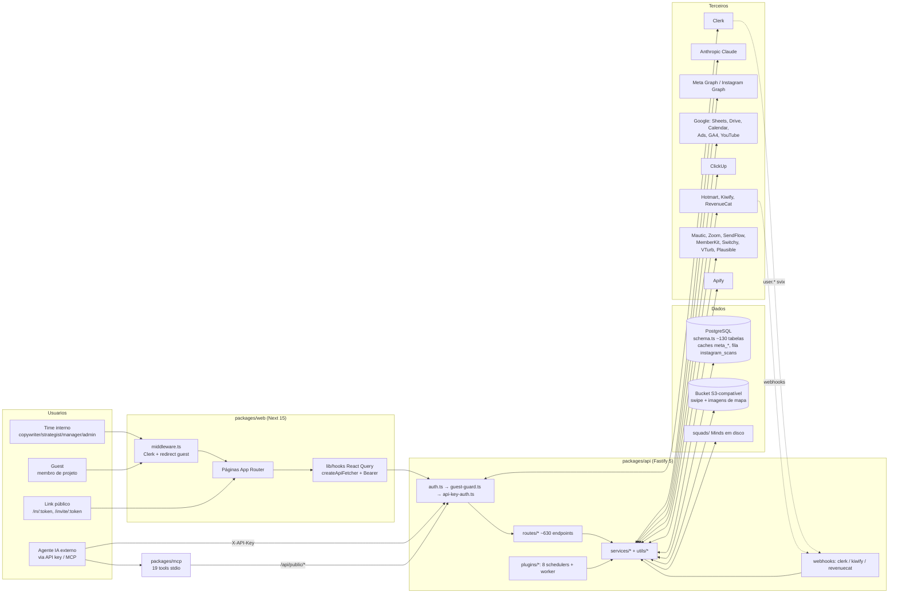

# Mapa descritivo do sistema — Loyola Digital X (Passagem 1: alto nível)

**Sistema mapeado:** `/Users/danilosagae/Documents/loyola` (referências abaixo são relativas a essa raiz)
**Data do levantamento:** 2026-09-21 · **HEAD:** `bb1608b6` (branch local atual: `fix/29.77-ctr-cpc-clique-no-link`; `main` existe local e remota)
**Escopo desta passagem:** estrutura, stack, modelo de dados, pontos de entrada, integrações, auth, saídas, convenções, testes e catálogo de módulos. Sem leitura profunda de handlers/serviços, sem propostas de mudança e sem comparação com os documentos `especificacao_tecnica_painel_planejamento.md` e `classificacao_regras_painel_planejamento.md` (não lidos nesta etapa, por regra).

**Regra de evidência:** toda afirmação traz `caminho/arquivo.ext:linha`. O que não foi lido está na seção 12 como NÃO LIDO. Nenhum valor de credencial, chave ou variável de ambiente é transcrito — apenas nomes de variáveis.

---

## 1. Stack e execução

### 1.1 Monorepo

| Item | Evidência |
|---|---|
| Nome do workspace: `loyola-digital-x`, `private`, `packageManager: pnpm@9.15.4`, `engines.node >= 20` | `package.json:2,3,17-20` |
| Orquestração de tarefas: Turborepo (`turbo dev/build/lint/typecheck`); `dev` exclui o pacote MCP por padrão (`--filter=!@loyola-x/mcp`) | `package.json:5-10`, `turbo.json:4-21` |
| Workspaces: `packages/*` | `pnpm-workspace.yaml:1-2` |
| TypeScript base: `target ES2022`, `module ESNext`, `moduleResolution bundler`, `strict: true`, `declaration`, `sourceMap` | `tsconfig.base.json:2-15` |
| Lint: ESLint 9 flat config com `typescript-eslint`; `no-unused-vars` = error (ignora `_`), `no-explicit-any` = warn | `eslint.config.mjs:4-19` |
| Dependências raiz (dev): `turbo`, `typescript`, `eslint`, `@eslint/js`, `typescript-eslint` | `package.json:11-16` |
| pnpm: `shamefully-hoist=false`, `strict-peer-dependencies=false` | `.npmrc:1-2` |

### 1.2 Pacotes

| Pacote | Papel | Stack declarada | Evidência |
|---|---|---|---|
| `@loyola-x/api` | Backend HTTP + jobs | Fastify 5, `@clerk/fastify`, Drizzle ORM 0.45 + `drizzle-kit` 0.31, `pg`, `zod` 4, `@anthropic-ai/sdk`, `googleapis`, `apify-client`, `@aws-sdk/client-s3` (+ presigner, lib-storage), `svix`, `mammoth`, `pdf-parse`, `lru-cache`, `@fastify/{cors,multipart,rate-limit}`; dev: `tsx`, `vitest` 4 | `packages/api/package.json:19-49` |
| `@loyola-x/web` | Frontend | Next 15 (App Router, `--turbopack` no build), React 19, `@clerk/nextjs` 7, `@tanstack/react-query` 5, `zustand`, Tailwind 4, `radix-ui`, `recharts`, `framer-motion`, `@dnd-kit/*`, `react-force-graph-2d`, `three`/`@react-three/*`, `jspdf`, `html-to-image`, `pdfjs-dist`, `shiki`, `react-markdown`; dev: `vitest`, `jsdom`, `@testing-library/react` | `packages/web/package.json:14-57` |
| `@loyola-x/shared` | Tipos e módulos puros compartilhados (ESM, `main: dist/index.js`) | só `typescript` | `packages/shared/package.json:1-15` |
| `@loyola-x/mcp` | Servidor MCP (stdio) que embrulha a API pública | `@modelcontextprotocol/sdk`, `zod`; build roda `scripts/verificar-tools.mjs` antes do `tsc` | `packages/mcp/package.json:1-24` |
| `@loyola-x/video` | Vídeo de showcase (Remotion) — não vai para produção | `remotion` 4.0.301, `@remotion/cli`, `@remotion/player` | `packages/video/package.json:1-20`; excluído da imagem em `.dockerignore:55` |

### 1.3 Como sobe (dev)

- Raiz: `pnpm dev` → `turbo dev` em todos os pacotes exceto MCP (`package.json:5`).
- API: `tsx watch src/server.ts`, porta padrão 3001, host 0.0.0.0 (`packages/api/package.json:8`, `packages/api/src/server.ts:7-8`).
- Web: `next dev --port 3000` (`packages/web/package.json:8`); em dev o Next faz proxy de `/api/*` para `http://localhost:3001` via `rewrites` (`packages/web/next.config.ts:74-81`), e o cliente usa caminho relativo quando `NEXT_PUBLIC_API_URL` está vazio (`packages/web/lib/api-client.ts:1-3`).
- MCP: `pnpm dev:mcp` → `tsx src/index.ts` (`package.json:6`, `packages/mcp/package.json:11`).

### 1.4 Boot da API (ordem de registro)

`packages/api/src/app.ts:132-309` (`buildServer`): error handler global (`:138-148`) → `envPlugin` (`:151`) → CORS, rate-limit, multipart 10 MB (`:154-156`) → `clerkPlugin` em `onRequest` (`:159-163`) → `usoDoProdutoPlugin` (`:167`) → `authPlugin` (`:168`) → `dbPlugin` (`:171`) → `guestGuardPlugin` (`:174`) → `apiKeyAuthPlugin` (`:178`) → serviços decorados (mindRegistry, mindEngine, claude, conversation, clickup, instagram — `:181-186`) → 8 schedulers/workers (`:189-203`) → ~100 plugins de rota (`:206-306`).

Validação de ambiente com `zod` em `packages/api/src/config/env.ts:4-93`; falha derruba o boot (`:106-112`). Obrigatórias: `DATABASE_URL`, `CLERK_SECRET_KEY`, `CLERK_PUBLISHABLE_KEY`, `ANTHROPIC_API_KEY` (`:10-13`). As demais são opcionais (lista completa de nomes em `:14-92`).

Conexão Postgres: `pg.Pool` com `max: 20` e `ssl: { rejectUnauthorized: false }` em produção (`packages/api/src/db/client.ts:15-22`); `drizzle(pool, { schema })` decorado em `fastify.db` (`:24-26`).

### 1.5 Como roda em produção

| Aspecto | O que o código declara | Evidência |
|---|---|---|
| Auto-migração no boot | `server.ts` executa `npx drizzle-kit push --force` antes de subir, quando `NODE_ENV=production` (ou `AUTO_MIGRATE=true`); falha não derruba o servidor | `packages/api/src/server.ts:10-40` |
| Comentário de deploy | "O deploy (Coolify/nixpacks) roda `node dist/server.js` direto e IGNORA o CMD/start do repo" | `packages/api/src/server.ts:11-13` |
| Dockerfile da API | multi-stage `node:20-alpine`, build do `shared` + `api`, copia `squads/` para a imagem, `EXPOSE 3001`, `CMD drizzle-kit push --force && node dist/server.js` | `packages/api/Dockerfile:1-23` |
| Dockerfile do web | `next build` standalone, `EXPOSE 3000`, `CMD node packages/web/server.js` | `packages/web/Dockerfile:1-22`, `packages/web/next.config.ts:11-12` |
| `.dockerignore` | escrito para nixpacks (`COPY . /app` três vezes); mantém `squads/` porque a API lê Minds de lá em runtime (`MINDS_BASE_PATH`) | `.dockerignore:1-58` |
| Railway | `railway.toml` aponta o Dockerfile da API e healthcheck em `/api/health` | `packages/api/railway.toml:1-9` |
| Vercel/CI | o CI comenta que lint/typecheck rodam "em paralelo com o deploy do Vercel" | `.github/workflows/ci.yml:5-7` |
| Health | `GET /api/health` devolve commit (`RAILWAY_GIT_COMMIT_SHA`/`GIT_COMMIT_SHA`) e `API_CONTRACT_VERSION` | `packages/api/src/routes/health.ts:41`; `packages/api/src/__tests__/health.test.ts:45-46` |
| Contrato web↔API | `API_CONTRACT_VERSION = 13` no shared; web compara com o que a API publica em `/api/health` | `packages/shared/src/contract.ts:148`; `packages/web/components/layout/api-contract-banner.tsx` (existe; NÃO LIDO) |
| Build do web | `eslint.ignoreDuringBuilds` e `typescript.ignoreBuildErrors` = true (as checagens vão para o CI); `outputFileTracingExcludes` corta pacotes da API/vídeo/MCP | `packages/web/next.config.ts:55-56, 24-45` |

> Observação (só constatação): há três alvos de deploy mencionados no código — Coolify/nixpacks (`server.ts`), Railway (`railway.toml`) e Vercel (`ci.yml`). Qual deles está ativo hoje não é derivável do código (ver §12).

---

## 2. Estrutura de pastas (até o 2º nível)

```
loyola/
├── .github/            # CI (workflows/ci.yml) e definições de agentes do framework AIOX (agents/*.agent.md)
├── .aiox, .aiox-core, .claude, .codex, .cursor, .gemini, .antigravity   # tooling de IA/processo (fora do runtime; excluído da imagem — .dockerignore:24-27)
├── docs/               # documentação do produto
│   ├── architecture/   # 3 docs (fullstack, schema, funnel-data-map)
│   ├── dados/          # CSV de dados + README
│   ├── discovery/, team/, qa/, "qa 2"/   # artefatos de processo
│   ├── guides/         # 5 guias (cadeia de CAC, panorama, MCP gateway/consumo)
│   ├── integrations/   # kiwify-webhooks.md
│   ├── specs/          # epic-41 (perpétuo)
│   ├── stories/        # 448 entradas (stories numeradas por epic)
│   └── llms.txt        # contrato da API pública para IA (47 KB)
├── kiwify-analise/     # exports da Kiwify para análise pontual — gitignored exceto README (.gitignore:47-51)
├── packages/
│   ├── api/            # Fastify + Drizzle (ver §2.1)
│   ├── web/            # Next.js (ver §2.2)
│   ├── shared/         # tipos + módulos puros compartilhados
│   ├── mcp/            # servidor MCP sobre /api/public/*
│   └── video/          # Remotion (showcase)
├── scripts/            # gerar-bundle-mcp.sh (bundle vendorizado do MCP para o gateway)
├── squads/             # "Minds" (personas de IA) lidos em runtime pela API (MINDS_BASE_PATH=./squads)
├── AGENTS.md, Context.md, AUDITORIA-ABA-CAC.md   # docs na raiz
├── package.json, pnpm-workspace.yaml, turbo.json, tsconfig.base.json, eslint.config.mjs
└── .env, .env.example, .dockerignore, .gitignore, .npmrc
```

### 2.1 `packages/api`

```
api/
├── src/
│   ├── server.ts         # entrypoint: auto-migração + listen (server.ts:42-55)
│   ├── app.ts            # buildServer(): registra plugins/rotas na ordem (app.ts:132-309)
│   ├── config/env.ts     # schema zod das variáveis de ambiente
│   ├── db/               # client.ts (Pool+Drizzle), schema.ts (5.324 linhas), migrations/ (167 .sql + meta/), seeds/ (nomenclatura.ts, switchy-presets.ts)
│   ├── middleware/       # auth.ts, guest-guard.ts, api-key-auth.ts, rate-limit.ts, cors.ts
│   ├── plugins/          # 8 schedulers/workers in-process (§4.5)
│   ├── routes/           # 96 arquivos de rota (~630 endpoints, §4.2)
│   ├── services/         # 138 arquivos: integrações, cálculos, sync; subpastas bi/, nomenclatura/, insta-scanner/
│   ├── scripts/          # 31 scripts tsx (backfills, apply-*-migration, diagnósticos)
│   ├── types/index.ts    # augmentation do FastifyRequest (userId, userRole, apiKey)
│   ├── utils/            # 17 módulos puros (meta-tax, produto, sale-date, single-flight…)
│   └── __tests__/        # 167 arquivos .test.ts (vitest) + fixtures/squads
├── scripts/              # 38 .mjs/.ts: apply-migration-00XX.mjs, run-migration.mjs, confere-*, diagnostica-*
├── tests/                # 1 teste node:test (.mts) fora do vitest
├── migrate-00{41,56,57,58,66}.ts   # scripts avulsos de migração na raiz do pacote
├── drizzle.config.ts     # schema ./src/db/schema.ts, out ./src/db/migrations, dialect postgresql
├── Dockerfile, railway.toml, vitest.config.ts, tsconfig.json, .env.example
```

### 2.2 `packages/web`

```
web/
├── app/
│   ├── (app)/            # área logada: bi, conversations, debriefings, funnel-maps, instagram, minds, pdi, pessoal, planner, projects/[id]/…, settings/…, sprint-dashboard, spy-conteudo, swipe-files, tasks, traffic, youtube, entrar, dev/metrics-demo
│   ├── (auth)/           # sign-in, sign-up (Clerk)
│   ├── (marketing)/      # landing "/"
│   ├── invite/[token]/   # aceite de convite
│   ├── m/[token]/        # mapa de funil compartilhado (público)
│   └── pending-approval/ # tela de espera de aprovação
├── components/           # 306 .tsx em 24 pastas (funnels=125 arquivos, ui, layout, traffic, instagram, bi, planner, swipe-files, …)
├── lib/                  # api-client.ts, hooks/ (120 hooks React Query), utils/ (lógica pura + 81 testes), formulas/, bi/, planner/, swipe/, stores/ (zustand), types/, constants/
├── middleware.ts         # clerkMiddleware: rotas públicas e redirecionamento de guest
├── next.config.ts, vitest.config.ts, vitest.setup.ts, components.json, Dockerfile, .env.example
```

> Constatação: existem pastas duplicadas com sufixo ` 2` (`lib/components/funnels 2`, `lib/planner/__tests__ 2`, `lib/swipe/__tests__ 2`, `docs/qa 2`). O `.gitignore:35-41` ignora `* 2.*` e `* 2/` explicitamente, com comentário explicando que são artefatos de sync do iCloud/Drive.

### 2.3 `packages/shared/src`

Módulos folha (sem imports entre si, por decisão documentada em `packages/shared/src/index.ts:8-29`): `contract.ts` (versão do contrato), `stage-types.ts` (grupos de tipos de etapa), `mcp-tools.ts` (lista canônica de tools), `campaign-name.ts`, `nomenclatura-*.ts` (campanha, VSL, anúncio, legado, códigos), `perpetuo-metricas.ts`, `veredito-do-perpetuo.ts`, `cadeia-cac.ts`, `video-camadas.ts`, `clique-no-link.ts`, `janela-de-dias.ts`, `lp-url.ts`, `numero-ptbr.ts`, `utm-value.ts`, e `types/` (chat, conversation, event-config, funnel, funnel-groups, instagram-report, manual-sales, memberkit, mind, organic-post, sales-plan, sprint-dashboard, task, user).

Regra de import (documentada, `packages/shared/src/index.ts:12-28`): web importa por subpath `@loyola-x/shared/src/<módulo>`; API importa **só** o bare `@loyola-x/shared` (o `tsc` não reescreve especificadores e o subpath quebraria em runtime).

### 2.4 `packages/mcp/src`

`index.ts` (transporte stdio), `client.ts` (HTTP para a API pública), `config.ts` (`LOYOLA_API_BASE_URL`, `LOYOLA_API_KEY`), `tools.ts` (19 tools, 1:1 com `/api/public/*`), `defasagem.ts` (compara com `GET /api/public/v1/mcp-manifest` e adiciona a pseudo-tool `AVISO_bundle_do_mcp_desatualizado`) — `packages/mcp/README.md:1-60`, `packages/shared/src/mcp-tools.ts:29-48`.

---

## 3. Modelo de dados

**Fonte:** `packages/api/src/db/schema.ts` (5.324 linhas, Drizzle/PostgreSQL). É a fonte de verdade do banco: o deploy aplica `drizzle-kit push --force` a partir dele (`server.ts:27`). Os arquivos SQL em `src/db/migrations/` são escritos à mão para o que o `push` não expressa (índices parciais, CHECKs, comentários, backfills) e aplicados por scripts (`scripts/run-migration.mjs:1-5`, `scripts/apply-migration-0136.mjs:1-11`).

**Migração mais recente:** `0150_instagram_analise_do_post.sql` (adiciona `analise`, `analise_em`, `analise_por` a `instagram_post_metrics`). Há 167 arquivos `.sql`; a numeração tem colisões (dois arquivos com o mesmo prefixo em 0001, 0041, 0056-0058, 0076, 0086-0089, 0102, 0109, 0114, 0144-0146, 0148, 0149). O journal do drizzle-kit (`migrations/meta/_journal.json`) só registra `0000`–`0007` — depois disso as migrações deixaram de ser geradas pelo drizzle-kit.

**Convenções gerais do schema** (valem para quase todas as tabelas): PK `id uuid defaultRandom()`; `created_at`/`updated_at timestamptz defaultNow()`; FKs com `onDelete` explícito (`cascade` para filhos, `set null` para autoria, `restrict` para "dono de dado"); segredos de terceiros sempre em par `*_encrypted` + `*_iv` (AES-256-GCM, `services/encryption.ts:3`); JSONB tipado com `.$type<…>()`; nomes de coluna em `snake_case`, propriedades em `camelCase`.

Notação abaixo: `NN` = NOT NULL; `PK`, `UQ`, `IDX`; `→ tabela (regra)` = FK; tipos abreviados (`tstz` = timestamp with time zone; `num(p,s)` = numeric).

### 3.1 Enums (`schema.ts`)

| Enum | Valores | Linha |
|---|---|---|
| `user_role` | copywriter, strategist, manager, admin, guest | 41 |
| `user_status` | active, pending, blocked | 49 |
| `message_role` | user, assistant | 55 |
| `task_status` | pending, open, in_progress, review, done, cancelled | 57 |
| `task_priority` | urgent, high, normal, low | 66 |
| `funnel_type` | launch, perpetual, mobile | 660 |
| `survey_type` | paid, organic | 1049 |
| `sales_product_type` | inferior, superior | 1192 |
| `funnel_spreadsheet_type` | leads, sales, custom, perpetual_sales, perpetual_upsell, applications | 1367 |
| `organic_post_source` | youtube, instagram | 1472 |
| `absence_kind` | ferias, folga, ausencia, licenca | 4225 |
| `absence_status` | programada, aprovada, concluida, cancelada | 4232 |
| `source_rule_operator` | igual, contem, comeca_com, vazio | 4354 |
| `naming_dictionary_type` | year, temperature, auction, format, creative_type, launch_type, creative_origin | 4780 |
| `naming_campaign_origin` | gerador, legado | 4793 |
| `naming_legacy_decision` | classificada, ignorada | 4797 |
| `naming_changelog_action` | create, update, delete, deactivate, reactivate, publish | 4802 |
| `naming_vsl_variable_type` | lead, problem, solution | 5151 |
| `naming_ad_part_type` | hook, body | 5245 |

O **tipo de etapa** (`funnel_stages.stage_type`) não é enum no banco: é `varchar(20)` (`schema.ts:904`) com o domínio declarado em TypeScript: `paid | application | free | sales | cpl | event | event_capture | debriefing | comercial | lyrio | mapa` (`packages/shared/src/types/funnel.ts:37-51`).

### 3.2 Identidade, projetos e acesso

| Tabela (linha) | Campos | Relações / índices |
|---|---|---|
| `users` (77) | id PK; clerk_id text NN; email text NN; name text NN; avatar_url text; role `user_role` NN default copywriter; listed bool NN default true; status `user_status` NN default active; created_at, updated_at | UQ clerk_id; UQ email |
| `api_keys` (115) | id PK; name text NN; key_prefix text NN; key_hash text NN (SHA-256, texto puro nunca gravado); scopes jsonb string[] NN default `["meta:read"]`; created_by → users (restrict) NN; last_used_at, revoked_at, created_at | UQ key_hash; IDX created_by |
| `projects` (142) | id PK; name varchar(100) NN; client_name varchar(100) NN; description text; color varchar(7); created_by → users (restrict) NN; is_active bool NN default true; created_at, updated_at | IDX created_by |
| `project_invitations` (333) | id PK; project_id → projects (cascade) NN; invited_by → users NN; email text NN; token text NN UQ; permissions jsonb NN default `{instagram,traffic,youtubeAds,youtubeOrganic,conversations,mind: true}`; accepted_at; expires_at tstz NN; created_at | UQ token; IDX project |
| `project_members` (365) | id PK; project_id → projects (cascade) NN; user_id → users (cascade) NN; role text NN default "guest"; permissions jsonb NN (mesmo default acima); created_at | UQ (project_id, user_id) |
| `project_minds` (395) | id PK; project_id → projects (cascade) NN; mind_id text NN; added_by → users NN; created_at | UQ (project_id, mind_id) |
| `user_activity` (3845) | user_id → users (cascade) NN; area varchar(24) NN; hora tstz NN (hora cheia UTC); requisicoes int NN default 0 | PK (user_id, area, hora); IDX hora |
| `people_records` (4239) | id PK; user_id → users (cascade) NN UQ; nome_completo text; foto text (data URI); nascimento date; telefone varchar(40); email_contato varchar(255); emergencia_nome/telefone/parentesco; cargo varchar(120); entrada_em date; cpf varchar(11); cnpj varchar(14); chave_pix varchar(140); endereco text; ajuste_saldo_dias int NN default 0; observacoes text; updated_by → users (set null); created_at, updated_at | 1:1 com users |
| `people_absences` (4299) | id PK; user_id → users (cascade) NN; kind `absence_kind` NN default ferias; status `absence_status` NN default programada; inicio date NN; fim date NN; cobertura_user_id → users (set null); observacao text; created_by → users (set null); created_at, updated_at | IDX (user_id, inicio); IDX (inicio, fim) |
| `pdi_documents` (4072) | id PK; user_id → users (cascade) NN; title varchar(255) NN; html text NN; created_by → users (restrict) NN; created_at, updated_at | IDX (user_id, created_at); sem UNIQUE em user_id (cada atribuição é uma versão) |

### 3.3 Minds, chat e tarefas

| Tabela (linha) | Campos | Relações / índices |
|---|---|---|
| `conversations` (164) | id PK; user_id → users (cascade) NN; mind_id text NN; mind_name text NN; squad_id text NN; title text; message_count int NN default 0; total_tokens int NN default 0; project_id → projects (set null); deleted_at; created_at, updated_at | IDX parciais (`deleted_at IS NULL`) por (user, updated_at) e (user, mind); IDX project; CHECKs `message_count >= 0`, `total_tokens >= 0` |
| `messages` (201) | id PK; conversation_id → conversations (cascade) NN; role `message_role` NN; content text NN; tokens_used int; metadata jsonb {model, inputTokens, outputTokens, taskDetected, finishReason, attachments[]}; created_at | IDX (conversation_id, created_at); CHECK `length(content) > 0` |
| `delegated_tasks` (236) | id PK; conversation_id → conversations (cascade) NN; message_id → messages (set null); user_id → users (cascade) NN; mind_id text NN; clickup_task_id text NN; clickup_url text NN; title text NN; description text; status `task_status` NN default open; priority `task_priority` NN default normal; tags text[]; created_at, updated_at | UQ clickup_task_id; CHECK `clickup_url LIKE 'https://%'`; CHECK título não vazio |

### 3.4 Contas de mídia (globais, ligadas a projetos por N:N)

| Tabela (linha) | Campos | Relações / índices |
|---|---|---|
| `instagram_accounts` (278) | id PK; user_id → users (cascade) NN; account_name varchar(100) NN; instagram_user_id varchar(50) NN; instagram_username varchar(50); access_token_encrypted/iv text NN; token_expires_at; profile_picture_url; is_active bool NN default true; last_synced_at; created_at, updated_at | UQ instagram_user_id |
| `instagram_account_projects` (308) | id PK; account_id → instagram_accounts (cascade) NN; project_id → projects (cascade) NN; created_at | UQ (account_id, project_id) |
| `instagram_metrics_cache` (417) | id PK; account_id → instagram_accounts (cascade) NN; metric_type varchar(50) NN; metric_data jsonb NN; period_start date; period_end date; fetched_at NN; expires_at tstz NN | UQ (account, type, period_start, period_end); IDX expires |
| `instagram_post_metrics` (454) | account_id → instagram_accounts (cascade) NN; media_id varchar(64) NN; posted_at tstz NN; media_type, media_product_type varchar(32); caption text; permalink text; like_count, comments_count, reach, views, saved, shares, follows int; skip_rate num(5,2); avg_watch_time_ms int; insights_at; follows_manual int; follows_manual_by → users (set null); follows_manual_at; analise jsonb; analise_em; analise_por → users (set null); updated_at | PK (account_id, media_id); IDX (account_id, posted_at) |
| `instagram_monthly_reports` (1514) | id PK; project_id → projects (cascade) NN; month varchar(7) NN (YYYY-MM); data jsonb NN; generated_by → users (restrict) NN; generated_at | UQ (project_id, month) |
| `meta_ads_accounts` (503) | id PK; account_name varchar(100) NN; meta_account_id varchar(50) NN; access_token_encrypted/iv NN; is_active; created_by → users (restrict) NN; created_at, updated_at | UQ meta_account_id |
| `meta_ads_account_projects` (528) | id PK; account_id → meta_ads_accounts (cascade); project_id → projects (cascade); created_at | UQ (account_id, project_id) |
| `google_ads_accounts` (553) | id PK; account_name; customer_id varchar(20) NN; developer_token_encrypted/iv NN; refresh_token_encrypted/iv NN; is_active; created_by → users (restrict); created_at, updated_at | UQ customer_id |
| `google_ads_account_projects` (580) | id PK; account_id → google_ads_accounts (cascade); project_id → projects (cascade); created_at | UQ (account_id, project_id) |
| `youtube_channels` (608) | id PK; channel_id varchar(50) NN; channel_name varchar(255) NN; thumbnail_url; subscriber_count int default 0; refresh_token_encrypted/iv NN; is_active; created_by → users (restrict); created_at, updated_at | UQ channel_id |
| `youtube_channel_projects` (635) | id PK; channel_id → youtube_channels (cascade); project_id → projects (cascade); created_at | UQ (channel_id, project_id) |
| `stage_organic_posts` (1477) | id PK; stage_id → funnel_stages (cascade) NN; project_id → projects (cascade) NN; source `organic_post_source` NN; external_id varchar(100) NN; created_by → users (restrict) NN; created_at | UQ (stage_id, source, external_id) |
| `instagram_scans` (3768) | id PK; username varchar(30) NN; status varchar(12) NN default queued (queued/running/done/failed); params jsonb NN default `{limit:120, since:null, tzOffset:-3}`; focus text; profile, metrics, analysis jsonb; usage jsonb {model, inputTokens, outputTokens}; error text; requested_by → users (restrict) NN; claimed_at, started_at, finished_at; created_at, updated_at | IDX (status, created_at) — fila; IDX (username, created_at) |

### 3.5 Funis e etapas (núcleo do domínio)

| Tabela (linha) | Campos | Relações / índices |
|---|---|---|
| `funnels` (666) | id PK; project_id → projects (cascade) NN; name varchar(255) NN; type `funnel_type` NN; meta_account_id → meta_ads_accounts (set null); campaigns jsonb `{id,name}[]` NN default []; google_ads_account_id → google_ads_accounts (set null); google_ads_campaigns jsonb NN default []; switchy_folder_ids jsonb `{id:number,name}[]`; switchy_linked_links jsonb `{uniq,id,domain}[]`; compare_funnel_id → funnels (set null, auto-referência); compare_start_date varchar(10); match_code varchar(50); dismissed_orphan_campaigns jsonb string[]; leads_goal_meta int; leads_goal_data_final date; last_audit_at; last_audit_by → users (set null); audit_status varchar(20) NN default pending; sort_order int NN default 0; archived_at; archived_by → users (set null); created_at, updated_at | IDX project; IDX (project, type, sort_order) |
| `funnel_stages` (868) | id PK; funnel_id → funnels (cascade) NN; name varchar(255) NN; meta_account_id → meta_ads_accounts (set null); campaigns jsonb NN default []; google_ads_account_id → google_ads_accounts (set null); google_ads_campaigns jsonb; switchy_folder_ids; switchy_linked_links; stage_type varchar(20) NN default "free"; sort_order int NN default 0; last_audit_at; last_audit_by → users (set null); audit_status varchar(20) NN default pending; projection_end_date date; lead_goal int; lp_tem_vsl bool (null = não respondido); ticket_medio_manual num(12,2); lp_links jsonb `Record<lpName,url>` NN default {}; day_notes jsonb `Record<YYYY-MM-DD,texto>` NN default {}; ga4_page_filter text; created_at, updated_at | IDX funnel; IDX projection_end_date |
| `funnel_maps` (772) | id PK; stage_id → funnel_stages (cascade) UQ (nullable: mapa "solto"); name varchar(160); project_id → projects (set null); tabs jsonb NN default [] — `{id,name,boxes[{id,type,label,x,y,width,height,color,status,stageId?,notes?,url?,imageUrl?,imageKey?,forma?}],connectors[{id,fromBox,fromPoint,toBox,toPoint,type,label?}]}[]`; share_token varchar(64) (UQ parcial na migration 0147); updated_by → users (set null); created_at, updated_at | — |
| `funnel_map_comments` (4471) | id PK; map_id → funnel_maps (cascade) NN; tab_id varchar(64) NN; parent_id uuid (sem FK declarada); box_id varchar(64); x, y int NN default 0; texto text NN; resolvido bool NN default false; created_by → users (set null); created_at, updated_at | IDX (map_id, created_at) |
| `funnel_batch_turns` (1608) | id PK; funnel_id → funnels (cascade) NN; date date NN; label varchar(255) NN; nota text; created_by → users (set null); created_at, updated_at | UQ (funnel_id, date); CHECK label-ou-nota na migration 0145 |
| `campaign_log_entries` (3385) | id PK; funnel_id → funnels (cascade) NN; occurred_at tstz NN; evento varchar(80) NN; aplicativo, categoria varchar(80); notes text; responsavel varchar(255); source varchar(20) NN default manual (manual/mautic/…); source_id varchar(120); created_by → users (restrict) NN; created_at, updated_at | IDX (funnel, occurred_at); UQ parcial (funnel_id, source_id) WHERE source_id IS NOT NULL |
| `funnel_groups_spreadsheets` (1546) | id PK; funnel_id → funnels (cascade) NN UQ; spreadsheet_id, spreadsheet_name, sheet_name varchar(255) NN; last_synced_at; created_at | — |
| `funnel_group_snapshots` (1567) | id PK; funnel_id → funnels (cascade) NN; campaign_id varchar(255) NN; campaign_name varchar(500) NN; snapshot_at tstz NN; clicks_total, group_full, group_open, group_total, input_amount, output_amount, participants_amount int NN default 0; source varchar(20) NN default planilha (sendflow/planilha); created_at | UQ (funnel, campaign, snapshot_at) |

### 3.6 Planilhas conectadas e configurações por etapa

| Tabela (linha) | Campos | Relações / índices |
|---|---|---|
| `stage_sales_spreadsheets` (978) | id PK; stage_id → funnel_stages (cascade) NN; subtype varchar(20) NN (capture/main_product/sales/tmb/event_sales — `shared/src/types/funnel.ts:54`); spreadsheet_id, spreadsheet_name, sheet_name NN; column_mapping jsonb NN default {} (email?, customerName?, productName?, valorBruto?, valorLiquido?, formaPagamento?, canalOrigem?, dataVenda?, utm_*?, closer?, telefone?, caixa?, negociacao?); order_bump_products jsonb string[] NN default []; product_types jsonb `Record<produto, tipo>` (nullable); created_at | IDX stage; UNIQUE parcial por SQL para subtype IN (capture, main_product) (comentário `:1038-1040`) |
| `funnel_spreadsheets` (1381) | id PK; funnel_id → funnels (cascade) NN; stage_id → funnel_stages (cascade) (nullable); label varchar(255) NN; type `funnel_spreadsheet_type` NN; platform varchar(20); spreadsheet_id, spreadsheet_name, sheet_name NN; column_mapping jsonb NN (name?, email?, phone?, date?, status?, value?, valorBruto?, valorLiquido?, formaPagamento?, productName?, faixa?, utm_*?); product_types jsonb `Record<string, principal|order_bump|combo|upsell>` NN default {}; created_by → users (restrict) NN; created_at, updated_at | IDX funnel; IDX stage |
| `funnel_surveys` (1051) | id PK; funnel_id → funnels (cascade) NN; stage_id → funnel_stages (cascade); spreadsheet_id, spreadsheet_name, sheet_name NN; survey_type `survey_type` NN default paid; column_mapping jsonb NN default {} (utm_source..utm_content?, email?, phone?, timestamp?, faixa?, questions[{columnName,label,showInDashboard}]?); created_at | IDX funnel, stage, type |
| `funnel_nps_datasets` (1105) | id PK; funnel_id → funnels (cascade) NN; stage_id → funnel_stages (cascade); label varchar(120) NN default "NPS"; spreadsheet_id/name, sheet_name NN; column_mapping jsonb {name?, email?, score?, timestamp?}; created_at | IDX funnel, stage |
| `nps_brinde_status` (1139) | id PK; dataset_id → funnel_nps_datasets (cascade) NN; respondent_key varchar(255) NN; delivered bool NN default false; updated_at | UQ (dataset_id, respondent_key) |
| `stage_lead_scoring_schemas` (1166) | id PK; stage_id → funnel_stages (cascade) NN UQ; survey_id → funnel_surveys (set null); schema_json jsonb NN; created_at, updated_at | — |
| `application_stage_configs` (1843) | id PK; stage_id → funnel_stages (cascade) NN UQ; sales_spreadsheet_ids jsonb string[] NN default []; utm_filters jsonb `{campo, modo: igual|contem, valores[]}[]` NN default []; created_by → users (set null); created_at, updated_at | — |
| `sales_products` (1197) | id PK; project_id → projects (cascade) NN; name varchar(255) NN; type `sales_product_type` NN; created_by → users (restrict) NN; created_at, updated_at | IDX project |
| `sales_spreadsheet_mappings` (1219) | id PK; product_id → sales_products (cascade) NN; spreadsheet_id/name, sheet_name NN; column_mapping jsonb NN (email, date, origin?, type?, value?, name?, phone?, status?, utm_*?); created_at | IDX product |
| `project_source_rules` (4608) | id PK; project_id → projects (cascade) (NULL = regra global); campo varchar(120) NN; operador `source_rule_operator` NN default igual; valor text NN default ""; origem varchar(120) NN (convenção `paid_*`/`organic_*`); ordem int NN default 0; ativa bool NN default true; created_by → users (set null); created_at, updated_at | IDX (project_id, ordem) |
| `seller_aliases` (3082) | id PK; project_id → projects (cascade) NN; canonical_name varchar(255) NN; aliases jsonb string[] NN default []; created_at, updated_at | IDX project |

### 3.7 Vendas manuais e evento presencial

| Tabela (linha) | Campos | Relações / índices |
|---|---|---|
| `manual_sales` (1255) | id PK; stage_id → funnel_stages (cascade) NN; customer_name varchar(255) NN; customer_email varchar(255); customer_phone varchar(50); value num(12,2) NN; product varchar(255); payment_method varchar(40); invoice_status varchar(20); seller_user_id → users (set null); seller_name varchar(255) NN; sale_date tstz NN; valor_recebido num(12,2); negociacao text; customer_cpf varchar(11); customer_address text; valor_nota num(12,2); memberkit_status varchar(12); memberkit_synced_at; memberkit_user_id varchar(64); installment_count int; installment_amount num(12,2); first_installment_date date; refunded_at; refund_reason text; refunded_by → users (set null); created_by → users (restrict) NN; created_at | IDX (stage_id, sale_date); CHECK `value > 0` |
| `manual_sale_receipts` (1340) | id PK; manual_sale_id → manual_sales (cascade) NN; mime_type varchar(100) NN; file_name varchar(255); byte_size int NN; conteudo **bytea** NN; uploaded_by → users (restrict) NN; created_at | UQ manual_sale_id (um comprovante por venda) |
| `stage_event_products` (1972) | id PK; stage_id → funnel_stages (cascade) NN; name varchar(255) NN; memberkit_classroom_id int; memberkit_classroom_name varchar(255); sort_order; created_at, updated_at | IDX stage |
| `stage_event_closers` (1996) | id PK; stage_id → funnel_stages (cascade) NN; name varchar(255) NN; sort_order; created_at, updated_at | IDX stage |
| `stage_event_mirrored_sheets` (2018) | id PK; event_stage_id → funnel_stages (cascade) NN; source_spreadsheet_id → stage_sales_spreadsheets (cascade) NN; created_at | UQ (event_stage_id, source_spreadsheet_id) |
| `stage_event_lead_status` (2044) | id PK; stage_id → funnel_stages (cascade) NN; lead_email varchar(255) NN; status varchar(20) NN default pending (pending/negotiating/declined); note text; assigned_seller varchar(255); updated_at | UQ (stage_id, lead_email) |
| `stage_sales_plan_sources` (2075) | id PK; stage_id → funnel_stages (cascade) NN; role varchar(20) NN default participants (participants/survey); tipo varchar(80) NN default ""; spreadsheet_id NN; spreadsheet_name varchar(500) NN default ""; sheet_name NN; mapping jsonb {name?, email?, telefone?, tipo?, faturamento?} NN default {}; sort_order; created_at, updated_at | IDX stage |
| `stage_sales_plan_rules` (2117) | id PK; stage_id → funnel_stages (cascade) NN; label varchar(255) NN; min_revenue, max_revenue num(14,2); offer varchar(500) NN default ""; sort_order; created_at, updated_at | IDX stage |
| `stage_event_payment_alerts` (3300) | id PK; stage_id → funnel_stages (cascade) NN UQ; enabled bool NN default true; channel_id text NN (canal de chat do ClickUp v3); channel_name text; mention_users jsonb `{id,username}[]` NN default []; last_sent_date date; created_by → users (restrict) NN; created_at, updated_at | — |
| `stage_operational_costs` (3354) | id PK; stage_id → funnel_stages (cascade) NN; category varchar(20) NN (venue/staff/logistica/hospedagem/alimentacao/marketing/outros); description varchar(255); amount num(12,2) NN; incurred_at date; created_by → users (set null); created_at, updated_at | — |
| `stage_memberkit_enrollment` (1942) | id PK; stage_id → funnel_stages (cascade) NN UQ; classroom_ids jsonb number[] NN default []; status varchar(10) NN default active; auto_enroll bool NN default true; created_at, updated_at | — |

### 3.8 CRM comercial (etapa `comercial`)

| Tabela (linha) | Campos | Relações / índices |
|---|---|---|
| `stage_comercial_config` (3177) | id PK; stage_id → funnel_stages (cascade) NN UQ; source_stage_ids jsonb string[] NN default []; comercial_source varchar(20) NN default buyers (buyers/survey); created_by → users (restrict) NN; created_at, updated_at | — |
| `stage_crm_columns` (3204) | id PK; stage_id → funnel_stages (cascade) NN; name varchar(80) NN; sort_order; is_terminal bool NN default false; created_at, updated_at | IDX (stage, sort_order) |
| `stage_crm_cards` (3227) | id PK; stage_id → funnel_stages (cascade) NN; column_id → stage_crm_columns (**restrict**) NN; customer_email varchar(255) (nullable); customer_name, customer_phone; products jsonb `{produto, valor, dataVenda, fonte}[]` NN default []; total_value num(12,2) NN default 0; first_purchase_at; notes text; assignee_name varchar(255); call_status varchar(12); call_count int NN default 0; temperature varchar(10); last_activity_at; sort_order; created_at, updated_at | UQ parcial (stage_id, customer_email) WHERE email IS NOT NULL; IDX (stage, column, sort) |

### 3.9 Integrações por projeto (conexões) e caches

| Tabela (linha) | Campos | Relações / índices |
|---|---|---|
| `project_zoom_connections` (1647) | id PK; project_id → projects (cascade) NN UQ; account_id, client_id varchar(255) NN; client_secret_encrypted/iv NN; created_at, updated_at | — |
| `funnel_stage_zoom_meetings` (2892) | id PK; stage_id → funnel_stages (cascade) NN; meeting_id varchar(64) NN; meeting_uuid varchar(255) NN; topic varchar(500); label varchar(255); start_time; duration_minutes int; last_synced_at; cached_data jsonb; sync_error text; created_at | UQ (stage_id, meeting_uuid) |
| `mautic_connections` (1677) | id PK; project_id → projects (cascade) NN UQ; base_url varchar(500) NN; username varchar(255) NN; password_encrypted/iv NN; created_at, updated_at | — |
| `funnel_stage_mautic_campaigns` (1699) | id PK; stage_id → funnel_stages (cascade) NN UQ; mautic_campaign_id varchar(64) NN; mautic_campaign_name varchar(500) NN; match_mode varchar(16) NN default manual (auto/manual); created_at, updated_at | — |
| `hotmart_connections` (1731) | id PK; project_id → projects (cascade) NN UQ; client_id_encrypted/iv NN; client_secret_encrypted/iv NN; created_at, updated_at | — |
| `hotmart_cache` (1759) | project_id → projects (cascade) NN; cache_key varchar(200) NN; data jsonb NN; computed_at NN | PK (project_id, cache_key) |
| `kiwify_connections` (1783) | id PK; project_id → projects (cascade) NN UQ; client_id_encrypted/iv, client_secret_encrypted/iv, account_id_encrypted/iv NN; webhook_token text UQ; created_at, updated_at | — |
| `kiwify_stage_configs` (1889) | id PK; stage_id → funnel_stages (cascade) NN UQ; product_ids jsonb string[] NN default []; start_date varchar(10) NN; ticket_price numeric; created_by → users (restrict) NN; created_at, updated_at | — |
| `kiwify_cache` (2260) | project_id → projects (cascade); cache_key varchar(200); data jsonb NN; computed_at | PK (project_id, cache_key) |
| `kiwify_webhook_events` (2145) | id PK; project_id → projects (cascade) NN; event_type, order_id, subscription_id text; dedup_key text NN (sha256 do corpo); payload jsonb NN; received_at NN | UQ (project_id, dedup_key); IDX project; IDX (project, subscription_id) |
| `kiwify_subscriptions` (2182) | id PK; project_id → projects (cascade) NN; subscription_id text NN; product_id, product_name, plan_name, customer_email, customer_name text; status text NN (active/waiting_payment/late/canceled/refunded/chargedback/trialing/completed/unknown); order_id text; amount int (centavos); currency text; started_at, next_charge_at, canceled_at; last_event_type text; last_event_at; created_at, updated_at | UQ (project_id, subscription_id); IDX (project, status) |
| `memberkit_connections` (1920) | id PK; project_id → projects (cascade) NN UQ; api_key_encrypted/iv NN; created_at, updated_at | — |
| `ga4_connections` (2232) | id PK; project_id → projects (cascade) NN UQ; refresh_token_encrypted/iv NN; property_id varchar(32) NN; property_name text; created_at, updated_at | — |
| `plausible_config` (4109) | id PK; singleton bool NN default true; base_url text NN; api_key_encrypted/iv NN; login_email text; login_password_encrypted/iv text; created_by → users (restrict) NN; created_at, updated_at | UQ singleton (1 linha global) |
| `plausible_project_sites` (4145) | id PK; project_id → projects (cascade) NN UQ; site_id varchar(255) NN; created_by → users (restrict) NN; created_at, updated_at | — |
| `vturb_connections` (4000) | id PK; project_id → projects (cascade) NN UQ; api_token_encrypted/iv NN; timezone varchar(60) NN default America/Sao_Paulo; created_by → users (restrict) NN; created_at, updated_at | — |
| `vturb_players` (4027) | id PK; project_id → projects (cascade) NN; stage_id → funnel_stages (cascade) NN; player_id varchar(64) NN; player_name text NN; duration, pitch_time int; created_by → users (restrict) NN; created_at, updated_at | UQ (stage_id, player_id) |
| `sendflow_connections` (4174) | id PK; project_id → projects (cascade) (NULL = conexão global); client_id varchar(255) NN; redirect_uri text; client_secret_encrypted NN / iv varchar(64) NN; refresh_token_encrypted NN / iv NN; access_token_encrypted / iv; access_token_expires_at; created_by → users (restrict) NN; created_at, updated_at | — |
| `project_switchy_settings` (2976) | id PK; project_id → projects (cascade) NN UQ; pixels jsonb `{platform,value,title?,id?,workspaceId?}[]` NN default []; show_gdpr bool NN default false; default_utm_term, default_utm_content varchar(120); created_at, updated_at | — |
| `switchy_channel_presets` (3011) | id PK; project_id → projects (cascade) NN; label, utm_medium, utm_source varchar(120) NN; sort_order; enabled bool NN default true; created_at, updated_at | IDX project |
| `switchy_shortened_links` (3033) | id PK; project_id → projects (cascade) NN; funnel_id → funnels (set null); folder_id varchar(64) NN; folder_name varchar(500); domain varchar(255); checkout_base_url text NN; channel_label, utm_campaign, utm_medium, utm_source, utm_term, utm_content varchar(120); note varchar(500); sck, vk_source text; full_url text NN; short_url text; switchy_link_id varchar(255); switchy_uniq bigint; created_at | IDX project, created_at, funnel |
| `planner_google_calendars` (4594) | id PK; calendar_id text NN UQ; label varchar(200) NN; created_by → users (set null); created_at; last_imported_at | — |

### 3.10 RevenueCat (etapa `lyrio` / funil `mobile`)

| Tabela (linha) | Campos | Relações / índices |
|---|---|---|
| `revenuecat_connections` (2281) | id PK; project_id → projects (cascade) NN UQ; api_key_encrypted/iv NN; created_at, updated_at | — |
| `revenuecat_stage_config` (2315) | id PK; stage_id → funnel_stages (cascade) NN UQ; project_id → projects (cascade) NN; rc_project_id varchar(64); label varchar(255); platform_fee_pct num(5,2) NN default 15.00; tax_pct num(5,2) NN default 5.00; other_costs_pct num(5,2) NN default 1.00; webhook_token text UQ; created_at, updated_at | IDX stage, project |
| `revenuecat_sales` (2364) | id PK; stage_id → funnel_stages (cascade) NN; project_id → projects (cascade) NN; event_id varchar(255) NN; dedup_key text NN; event_type varchar(40); store varchar(30); environment varchar(20); app_user_id varchar(255); product_id varchar(255); country_code, currency varchar(8); price_in_purchased_currency num(14,4); revenue_usd num(14,4); purchased_at; event_at; utm_source/medium/campaign/term/content varchar(255); gclid, fbclid text; acquisition_source varchar(64); payload jsonb NN; created_at | UQ (stage_id, event_id); IDX (stage, purchased_at), (stage, event_at), project, (stage, utm_campaign), (stage, utm_content) |
| `revenuecat_subscriptions` (2459) | id PK; stage_id → funnel_stages (cascade) NN; project_id → projects (cascade) NN; subscription_id varchar(255) NN; customer_id varchar(255) NN; product_id; store; country; auto_renewal_status, status varchar(40); starts_at, ends_at, current_period_starts_at, current_period_ends_at; entitlements jsonb; payload jsonb NN; synced_at NN; created_at | UQ (stage_id, subscription_id); IDX (stage, starts_at), (stage, customer_id) |
| `revenuecat_metric_snapshots` (2535) | id PK; stage_id → funnel_stages (cascade) NN; rc_project_id text NN; snapshot_date text NN; metrics jsonb NN; collected_at NN | UQ (stage_id, snapshot_date) |
| `revenuecat_backfill_state` (2560) | stage_id PK → funnel_stages (cascade); status varchar(20) NN default idle; next_cursor text; customers_processed, subscriptions_upserted int NN default 0; error text; started_at, finished_at; updated_at | — |

### 3.11 Caches da Meta (DB-first)

| Tabela (linha) | Campos | Relações / índices |
|---|---|---|
| `meta_entity_names_cache` (2580) | project_id → projects (cascade) NN; entity_type varchar(20) NN; entity_id varchar(64) NN; entity_name varchar(500) NN; effective_status varchar(40); last_synced_at NN | PK (project, entity_type, entity_id) |
| `meta_ad_creatives_cache` (2614) | project_id → projects (cascade) NN; ad_id varchar(64) NN; creative jsonb NN {imageUrl?, thumbnailUrl?, videoId?, title?, body?, linkUrl?, ctaType?, objectType?, linkUrlResolver?, adPermalinkUrl?, adPermalinkResolver?, igPermalinkUrl?, igPermalinkResolver?}; last_synced_at NN | PK (project, ad_id) |
| `meta_creative_thumbnails` (2680) | project_id → projects (cascade) NN; ad_id varchar(64) NN; mime_type varchar(100) NN; byte_size int NN; conteudo **bytea** NN; source_url text; fetched_at NN | PK (project, ad_id) |
| `meta_campaign_insights_daily` (2699) | project_id → projects (cascade) NN; campaign_id varchar(64) NN; date_start varchar(10) NN; spend, impressions, reach, clicks numeric NN default 0; actions, action_values jsonb `{action_type,value}[]`; last_synced_at NN | PK (project, campaign, date_start) |
| `meta_ad_insights_daily` (2731) | project_id NN; ad_id varchar(64) NN; date_start varchar(10) NN; adset_id, adset_name, campaign_id, campaign_name, ad_name; spend, impressions, reach, clicks numeric NN default 0; actions, action_values jsonb; video_metrics jsonb; last_synced_at NN | PK (project, ad_id, date_start); IDX (project, campaign, date) |
| `meta_placement_insights_daily` (2770) | project_id NN; date_start NN; publisher_platform, platform_position varchar(64) NN; spend, impressions, clicks numeric; actions, action_values jsonb; last_synced_at | PK (project, date, platform, position) |
| `meta_hourly_insights_daily` (2823) | project_id NN; date_start NN; campaign_id varchar(64) NN; hour int NN (0..23 no fuso da conta); spend, impressions, clicks numeric; account_timezone varchar(64); last_synced_at | PK (project, date, campaign, hour) |
| `meta_sync_state` (2871) | project_id NN; account_id varchar(64) NN; kind varchar(32) NN (ad-daily/campaign-daily/placements/creatives/names); last_run_at, last_success_at; rows_upserted int NN default 0; status varchar(16); error text; duration_ms int | PK (project, account, kind) |
| `public_metrics_cache` (3114) | project_id → projects (cascade) NN; scope varchar(40) NN; key varchar(200) NN; payload jsonb NN; computed_at NN | PK (project, scope, key) |

### 3.12 Relatórios, documentos e conteúdo

| Tabela (linha) | Campos | Relações / índices |
|---|---|---|
| `debriefings` (3140) | id PK; campaign_name text NN; stage_id → funnel_stages (set null); html text NN; file_name text; created_by → users (restrict) NN; created_at; updated_by → users (restrict); updated_at | IDX created_at, stage |
| `debriefing_comments` (3426) | id PK; debriefing_id → debriefings (cascade) NN; user_id → users (restrict) NN; text text NN; anchor_x, anchor_y double precision; created_at | IDX (debriefing, created_at) |
| `sprint_dashboard_config` (2927) | id PK; singleton bool NN default true; blocks jsonb NN default [] (`{id,title,subtitle?,color,clickupListIds[],filters{statuses?,tags?,assigneeIds?},groupBy?,sortOrder,campaignPhases?[]}[]`); updated_by → users (set null); created_at, updated_at | UQ singleton |
| `sprint_reports` (3334) | id PK; title varchar(255) NN; author varchar(120); kind varchar(60); html text NN; created_at | — |
| `launch_report_configs` (3480) | id PK; stage_id → funnel_stages (cascade) NN; tipo varchar(20) NN (pago/gratuito/perpetuo); etapa varchar(30) NN (leads-captacao/vendas-captacao/vendas-principal/leads-downsell/vendas-downsell); entidade_captura varchar(10) NN (vendas/leads); data_inicio, data_fim date; imposto_pct num(6,4); validado bool NN default false; validado_em; validado_por → users (set null); created_at, updated_at | UQ stage_id |
| `expert_report_configs` (3536) | id PK; project_id → projects (cascade) NN; imposto_pct num(6,4); campos_pesquisa jsonb `Partial<Record<campoCanônico, chave>>` NN default {} (campos canônicos: faixa, idade, sexo, estado_civil, escolaridade, renda, profissao, setor, funcionarios, religiao — `:3522-3533`); created_at, updated_at | UQ project_id |
| `perpetual_report_configs` (3572) | id PK; funnel_id → funnels (cascade) NN; prefixo_campanha varchar(120); produto varchar(255); produtos_order_bump jsonb string[] NN default []; imposto_pct, taxa_plataforma_pct, taxa_imposto_pct, taxa_outros_pct num(6,4); margem_desejada_pct num(6,4); cmv num(12,2); gateway_pct_var num(6,5); manual_rates jsonb `Record<etapa,{value,source,windowStart,windowEnd,measuredAt}>` NN default {}; funnel_architecture varchar(40); chain_defect_reading varchar(120); ceilings jsonb `Record<var,{value,source,note?}>` NN default {}; tem_split_formato bool NN default false; origens_pagas jsonb string[] NN default ["meta"]; inicio_trafego date; validado bool NN default false; validado_em; validado_por → users (set null); created_at, updated_at | UQ funnel_id |
| `perpetual_reports` (3686) | id PK; funnel_id → funnels (cascade) NN; data_inicio, data_fim date NN; html text NN; metricas jsonb NN default {}; alertas jsonb `{codigo,mensagem}[]` NN default []; gerado_por → users (set null); created_at | IDX (funnel, created_at) |
| `launch_reports` (3724) | id PK; project_id → projects (cascade) NN; funnel_id → funnels (set null); stage_id → funnel_stages (set null); kind varchar(20) NN default resumao (resumao/comparativo); title varchar(255) NN; data_inicio, data_fim date; html text NN; metricas jsonb; alertas jsonb; gerado_por → users (set null); created_at | IDX (stage, created_at), (project, created_at) |
| `bi_dashboards` (4668) | id PK; project_id → projects (cascade) NN; nome varchar(200) NN; widgets jsonb NN default []; date_range jsonb NN default `{preset:"last_30d"}`; slicers jsonb NN default []; escopo varchar(20) NN default projeto (projeto/todos); created_by → users (set null); created_at, updated_at | IDX project |
| `ab_tests` (5111) | id PK; project_id → projects (cascade) NN; nome text NN; status varchar(12) NN default rascunho (rascunho/ativo/encerrado — CHECK na migration 0144); meta_conversao text; variacoes jsonb `{id,nome,url}[]` NN default []; iniciado_em, encerrado_em; created_by → users (set null); created_at, updated_at | IDX (project, created_at) |
| `swipe_files` (3927) | id PK; title varchar(200) NN; notes text; asset_kind varchar(10) NN (image/video/pdf/link/html/doc); file_url, file_key text; file_mime varchar(100); file_size_bytes, width, height int; source_url text; og_title, og_description, og_image text; og_site_name varchar(120); og_fetched_at; brand, niche varchar(120); platform, format varchar(40); tags jsonb string[] NN default []; is_favorite bool NN default false; import_key text (UQ parcial); created_by → users (restrict) NN; created_at, updated_at | IDX created_at; IDX (platform, format, niche) |
| `swipe_collections` (3862) | id PK; nome varchar(120) NN; descricao text; parent_id → swipe_collections (cascade, auto-referência); created_by → users (set null); created_at, updated_at | UQ parcial `lower(nome)` na raiz; UQ parcial (parent_id, lower(nome)) nas filhas |
| `swipe_collection_items` (3905) | collection_id → swipe_collections (cascade) NN; swipe_id → swipe_files (cascade) NN; added_by → users (set null); added_at NN | PK (collection_id, swipe_id) |
| `swipe_clickup_alerts` (4715) | id PK; enabled bool NN default true; channel_id text NN; channel_name text; video_channel_id, video_channel_name text; mention_users jsonb NN default []; created_by → users (set null); created_at, updated_at | singleton por índice parcial (migration 0125) |

### 3.13 Planner (calendário)

| Tabela (linha) | Campos | Relações / índices |
|---|---|---|
| `planner_campaigns` (4378) | id PK; name varchar(200) NN; color varchar(9) NN default #6D5BD0; sort_order int NN default 0; project_id → projects (set null); google_calendar_id text; phases jsonb `{id,name,start,end,googleEventId?,googleSyncPendente?}[]` NN default [] (datas como texto ISO ou ""); created_by → users (set null); created_at, updated_at | IDX (sort_order, created_at); IDX project |
| `planner_annual_tracks` (4501) | id PK; project_id → projects (cascade) NN; grupo varchar(20) NN (organico/trafego/ascensao); nome varchar(120) NN default ""; sort_order; created_by → users (set null); created_at, updated_at | IDX (project, sort_order) |
| `planner_annual_groups` (4535) | id PK; project_id → projects (cascade) NN; grupo varchar(20) NN; rotulo varchar(40); cor varchar(7); updated_by → users (set null); updated_at | UQ (project_id, grupo) |
| `planner_annual_cells` (4560) | id PK; track_id → planner_annual_tracks (cascade) NN; ano int NN; mes int NN (1-12); frequencia varchar(120); produto varchar(160); categoria varchar(20); funil varchar(60); updated_by → users (set null); updated_at | UQ (track_id, ano, mes) |

### 3.14 Nomenclatura de campanhas (Epic 47)

| Tabela (linha) | Campos | Relações / índices |
|---|---|---|
| `naming_experts` (4811) | id PK; code varchar(4) NN (imutável); name varchar(120) NN; project_id → projects (set null); active bool NN default true; created_at, updated_at | UQ code; UQ project_id |
| `naming_products` (4842) | id PK; expert_id → naming_experts (restrict) NN; slug varchar(20) NN; name varchar(120) NN; description text; active; created_at, updated_at | UQ (expert_id, slug) |
| `naming_funnels` (4867) | id PK; expert_id → naming_experts (restrict) NN; code varchar(3) NN (a01…a99); description text NN; started_at date NN defaultNow; active; created_at, updated_at | UQ (expert_id, code) |
| `naming_offers` (4893) | id PK; expert_id → naming_experts (restrict) NN; code varchar(4) NN (of01…of99); description text NN; started_at date NN; active; created_at, updated_at | UQ (expert_id, code) |
| `naming_landing_pages` (4919) | id PK; expert_id, product_id → naming_products, funnel_id → naming_funnels, offer_id → naming_offers (todos restrict, NN); code varchar(3) NN (lpa, lpb…); slug varchar(80) NN (gerado pelo serviço); url text; description text; active; created_at, updated_at | UQ (expert, product, funnel, offer, code); UQ slug |
| `naming_dictionary_values` (4962) | id PK; type `naming_dictionary_type` NN; value varchar(20) NN; description text; sort_order; active; created_at, updated_at | UQ (type, value) |
| `naming_campaigns` (4982) | id PK; expert_id, product_id, funnel_id (restrict, NN); offer_id → naming_offers (restrict, nullable quando `ofmix`); offer_value varchar(8) NN; year, temperature, auction, format varchar(20) NN; landing_page_id → naming_landing_pages (restrict, nullable); lp_value varchar(8) NN; suffix varchar(3); name varchar(160) NN (gerado); published_at; meta_campaign_id varchar(40); origin `naming_campaign_origin` NN default gerador; meta_campaign_name varchar(500); notes text; created_by → users (set null); created_at, updated_at | IDX expert, name, meta_campaign_id |
| `naming_legacy_decisions` (5048) | id PK; project_id → projects (cascade) NN; campaign_id varchar(64) NN; decision `naming_legacy_decision` NN; naming_campaign_id → naming_campaigns (set null); reason text; author → users (set null); created_at | UQ (project_id, campaign_id) |
| `naming_changelog` (5082) | id PK; entity varchar(40) NN; entity_id uuid NN; action `naming_changelog_action` NN; before, after jsonb; author → users (set null); created_at | IDX (entity, entity_id) |
| `naming_vsl_variables` (5157) | id PK; expert_id → naming_experts (restrict) NN; type `naming_vsl_variable_type` NN; code varchar(20) NN; description text NN; active; created_at, updated_at | UQ (expert, type, code) |
| `naming_vsls` (5187) | id PK; expert_id, product_id (restrict NN); lead_id, problem_id, solution_id → naming_vsl_variables (restrict NN); offer_id → naming_offers (restrict NN); lead_value, problem_value, solution_value varchar(20) NN; offer_value varchar(8) NN; name varchar(160) NN (gerado); url text; notes text; created_by → users (set null); created_at, updated_at | UQ name |
| `naming_ad_parts` (5254) | id PK; expert_id → naming_experts (restrict) NN; type `naming_ad_part_type` NN; code varchar(20) NN; description text NN; active; created_at, updated_at | UQ (expert, type, code) |
| `naming_ads` (5280) | id PK; expert_id → naming_experts (restrict) NN; creative_type varchar(20) NN; creative_seq int NN; launch_type varchar(20) NN; launch_seq int NN; origin varchar(20); hook_id, body_id → naming_ad_parts (restrict); ad_date date NN; description text; structure varchar(80) NN (gerada); name varchar(160) NN (gerada); notes text; created_by → users (set null); created_at, updated_at | UQ (expert_id, creative_seq); IDX expert, hook, body |

### 3.15 Diagrama ER (Mermaid) — entidades principais e relações

```mermaid
erDiagram
    users ||--o{ projects : "created_by"
    users ||--o{ project_members : ""
    users ||--o{ conversations : ""
    users ||--|| people_records : "1:1"
    users ||--o{ people_absences : ""
    users ||--o{ pdi_documents : "dono"
    users ||--o{ api_keys : "created_by"
    users ||--o{ user_activity : ""
    projects ||--o{ project_members : ""
    projects ||--o{ project_invitations : ""
    projects ||--o{ project_minds : ""
    projects ||--o{ funnels : ""
    projects ||--o{ meta_ads_account_projects : ""
    meta_ads_accounts ||--o{ meta_ads_account_projects : ""
    projects ||--o{ instagram_account_projects : ""
    instagram_accounts ||--o{ instagram_account_projects : ""
    instagram_accounts ||--o{ instagram_post_metrics : ""
    instagram_accounts ||--o{ instagram_metrics_cache : ""
    projects ||--o{ google_ads_account_projects : ""
    google_ads_accounts ||--o{ google_ads_account_projects : ""
    projects ||--o{ youtube_channel_projects : ""
    youtube_channels ||--o{ youtube_channel_projects : ""
    conversations ||--o{ messages : ""
    conversations ||--o{ delegated_tasks : ""

    funnels ||--o{ funnel_stages : ""
    funnels o|--o| funnels : "compare_funnel_id"
    funnels ||--o{ funnel_spreadsheets : ""
    funnels ||--o{ funnel_surveys : ""
    funnels ||--o{ funnel_nps_datasets : ""
    funnels ||--o{ funnel_batch_turns : ""
    funnels ||--o{ campaign_log_entries : ""
    funnels ||--o| funnel_groups_spreadsheets : ""
    funnels ||--o{ funnel_group_snapshots : ""
    funnels ||--o| perpetual_report_configs : ""
    funnels ||--o{ perpetual_reports : ""
    funnels ||--o{ switchy_shortened_links : ""

    funnel_stages ||--o| funnel_maps : "stage_id UQ"
    funnel_maps ||--o{ funnel_map_comments : ""
    funnel_stages ||--o{ stage_sales_spreadsheets : ""
    funnel_stages ||--o{ manual_sales : ""
    manual_sales ||--o| manual_sale_receipts : ""
    funnel_stages ||--o| stage_lead_scoring_schemas : ""
    funnel_surveys ||--o{ stage_lead_scoring_schemas : "survey_id"
    funnel_nps_datasets ||--o{ nps_brinde_status : ""
    funnel_stages ||--o| application_stage_configs : ""
    funnel_stages ||--o{ stage_organic_posts : ""
    funnel_stages ||--o{ stage_event_products : ""
    funnel_stages ||--o{ stage_event_closers : ""
    funnel_stages ||--o{ stage_event_mirrored_sheets : ""
    stage_sales_spreadsheets ||--o{ stage_event_mirrored_sheets : "source"
    funnel_stages ||--o{ stage_event_lead_status : ""
    funnel_stages ||--o{ stage_sales_plan_sources : ""
    funnel_stages ||--o{ stage_sales_plan_rules : ""
    funnel_stages ||--o| stage_event_payment_alerts : ""
    funnel_stages ||--o{ stage_operational_costs : ""
    funnel_stages ||--o| stage_memberkit_enrollment : ""
    funnel_stages ||--o| stage_comercial_config : ""
    funnel_stages ||--o{ stage_crm_columns : ""
    stage_crm_columns ||--o{ stage_crm_cards : "restrict"
    funnel_stages ||--o| launch_report_configs : ""
    funnel_stages ||--o{ launch_reports : ""
    funnel_stages ||--o{ debriefings : "set null"
    debriefings ||--o{ debriefing_comments : ""
    funnel_stages ||--o| funnel_stage_mautic_campaigns : ""
    funnel_stages ||--o{ funnel_stage_zoom_meetings : ""
    funnel_stages ||--o| kiwify_stage_configs : ""
    funnel_stages ||--o| revenuecat_stage_config : ""
    funnel_stages ||--o{ revenuecat_sales : ""
    funnel_stages ||--o{ revenuecat_subscriptions : ""
    funnel_stages ||--o{ revenuecat_metric_snapshots : ""
    funnel_stages ||--o| revenuecat_backfill_state : ""
    funnel_stages ||--o{ vturb_players : ""

    projects ||--o| mautic_connections : ""
    projects ||--o| hotmart_connections : ""
    projects ||--o{ hotmart_cache : ""
    projects ||--o| kiwify_connections : ""
    projects ||--o{ kiwify_webhook_events : ""
    projects ||--o{ kiwify_subscriptions : ""
    projects ||--o{ kiwify_cache : ""
    projects ||--o| memberkit_connections : ""
    projects ||--o| ga4_connections : ""
    projects ||--o| plausible_project_sites : ""
    projects ||--o| vturb_connections : ""
    projects ||--o| project_zoom_connections : ""
    projects ||--o| revenuecat_connections : ""
    projects ||--o{ sendflow_connections : "NULL=global"
    projects ||--o| project_switchy_settings : ""
    projects ||--o{ switchy_channel_presets : ""
    projects ||--o{ seller_aliases : ""
    projects ||--o{ sales_products : ""
    sales_products ||--o{ sales_spreadsheet_mappings : ""
    projects ||--o{ project_source_rules : "NULL=global"
    projects ||--o{ instagram_monthly_reports : ""
    projects ||--o| expert_report_configs : ""
    projects ||--o{ bi_dashboards : ""
    projects ||--o{ ab_tests : ""
    projects ||--o{ planner_campaigns : "set null"
    projects ||--o{ planner_annual_tracks : ""
    planner_annual_tracks ||--o{ planner_annual_cells : ""
    projects ||--o{ planner_annual_groups : ""

    projects ||--o{ meta_entity_names_cache : ""
    projects ||--o{ meta_ad_creatives_cache : ""
    projects ||--o{ meta_creative_thumbnails : ""
    projects ||--o{ meta_campaign_insights_daily : ""
    projects ||--o{ meta_ad_insights_daily : ""
    projects ||--o{ meta_placement_insights_daily : ""
    projects ||--o{ meta_hourly_insights_daily : ""
    projects ||--o{ meta_sync_state : ""
    projects ||--o{ public_metrics_cache : ""
    projects ||--o| naming_experts : "UQ project_id"

    naming_experts ||--o{ naming_products : ""
    naming_experts ||--o{ naming_funnels : ""
    naming_experts ||--o{ naming_offers : ""
    naming_experts ||--o{ naming_landing_pages : ""
    naming_products ||--o{ naming_landing_pages : ""
    naming_funnels ||--o{ naming_landing_pages : ""
    naming_offers ||--o{ naming_landing_pages : ""
    naming_experts ||--o{ naming_campaigns : ""
    naming_landing_pages ||--o{ naming_campaigns : ""
    naming_campaigns ||--o{ naming_legacy_decisions : ""
    naming_experts ||--o{ naming_vsl_variables : ""
    naming_vsl_variables ||--o{ naming_vsls : "lead/problem/solution"
    naming_experts ||--o{ naming_ad_parts : ""
    naming_ad_parts ||--o{ naming_ads : "hook/body"

    swipe_collections ||--o{ swipe_collection_items : ""
    swipe_files ||--o{ swipe_collection_items : ""
    swipe_collections o|--o{ swipe_collections : "parent_id"
```



Tabelas sem FK (globais/singletons): `sprint_dashboard_config`, `sprint_reports`, `plausible_config`, `swipe_clickup_alerts`, `planner_google_calendars`, `instagram_scans` (só `requested_by`), `naming_dictionary_values`, `naming_changelog`.

---

## 4. Pontos de entrada

### 4.1 Telas (Next.js App Router — `packages/web/app`)

Todas as páginas são `page.tsx` no caminho indicado (62 páginas). Descrição = nome da rota + item de navegação correspondente (`components/layout/app-sidebar.tsx:35-70`, `project-folder.tsx:91-104`, `guest-sidebar.tsx:38-49`).

| Rota | Arquivo | O que é |
|---|---|---|
| `/` | `app/(marketing)/page.tsx` | landing pública |
| `/sign-in`, `/sign-up` | `app/(auth)/sign-in/[[...sign-in]]/page.tsx`, `sign-up/…` | telas do Clerk |
| `/pending-approval` | `app/pending-approval/page.tsx` | espera de aprovação de conta |
| `/invite/[token]` | `app/invite/[token]/page.tsx` | aceite de convite de projeto (pública no middleware) |
| `/m/[token]` | `app/m/[token]/page.tsx` | mapa de funil compartilhado por link (público) |
| `/entrar` | `app/(app)/entrar/page.tsx` | decide o destino pós-login: PDI ou Minds (`packages/web/.env.example:7-12`) |
| `/pessoal` | `app/(app)/pessoal/page.tsx` | RH: fichas, férias e ausências |
| `/planner` | `app/(app)/planner/page.tsx` | "Calendário": planner de campanhas + calendário anual |
| `/sprint-dashboard` | `app/(app)/sprint-dashboard/page.tsx` | "Sprint Semanal" (ClickUp) |
| `/funnel-maps` | `app/(app)/funnel-maps/page.tsx` | "Funis": lista de mapas de funil |
| `/minds`, `/minds/[mindId]`, `/minds/[mindId]/chat` | `app/(app)/minds/…` | catálogo de Minds e chat |
| `/conversations` | `app/(app)/conversations/page.tsx` | histórico de conversas |
| `/bi` | `app/(app)/bi/page.tsx` | construtor de BI |
| `/spy-conteudo`, `/spy-conteudo/[scanId]` | `app/(app)/spy-conteudo/…` | scan de perfil do Instagram (Apify + Claude) |
| `/swipe-files` | `app/(app)/swipe-files/page.tsx` | biblioteca de referências |
| `/tasks` | `app/(app)/tasks/page.tsx` | "Tasks Agents" (tarefas delegadas ao ClickUp) |
| `/debriefings`, `/debriefings/[id]` | `app/(app)/debriefings/…` | documentos de debriefing (globais) |
| `/pdi`, `/pdi/gerenciar` | `app/(app)/pdi/…` | PDI do usuário / gestão (admin) |
| `/instagram`, `/traffic`, `/youtube` | `app/(app)/{instagram,traffic,youtube}/page.tsx` | visões globais (cross-projeto) |
| `/projects/[id]` | `app/(app)/projects/[id]/page.tsx` | home do projeto (layout em `projects/[id]/layout.tsx`) |
| `/projects/[id]/funnels/[funnelId]` | `…/funnels/[funnelId]/page.tsx` | funil (lista de etapas / dashboard do perpétuo) |
| `/projects/[id]/funnels/[funnelId]/stages/[stageId]` | `…/stages/[stageId]/page.tsx` (938 linhas) | **tela principal**: renderiza a view conforme `stageType` (`:177-283`) |
| `/projects/[id]/funnels/[funnelId]/campaign-log` | `…/campaign-log/page.tsx` | log de campanha do funil |
| `/projects/[id]/{instagram, youtube-organic, minds, traffic, youtube, sales, subscriptions, conversations, ab-tests, switch}` | `app/(app)/projects/[id]/*/page.tsx` | abas do projeto: Instagram, YouTube, Minds, Ads, YouTube Ads, Vendas, Assinaturas, Conversas, Testes A/B, Switch (admin-only na navegação) |
| `/projects/[id]/reports/instagram`, `…/[reportId]` | `…/reports/instagram/…` | relatórios mensais de Instagram |
| `/settings` + `/settings/{general, users, api-keys, audit, adesao, analytics, google-ads (+callback), google-analytics/callback, youtube (+callback), instagram, traffic, sales, whatsapp, origem, nomenclatura}` | `app/(app)/settings/**/page.tsx` | configurações globais e callbacks OAuth |
| `/dev/metrics-demo` | `app/(app)/dev/metrics-demo/page.tsx` | página de demonstração de métricas |

Layout/guards no web: `app/(app)/layout.tsx` (área logada), `components/layout/user-status-guard.tsx`, `api-contract-banner.tsx` (existem; conteúdo NÃO LIDO).

### 4.2 Endpoints HTTP da API (Fastify)

Inventário extraído por script sobre `packages/api/src/routes/*.ts` (método, path, linha da declaração). **~630 endpoints em 96 arquivos.** A descrição de cada grupo vem do cabeçalho do arquivo; a de cada endpoint, do path (handlers não lidos individualmente — Passagem 2). Prefixo `P` = `/api/projects/:projectId`; `F` = `P/funnels/:funnelId`; `S` = `F/stages/:stageId`.

**Autenticação por grupo:** tudo sob `/api/*` exige sessão Clerk, exceto `/api/health`, `/api/webhooks/*`, `/api/public/*` (API key), `GET /api/invitations/:token`, `GET /api/compartilhado/*`, `GET /api/oauth/sendflow/callback` (`middleware/auth.ts:10-30`).

#### Núcleo: saúde, identidade, admin

| Método | Path | Ref | Faz |
|---|---|---|---|
| GET | `/api/health` | health.ts:41 | status, commit e `API_CONTRACT_VERSION` |
| GET | `/api/me` | admin.ts:20 | usuário atual (permitido mesmo `pending`) |
| POST | `/api/admin/meta-perf-sync` | admin.ts:33 | disparo manual do sync Meta (admin/manager) |
| GET | `/api/admin/adesao` | admin.ts:84 | uso do produto por área (`user_activity`) |
| GET | `/api/admin/users` | admin.ts:166 | lista usuários |
| GET | `/api/admin/audit/tokens` | admin.ts:185 | auditoria de tokens |
| PATCH | `/api/admin/users/:id/status`, `/api/admin/users/:id` | admin.ts:314, 350 | status (active/pending/blocked) e dados do usuário |
| POST | `/api/admin/sync-users` | admin.ts:393 | sincroniza usuários com o Clerk |
| POST/GET/DELETE | `/api/api-keys`, `/api/api-keys/:id` | api-keys.ts:29, 67, 97 | gestão de API keys (só admin — `:9-11`) |
| POST | `/api/projects`; GET `/api/projects`; GET/PUT/DELETE `/api/projects/:id` | projects.ts:101-189 | CRUD de projetos |
| GET | `P/instagram/accounts`, `P/conversations`, `P/members`, `P/my-membership`, `P/minds` | projects.ts:205-390 | recursos do projeto |
| DELETE/PATCH | `P/members/:userId`, `P/members/:userId/permissions` | projects.ts:321, 345 | membros e permissões de guest |
| POST/DELETE | `P/minds`, `P/minds/:mindId` | projects.ts:423, 474 | Minds vinculados ao projeto |
| POST/GET/DELETE | `P/invitations`, `/api/invitations/:token` (GET público), `POST /api/invitations/:token/accept`, `P/pending-invitations`, `P/invitations/:invitationId` | invitations.ts:66-277 | convites de guest |
| POST | `/api/upload` | upload.ts:40 | extrai texto de PDF/DOCX para o chat (`mammoth`, `pdf-parse` — `:2-3,22`) |

#### Minds, chat, tarefas

| Método | Path | Ref | Faz |
|---|---|---|---|
| GET | `/api/minds`, `/api/minds/:mindId` | minds.ts:7, 55 | catálogo de Minds (lidos de `squads/`) |
| POST | `/api/chat` | chat.ts:32 | conversa com um Mind (Claude) |
| GET/DELETE | `/api/conversations`, `/api/conversations/:id/messages`, `/api/conversations/:id` | conversations.ts:21-76 | histórico |
| POST/GET | `/api/tasks` | tasks.ts:37, 117 | tarefas delegadas → ClickUp |

#### Funis, etapas, mapas

| Método | Path | Ref | Faz |
|---|---|---|---|
| GET/POST | `P/funnels`; PUT `P/funnels/reorder`; PUT `F/archive`, `F/unarchive`; GET/PUT/DELETE `F` | funnels.ts:188-653 | CRUD, ordem e arquivamento de funis |
| GET | `P/meta-campaigns`, `F/orphan-campaigns`, `P/google-ads-campaigns`; POST `F/orphan-campaigns/dismiss`; POST `/api/funnels/:funnelId/audit` | funnels.ts:691-999 | campanhas disponíveis/órfãs e auditoria |
| GET/POST | `F/stages`; GET/PUT/DELETE `S`; POST `F/stages/reorder`; POST/DELETE `S/audit`; PATCH `S/cadeia-cac-config`; PATCH `/api/funnels/:funnelId/stages/:stageId/lead-inputs` | funnel-stages.ts:250-734 | CRUD de etapas, auditoria, config da cadeia de CAC, metas de lead |
| GET/PUT/DELETE | `S/map` | funnel-maps.ts:389-493 | mapa da etapa tipo `mapa` |
| GET/POST | `/api/funnel-maps`; POST `/:id/duplicar`; GET/PUT/DELETE `/:id`; PUT `/:id/vincular`; GET/POST/DELETE `/:id/compartilhar`; GET `/api/compartilhado/mapas/:token` (público); GET/POST `/:id/comentarios`; PUT/DELETE `/api/funnel-maps/comentarios/:id`; POST `/api/funnel-maps/imagem` | funnel-maps.ts:247-1089 | mapas soltos, compartilhamento por token, comentários e upload de imagem |
| GET/POST/PATCH/PUT/DELETE | `F/batch-turns`, `/:id`, `/por-data/:date` | funnel-batch-turns.ts:64-285 | viradas de lote e observações do dia |
| GET/POST/PATCH/DELETE | `F/campaign-log`, `/:entryId`; POST `/sync` | campaign-log.ts:164-490 | log de campanha (manual + sync Mautic) |
| GET/POST/DELETE | `F/groups-spreadsheet`; POST `/sync`; GET `F/group-snapshots/daily` | funnel-groups.ts:61-205 | grupos de WhatsApp (planilha legado / SendFlow) |
| GET/POST/PUT/DELETE | `F/spreadsheets`, `/:id`; GET `/:id/data` | funnel-spreadsheets.ts:140-328 | planilhas genéricas do funil |
| GET/POST/DELETE/PATCH | `F/surveys`, `/:surveyId`, `/:surveyId/mapping`; GET `F/surveys/summary` | google-sheets.ts:84-215 | pesquisas de qualificação |
| GET | `/api/google-sheets/spreadsheets`, `/:spreadsheetId/sheets`, `/:sheetName/data`; POST `invalidate-cache`, `/:sheetName/refresh` | google-sheets.ts:16-205 | navegação e cache do Google Sheets |

#### Etapas: vendas, captação, aplicação

| Método | Path | Ref | Faz |
|---|---|---|---|
| GET/POST/DELETE/PUT | `S/sales-spreadsheets`, `/:subtype`, `/by-id/:id`, `/by-id/:id/products`, `/rows` | stage-sales-spreadsheets.ts:163-485 | planilhas de venda da etapa |
| GET | `S/sales-data`, `S/sales-conversion`, `S/hot-cold-buyers`, `S/sales-data-daily` | stage-sales-data.ts:361-1415 | agregações de venda da etapa |
| GET | `S/sales-daily-comparison`, `S/buyers-origin`, `S/lead-journey`, `S/application-bands`, `S/lp-funnel` | stage-sales-journey.ts:322-1299 | comparação D1/D2/D3, origem dos compradores, jornada do lead |
| GET | `S/applications-daily`, `S/applications-list` | stage-applications.ts:549, 676 | aplicações por dia/lista |
| GET/PUT | `S/application/sources`; GET `S/application/dashboard` | stage-application.ts:185-252 | etapa de Aplicação |
| GET/PUT | `S/lead-scoring`; GET `/debug`, `/origins`, `/results`, `/campaign-breakdown`, `/adset-breakdown`, `/ad-breakdown` | lead-scoring.ts:1473-2024 | schema e resultados de lead scoring |
| GET | `/api/funnels/:funnelId/stages/:stageId/lp-campaigns` | lp-campaigns.ts:64 | performance por LP (campanhas `lpa/lpb/…`) |
| GET | `/api/funnels/:funnelId/stages/:stageId/creative-performance` | stage-creative-performance.ts:225 | desempenho por criativo (Meta ao vivo + planilhas) |
| GET | `S/creative-revenue` | creative-revenue.ts:110 | faturamento por criativo |
| GET | `S/meta-ads-comparison` | meta-ads-comparison.ts:151 | comparação de Meta Ads entre lançamentos |
| GET | `S/sellers-breakdown` | sellers-breakdown.ts:173 | vendas por vendedor × banda do lead |
| GET/POST/PUT/DELETE | `P/seller-aliases`, `/:id` | seller-aliases.ts:94-178 | merge de nomes de vendedor |
| GET | `P/manual-sales/sellers`; GET/POST `S/manual-sales`; PATCH/DELETE `/:saleId`; POST/DELETE `/:saleId/refund`; POST `/:saleId/memberkit-enroll`; POST `/extract-receipt`; POST/GET/DELETE `/:saleId/receipt`; GET `S/all-sales`; GET `S/manual-sales/export.csv` | manual-sales.ts:403-1564 | vendas manuais, reembolso, matrícula MemberKit, comprovante (IA extrai dados), exportação CSV |
| GET/PUT | `S/event-products`, `S/event-closers`, `S/event-mirrored-sheets`; GET `F/sales-spreadsheets-all`; GET `S/event-leads`, `S/event-map`, `S/event-lead-answers`; PUT `S/event-lead-status`, `S/event-lead-seller`, `S/event-lead-seller-bulk` | stage-event-config.ts:91-916 | etapa Evento Presencial |
| GET/PUT | `S/sales-plan-sources`, `S/sales-plan-rules`; GET `S/sales-plan` | stage-sales-plan.ts:222-304 | plano de vendas do evento |
| GET/POST/PATCH/DELETE | `S/operational-costs`, `/:costId`; GET `/api/public/v1/projects/:projectId/stages/:stageId/operational-costs` (API key) | stage-operational-costs.ts:85-183 | custos operacionais |
| GET/PUT/DELETE | `S/payment-alert`; POST `/test`; GET `P/clickup/chat-channels`, `P/clickup/members` | event-payment-alerts.ts:93-234 | alerta diário de pagamentos no ClickUp |
| GET/PUT | `S/crm`, `S/crm/config`; POST `/sync`; POST/PATCH/DELETE `/columns…`; PATCH `/columns-reorder`; POST/PATCH/DELETE `/cards…`; GET `/cards/:cardId/survey` | stage-comercial.ts:514-1000 | CRM kanban |
| GET/POST/PATCH/DELETE | `S/nps`, `/:datasetId/mapping`, `/:datasetId`; GET `/:datasetId/columns`, `/:datasetId/cross`; PUT `/:datasetId/brinde`; GET `P/nps/spreadsheets/:spreadsheetId/sheets` | nps.ts:54-263 | NPS cruzado com pesquisa |
| POST/DELETE/GET | `S/organic-posts`, `/:linkId`; GET `P/organic-posts/links` | organic-posts.ts:466-619 | posts orgânicos vinculados à etapa |
| GET | `P/stages/:stageId/cadeia-cac` | stage-cadeia-cac.ts:59 | cadeia de CAC da etapa (aba) |
| GET | `P/panorama-cac` | project-panorama.ts:46 | panorama de CAC do projeto (aba) |

#### Perpétuo

| Método | Path | Ref | Faz |
|---|---|---|---|
| GET/POST/DELETE | `F/perpetual-spreadsheet`; GET `/products`; PUT `/product-types` | perpetual-spreadsheets.ts:184-389 | planilha de vendas do perpétuo (1 por funil) |
| GET | `F/perpetual/sales-data`, `F/perpetual/sales-data-daily`, `F/perpetual/hourly` | perpetual-sales-data.ts:106-175 | agregações do perpétuo |
| GET/POST/DELETE | `F/perpetual-upsell-spreadsheet`; GET `F/perpetual-upsell/data` | perpetual-upsell-spreadsheets.ts:87-188; perpetual-upsell-data.ts:124 | cross-sell high ticket |
| GET/PUT | `F/perpetual-report-config`; POST `/validate` | perpetual-report-config.ts:174-327 | config do relatório perpétuo |
| POST/GET | `F/perpetual-report`; GET `/:reportId` | perpetual-report.ts:73-161 | geração e leitura do relatório HTML |

#### Relatórios de lançamento, sprint, debriefings, BI

| Método | Path | Ref | Faz |
|---|---|---|---|
| GET/PUT | `S/report-config`; POST `/validate`; GET `/survey-questions`; PUT `P/report-config` | launch-report-config.ts:152-332 | config do Resumão/Comparativo (etapa e projeto) |
| POST | `S/reports/resumao`; GET `S/reports`; GET/DELETE `S/reports/:reportId`; POST `P/reports/comparativo` | launch-reports.ts:109-319 | Resumão e Comparativo (HTML persistido) |
| POST | `/api/public/v1/reports` (API key, scope `reports:write`); GET `/api/sprint-reports`, `/:id`; DELETE `/:id` | sprint-reports.ts:30-93 | relatórios HTML gerados por IA externa |
| GET/PUT | `/api/sprint-dashboard/config`; GET `/tasks`, `/metrics`, `/list/:listId/statuses`, `/hierarchy`; PUT `/task/:taskId`, `/task/:taskId/status`, `/task/:taskId/complete` | sprint-dashboard.ts:134-584 | dashboard ClickUp (write-through) |
| GET/POST/PUT/DELETE | `/api/debriefings`, `/:id`; GET/POST/DELETE `/:id/comments…` | debriefings.ts:108-383 | debriefings HTML + comentários ancorados |
| GET | `/api/bi/catalogo`, `/api/bi/presets`, `/api/bi/valores`; POST `/api/bi/query` | bi-catalogo.ts:32-44; bi-query.ts:22 | catálogo semântico e executor de consultas |
| GET/POST/PUT/DELETE | `P/bi/dashboards`, `/:id`; POST `/:id/duplicate`, `/:id/widgets`, `/:id/execute`, `/:id/refresh-all`, `/:id/agente`; DELETE `/:id/widgets/:widgetId` | bi-dashboards.ts:170-652 | dashboards de BI (+ agente Claude) |
| POST/GET/PUT | `/api/pdi`, `/api/pdi/me`, `/me/exists`, `/assignable-users`, `/:id`; DELETE `/:id` | pdi.ts:41-187 | PDI |
| GET/PUT/POST/DELETE | `/api/pessoal/time`, `/api/pessoal`, `/me`, `/:userId`, `/:userId/ausencias`, `/ausencias/:id` | pessoal.ts:342-669 | RH |

#### Tráfego (Meta / Google Ads / YouTube) e analytics

| Método | Path | Ref | Faz |
|---|---|---|---|
| POST/GET/DELETE | `/api/meta-ads/accounts`, `/:id`; POST/DELETE `/:id/projects/:projectId`; GET `/:id/campaigns`, `/insights`, `/adsets`, `/ads`, `/insights/daily`, `/insights/campaigns` | meta-ads.ts:59-442 | contas Meta e leitura ao vivo |
| GET | `/api/traffic/analytics/:projectId/{overview, campaigns, adsets, ads, top-performers, all-adsets, all-ads, campaign-daily, placements, ad-creatives, ad-link-urls, camadas-de-video, temperatura-publico, entity-daily, video-source, meta-freshness, creative-thumb/:adId, creative-video/:adId}`; POST `/meta-names/resolve`, `/invalidate` | traffic-analytics.ts:121-1456 | painéis de tráfego (DB-first) |
| POST/GET/DELETE | `/api/google-ads/accounts…`; GET `/auth/url`; POST `/auth/callback`, `/auth/connect` | google-ads.ts:45-326 | contas Google Ads + OAuth |
| GET | `/api/google-ads/analytics/:accountId/{overview, daily, campaigns, adgroups, ads, top-performers}` | google-ads-analytics.ts:43-225 | métricas Google Ads |
| GET/POST/DELETE | `/api/youtube-channels…`; GET `/auth/url`; POST `/auth/callback`, `/auth/connect`; GET `/:id/overview`, `/daily`, `/videos` | youtube-channels.ts:24-178 | canais YouTube + OAuth |
| GET/POST/PUT/DELETE | `/api/google-analytics/auth/url`, `/auth/callback`; `P/ga4/properties`, `P/ga4/connection`; GET `S/ga4-analytics` | ga4.ts:91-221 | GA4 por projeto |
| GET/PUT/DELETE/POST | `/api/plausible/config`, `/test`, `/sites`; `P/plausible/site`; GET `P/plausible/dashboard` | plausible.ts:123-430 | Plausible (singleton global + site por projeto) |
| GET/POST/PATCH/DELETE | `P/ab-tests`, `/metas`, `/:testeId`, `/:testeId/resultado` | ab-tests.ts:126-302 | testes A/B (medição via Plausible) |
| GET/PUT/DELETE | `P/vturb/connection`; GET `P/vturb/players`, `/quota`; GET/POST/DELETE `P/stages/:stageId/vturb/players…`; GET `/:id/overview`; GET `F/vturb/chain` | vturb.ts:76-399 | VTurb (VSL) |
| GET | `S/drive-creatives`, `/diagnostico`, `/casar` | drive-creatives.ts:136-240 | criativos do Google Drive por convenção de pasta |
| GET | `/api/fx/usd-brl` | fx.ts:6 | câmbio USD→BRL |

#### Instagram / orgânico

| Método | Path | Ref | Faz |
|---|---|---|---|
| POST/GET/PUT/DELETE | `/api/instagram/accounts`, `/:id`; GET `/:id/{profile, insights, mensal, media, demographics, stories, reels, debug-metrics, top-posts-by-followers}`; POST `/:id/refresh`; POST/DELETE `/:id/projects/:projectId`; GET/POST `/:id/analise-ia`; PUT `/:id/posts/:mediaId/seguidores`; GET/POST `/:id/posts/:mediaId/analise` | instagram.ts:101-1143 | contas, métricas (cache em banco), análise por IA |
| POST/GET | `P/reports/instagram/generate`, `P/reports/instagram`, `/:reportId` | instagram-reports.ts:463-596 | relatório mensal |
| GET/POST/DELETE | `/api/instagram-scans`, `/:id` | instagram-scans.ts:53-184 | fila de scans (Spy de Conteúdo) |

#### Integrações por projeto

| Método | Path | Ref | Faz |
|---|---|---|---|
| GET/PUT/DELETE | `P/mautic/connection`; GET `P/mautic/campaigns`; GET/PUT/DELETE `S/mautic-campaign`; GET `S/mautic-emails`, `S/mautic-metrics` | mautic.ts:114-354 | Mautic |
| GET/PUT/DELETE | `P/hotmart/connection`; GET `P/hotmart/products`, `/dashboard` | hotmart.ts:191-299 | Hotmart |
| GET/PUT/DELETE | `P/kiwify/connection`; GET `/products`, `/dashboard`, `/webhook`, `/subscriptions/summary`; POST `/webhook/rotate`; GET/PUT/DELETE `S/kiwify/config`; GET `S/kiwify/reconciliation` | kiwify.ts:217-628 | Kiwify |
| GET/PUT/DELETE | `P/memberkit/connection`; GET `/classrooms`, `/courses`; GET/PUT `S/memberkit-enrollment` | memberkit.ts:104-249 | MemberKit |
| GET/PUT/DELETE | `P/revenuecat/connection`; GET `/projects`; GET/PUT `S/revenuecat/config`; GET `/webhook`; POST `/webhook/rotate`; GET `/sales`, `/overview`, `/metricas-derivadas`; GET/POST `/backfill` | revenuecat.ts:125-597 | RevenueCat |
| GET/POST/DELETE | `P/zoom/connection`; GET `P/zoom/past-meetings`; GET/POST/DELETE `S/zoom/meetings…`; GET `/:meetingRowId/participants`; POST `/:meetingRowId/sync` | zoom-stage.ts:107-566 | Zoom |
| GET/PUT/DELETE | `P/sendflow/connection`, `/api/settings/sendflow/connection`; POST `/api/settings/sendflow/authorize-url`; GET `/api/oauth/sendflow/callback` (público); GET `P/sendflow/releases`, `F/sendflow/summary`, `F/sendflow/origem` | sendflow.ts:138-632 | SendFlow (WhatsApp) |
| GET/PUT/POST/DELETE | `P/switchy/{folders, links, pixels, domains, settings, presets…, generate, links/history…}` | switchy.ts:150-742 | gerador de shortlinks Switchy |
| GET/POST/PUT/DELETE | `P/source-match/diagnostico`, `/orfas`, `/regras…`; `/api/source-match/regras-globais…`; POST `/testar` | project-source-rules.ts:138-364 | regras de origem de lead |
| GET/POST/DELETE/PUT | `P/sales/products…`, `/mappings…`; GET `P/sales/ascension` | sales.ts:40-134 | produtos e ascensão (inferior→superior) |

#### Planner e nomenclatura

| Método | Path | Ref | Faz |
|---|---|---|---|
| GET/POST | `/api/planner/campanhas`; PUT `/:id`, `/ordem`; POST `/:id/duplicar`; DELETE `/:id` | planner.ts:117-456 | planner de campanhas |
| GET | `/api/planner/anual/vocabulario`, `/:projectId/:ano`; PUT `/:projectId/grupos/:grupo`; POST `/:projectId/esteiras`, `/esteiras/iniciais`; PUT/DELETE `/esteiras/:id`; PUT `/esteiras/:trackId/:ano` | planner-anual.ts:62-289 | calendário anual |
| 57 rotas sob `/api/nomenclatura/*` | experts, produtos, funis, ofertas, lps, dicionario (+ `proximo-codigo`, `desativar`, `reativar`, `impacto-da-desativacao`), `validar-nome`, campanhas (+ `publicar`), `vsl/*`, `ads/*`, `dimensoes`, `cobertura`, `legadas/*`, `changelog` | nomenclatura.ts:159-1365 | dicionário e geradores de nome (campanha, VSL, anúncio) |

#### Swipe Files (área global)

`GET/POST /api/swipe-files`, `GET /por-ids`, `POST /busca-contexto`, `GET/POST/PATCH/DELETE /colecoes…`, `PUT /colecoes/:id/pecas`, `GET /:id/texto`, `POST /analisar`, `POST /upload`, `GET /storage-check`, `POST /preview`, `PATCH/DELETE /:id`, `GET/PUT /clickup-alert`, `GET /clickup-channels`, `/clickup-members`, `POST /clickup-alert/test`, `POST /catalogar-lote`, `/aviso-de-lote`, `/importar-clickup` — `swipe-files.ts:187-1669`.

#### API pública read-only (`/api/public/*`, header `X-API-Key`)

| Path | Ref |
|---|---|
| `GET /api/public/v1/projects`, `/projects/:projectId/funnels`, `/funnels/:funnelId/stages` | public-discovery.ts:37-128 |
| `GET /api/public/v1/mcp-manifest` | public-mcp-manifest.ts:39 |
| `GET /api/public/meta/v1/projects/:projectId/{campaigns, creatives, creatives/:adId/timeseries, daily, stages/:stageId/daily, stages/:stageId/campaigns/daily}` | public-meta.ts:187-727 |
| `GET /api/public/meta/v1/projects/:projectId/stages/:stageId/cadeia-cac`, `…/panorama-cac`, `…/vsl-funnel` | public-cadeia-cac.ts:41; public-panorama.ts:22; public-vsl.ts:49 |
| `GET /api/public/v1/projects/:projectId/stages/:stageId/{leads-summary, survey, sales-daily, sales-rows, operational-costs}` | public-leads.ts:22-155; public-sales-rows.ts:88; stage-operational-costs.ts:183 |
| `GET /api/public/v1/stages/:stageId/sales`, `/funnels/:funnelId/sales`, `/funnels/:funnelId/perpetual-metrics`, `/projects/:projectId/cross-launch` | public-funnel-sales.ts:106, 220; public-perpetual-metrics.ts:106; public-cross-launch.ts:16 |
| `POST /api/public/v1/reports` (única escrita, scope `reports:write`) | sprint-reports.ts:30; allowlist em `middleware/api-key-auth.ts:22` |

### 4.3 Webhooks (sem sessão; `middleware/auth.ts:12`)

| Path | Ref | Autenticação | Faz |
|---|---|---|---|
| `POST /api/webhooks/clerk` | webhooks.ts:56 | assinatura Svix (`CLERK_WEBHOOK_SECRET`, headers `svix-*` — `:57-70`) | trata `user.created`, `user.updated`, `user.deleted` (`:92, 147, 166`) |
| `POST /api/webhooks/kiwify/:projectId?token=` | webhooks.ts:200 | comparação constant-time do `webhook_token` do projeto (`schema.ts:1797-1802`) | grava `kiwify_webhook_events` (dedup sha256) e normaliza `kiwify_subscriptions` |
| `POST /api/webhooks/revenuecat/:stageId?token=` | webhooks.ts:331 | `webhook_token` da etapa (`schema.ts:2312-2314`) | grava `revenuecat_sales` (idempotente por `event_id`) |

### 4.4 Callbacks OAuth (navegação)

`GET /api/oauth/sendflow/callback` (público, autorizado pelo `state` — `middleware/auth.ts:16-19`, `sendflow.ts:413`); Google Ads / GA4 / YouTube: `GET …/auth/url` + `POST …/auth/callback` (autenticados) com páginas de callback no web em `settings/{google-ads,google-analytics,youtube}/callback`.

### 4.5 Jobs agendados e workers (in-process, `packages/api/src/plugins/`)

Todos desligados em `NODE_ENV=test` e auto-reagendáveis com `setTimeout`/`setInterval`; nenhum usa cron externo ou fila externa.

| Plugin | Gatilho | Flag / config | Faz |
|---|---|---|---|
| `meta-names-scheduler.ts` | diário, hora local `META_BACKFILL_HOUR` (default 3) | `META_BACKFILL_ENABLED` | backfill de nomes/status de entidades Meta (`:2-4, 20-31`) |
| `meta-perf-scheduler.ts` | diário `META_PERF_SYNC_HOUR` (default 4) + intraday a cada `META_PERF_INTRADAY_MINUTES` (default 15) | `META_PERF_SYNC_ENABLED`, `META_PERF_INTRADAY_ENABLED`, `META_PERF_SYNC_DAYS`, `META_PERF_INTRADAY_DAYS` | sync de insights Meta para as tabelas `meta_*_insights_daily` (`:3-4, 24-34, 129-130`) |
| `meta-activities-scheduler.ts` | a cada `META_ACTIVITIES_MINUTES` (default 30) | `META_ACTIVITIES_ENABLED`, `META_ACTIVITIES_DAYS` | histórico de alterações da Meta → `campaign_log_entries` (`:8-9, 16-23`) |
| `payment-alerts-scheduler.ts` | diário a partir de `PAYMENT_ALERT_HOUR` (default 8, SP) | `PAYMENT_ALERT_ENABLED` | aviso de parcelas do dia no chat do ClickUp (`:3, 11-20`) |
| `sendflow-groups-scheduler.ts` | diário às 5h (`HORA_DA_COLETA = 5`) | — | snapshot dos grupos + disparos → log (`:1-24, 64-71`) |
| `revenuecat-snapshot-scheduler.ts` | diário às 4h (`HORA_DA_COLETA = 4`) | — | `revenuecat_metric_snapshots` (`:1-10, 25-36`) |
| `planner-sync-scheduler.ts` | a cada `PLANNER_SYNC_MINUTES` (default 30, mínimo 5) | `PLANNER_SYNC_ENABLED`; exige `GOOGLE_SERVICE_ACCOUNT_KEY` | Planner ↔ Google Calendar (`:39-59`) |
| `insta-scan-worker.ts` | tick a cada 5 s (`TICK_MS`) | `INSTA_SCAN_WORKER_ENABLED`, `INSTA_SCAN_CONCURRENCY`; exige `APIFY_TOKEN` | consome a fila `instagram_scans` com `FOR UPDATE SKIP LOCKED` (`:1-15`) |
| `uso-do-produto.ts` | a cada 60 s (`INTERVALO_MS`) | — | grava o acumulador de uso em `user_activity` com `ON CONFLICT` somando (`:1-31, 57`) |

### 4.6 Comandos de linha (scripts)

- `package.json` da API (`:9-18`): `db:push`, `db:migrate` (= `drizzle-kit push --force`), `db:generate`, `backfill:meta-names`, `backfill:kiwify-subs`, `seed:nomenclatura`, `nomenclatura:recalcular-nomes`.
- `packages/api/src/scripts/` (31 arquivos, `tsx`): `apply-*-migration.ts` (8), `backfill-*.ts` (14: catalogo-swipe, creative-thumbnails, cross-launch, instagram-post-metrics, kiwify-subscriptions, lead-origin, meta-names, meta-perf, planner-agenda, sales-daily, survey, swipe-catalogo, swipe-preview, user-names), diagnósticos (`debug-sheet-headers`, `diag-cobertura-colunas`, `medir-cobertura-atribuicao`, `mesclar-campanhas-duplicadas`, `previa-import-clickup`, `recontagem-viabilidade-teto`, `relatorio-agrupamento-campanhas`), `seed-nomenclatura.ts`, `recalcular-nomes-de-campanha.ts`.
- `packages/api/scripts/` (38): `apply-migration-00XX.mjs` (29), `run-migration.mjs` (aplica SQL por `--> statement-breakpoint`), `confere-*`, `diagnostica-creative-revenue.ts`, `dump-top-criativos-vs-detalhamento.ts`, `mede-panorama.ts`, `migrar-widgets-para-faturamento.mjs`, `debug-stage-sales-mapping.mjs`.
- `packages/api/migrate-00{41,56,57,58,66}.ts` na raiz do pacote (NÃO LIDOS).
- `scripts/gerar-bundle-mcp.sh` (raiz): gera `packages/mcp/loyola-mcp-bundle.cjs` para o gateway (`.gitignore:53-55`).
- `packages/mcp/scripts/verificar-tools.mjs`: falha o build se `tools.ts` divergir de `shared/src/mcp-tools.ts` (`packages/mcp/package.json:11`; `mcp-tools.ts:22-25`).

### 4.7 Tools MCP (`packages/mcp`)

19 tools na lista canônica `TOOLS_DO_MCP` (`packages/shared/src/mcp-tools.ts:29-48`; o README em `packages/mcp/README.md:9` diz "18"). Cada tool mapeia 1:1 em um endpoint `/api/public/*` (`README.md:5`). Consumidor citado no código: "agente Inácio" (`public-cadeia-cac.ts:2`, `public-perpetual-metrics.ts:2`).

### 4.8 Consumidores de fila

Único: `insta-scan-worker.ts` sobre a tabela `instagram_scans` (fila no Postgres, sem Redis — `plugins/insta-scan-worker.ts:4-7`).

---

## 5. Integrações externas

Nomes de variáveis vêm de `packages/api/src/config/env.ts` salvo indicação. Credenciais por projeto ficam cifradas no banco (§3.9).

| Serviço | Onde a chamada é feita | Credencial (nome) | Endpoint/base | O que o sistema espera |
|---|---|---|---|---|
| **Clerk** (auth) | `middleware/auth.ts:32-56, 142` (`getAuth`, `clerkClient.users.getUser`); `app.ts:159-163`; `routes/webhooks.ts:56` | `CLERK_SECRET_KEY`, `CLERK_PUBLISHABLE_KEY`, `CLERK_WEBHOOK_SECRET`; web: `NEXT_PUBLIC_CLERK_*` (`packages/web/.env.example:1-4`) | SDK | `userId` da sessão; e-mail/nome/avatar do usuário; eventos `user.*` via Svix |
| **Anthropic Claude** | `services/claude.ts:1-11` (modelo padrão `claude-sonnet-4-6`, `:11`); usado por chat, análise de post do Instagram, análise de swipe, Spy de Conteúdo, extração de comprovante, agente de BI | `ANTHROPIC_API_KEY` (também lido direto de `process.env` em 3 pontos) | SDK | texto/JSON gerado; retry em erros `APIError` (`:17-34`) |
| **Meta Graph API** (Ads) | `services/meta-ads.ts:10-11` (`v21.0`), `meta-names-backfill.ts`, `meta-perf-sync.ts`, `meta-activity-log-sync.ts` | token por conta em `meta_ads_accounts` (cifrado) | `https://graph.facebook.com/v21.0` | campanhas/adsets/ads, insights diários (com breakdowns de placement e hora), creatives, activity log |
| **Instagram Graph API** | `services/instagram.ts:18-19` (`v25.0`), `routes/instagram.ts`, `routes/organic-posts.ts`, `routes/instagram-reports.ts` | token por conta em `instagram_accounts` (cifrado) | `https://graph.instagram.com/v25.0` | perfil, mídia, insights (limite de 200 chamadas/hora citado em `schema.ts:448`) |
| **Google Sheets / Drive** | `services/google-sheets.ts:9-28` (JWT de service account), `services/drive-creatives.ts` | `GOOGLE_SERVICE_ACCOUNT_KEY` (lido de `process.env`, fora do zod) | `sheets.googleapis.com/v4`, `www.googleapis.com/drive/v3`, escopos readonly | linhas das planilhas (leads, vendas, pesquisas, NPS) lidas **ao vivo**; arquivos de criativos no Drive |
| **Google Calendar** | `services/planner-google.ts:63-101` | `GOOGLE_SERVICE_ACCOUNT_KEY` | `www.googleapis.com/calendar/v3` (escopo `calendar`) | eventos das agendas cadastradas em `planner_google_calendars`; escreve fases (POST `:101`) |
| **Google Ads** | `services/google-ads.ts` | `GOOGLE_ADS_CLIENT_ID`, `GOOGLE_ADS_CLIENT_SECRET`, `GOOGLE_ADS_DEVELOPER_TOKEN` + refresh token por conta | `googleads.googleapis.com`, OAuth `accounts.google.com` | métricas de campanhas/adgroups/ads |
| **GA4 Data/Admin API** | `services/ga4.ts:16-17, 53` | mesmo client OAuth do Google Ads; refresh token em `ga4_connections` | `analyticsdata.googleapis.com/v1beta`, `analyticsadmin.googleapis.com/v1beta` | `runReport` filtrado por página (`funnel_stages.ga4_page_filter`) |
| **YouTube Data/Analytics** | `services/youtube.ts` | mesmo client OAuth; refresh token em `youtube_channels` | `www.googleapis.com/youtube/v3`, `youtubeanalytics.googleapis.com/v2` | overview/daily/videos do canal |
| **ClickUp** | `services/clickup.ts:10, 399` (v2 e v3), `routes/sprint-dashboard.ts`, `routes/tasks.ts`, `event-payment-alerts`, `swipe-clickup-aviso.ts`, `swipe-import-clickup.ts` | `CLICKUP_API_TOKEN` (+ `CLICKUP_DEFAULT_LIST_ID` via `process.env`) | `api.clickup.com/api/v2`, `/api/v3` (chat) | tarefas, listas, membros; **escreve** tarefas (POST/PUT `:337-371`) e mensagens de chat (POST `:455`) |
| **Mautic** (self-hosted por cliente) | `services/mautic.ts:47-57` | usuário/senha em `mautic_connections` | `{base_url}/api/*` | campanhas, e-mails e stats (trackables, bounces, unsubscribes) |
| **Hotmart** | `services/hotmart.ts` | client_id/secret em `hotmart_connections` | `api-sec-vlc.hotmart.com/security/oauth/token` + API de assinaturas | resumo de assinaturas (cache em `hotmart_cache`) |
| **Kiwify** | `services/kiwify.ts`, `kiwify-subscriptions.ts`, `kiwify-reconciliation.ts`, `kiwify-event-tickets.ts` | client_id/secret/account_id em `kiwify_connections` | `public-api.kiwify.com/v1` (+ `/oauth/token`) | stream de `/sales`; estado de assinatura só via webhook (`schema.ts:1780-1781`) |
| **MemberKit** | `services/memberkit.ts:4-16, 187` | API key em `memberkit_connections` (vai na query string) | `memberkit.com.br/api/v1` | turmas/cursos; **escreve** matrícula (`POST /users`) |
| **RevenueCat** | `services/revenuecat.ts:6-15`, `revenuecat-backfill.ts:30, 242`, `revenuecat-snapshot.ts` | secret key em `revenuecat_connections` | `api.revenuecat.com/v2` | projects, metrics/overview, customers/subscriptions (backfill com cursor) |
| **Zoom** | `services/zoom.ts:30` (OAuth server-to-server), `routes/zoom-stage.ts` | account_id/client_id/secret em `project_zoom_connections` | `zoom.us/oauth/token`, `api.zoom.us/v2/{past_meetings, report/meetings, report/webinars, metrics/meetings, users}` | reuniões passadas e participantes |
| **SendFlow** (WhatsApp) | `services/sendflow.ts:86, 159`, `sendflow-oauth.ts` | client_id/secret + refresh token em `sendflow_connections`; `API_PUBLIC_URL` para o callback | `cf1.sendflow.pro` (+ `/mcp`) | grupos/participantes e disparos; OAuth authorization_code |
| **Switchy** | `services/switchy.ts:63, 251, 302` | `SWITCHY_API_TOKEN` (global) | `graphql.switchy.io/v1/graphql` | pastas, pixels, domínios; **cria/atualiza** shortlinks |
| **VTurb** | `services/vturb.ts` | token em `vturb_connections` | `analytics.vturb.net` | players, stats de retenção/pitch (rate limit 60/min citado em `routes/vturb.ts:6`) |
| **Plausible** (self-hosted, único) | `services/plausible.ts:34, 81, 135` | API key + login opcional em `plausible_config` | `{base_url}/api/v2/query` com fallback `/api/v1/stats/*`; `/api/sites` por sessão | agregados e breakdowns por site/período |
| **Apify** | `services/insta-scanner/scraper.ts:11, 49-76` | `APIFY_TOKEN`, `APIFY_ACTOR` | SDK `apify-client` | perfil e posts de um Instagram de terceiro |
| **Storage S3-compatível** | `services/object-storage.ts:20-150` (upload por URL assinada) | `STORAGE_ENDPOINT`, `STORAGE_ACCESS_KEY_ID`, `STORAGE_SECRET_ACCESS_KEY`, `STORAGE_BUCKET`, `STORAGE_PUBLIC_URL`, `STORAGE_REGION`, `STORAGE_FORCE_PATH_STYLE` | endpoint configurável (Supabase/R2/MinIO — `env.ts:79-82`) | guarda binários de Swipe Files e imagens do mapa (`schema.ts:823-830`) |
| **AwesomeAPI** (câmbio) | `services/fx.ts` | `USD_BRL_RATE` opcional (override, via `process.env`) | `economia.awesomeapi.com.br/last/USD-BRL` | cotação USD→BRL |
| **Open Graph de links** | `services/link-preview.ts:116` (`fetch(url)`) | — | URL informada pelo usuário | título/descrição/imagem do preview |
| **chart.js via CDN** | `services/launch-report-render.ts` | — | `cdn.jsdelivr.net/npm/chart.js` embutido no HTML gerado | script carregado pelo navegador de quem abre o relatório |

Não há envio de e-mail no código (nenhuma ocorrência de nodemailer/resend/sendgrid/smtp em `packages/api/src`, `packages/web/lib`, `packages/web/app`).

---

## 6. Autenticação e permissão

### 6.1 Papéis

`user_role`: `copywriter` (default), `strategist`, `manager`, `admin`, `guest` (`schema.ts:41-47`). Status: `active`, `pending` (default no auto-provisionamento — `middleware/auth.ts:78`), `blocked`.

### 6.2 Fluxo de autenticação (API)

1. `clerkPlugin` valida o Bearer/cookie em `onRequest` (`app.ts:159-163`).
2. `authPlugin` (`middleware/auth.ts:8-229`): pula rotas públicas (`:10-30`); sem `userId` → 401 (`:33-36`); resolve Clerk ID → `users` e **auto-provisiona** com `status: pending` se não existir (`:46-93`); repara nome/e-mail/avatar corrompidos a partir do Clerk (`:115-188`); permite `/api/me` e aceite de convite mesmo `pending` (`:191-200`); `pending` → 403 `PENDING_APPROVAL`, `blocked` → 403 `BLOCKED` (`:202-214`); registra uso por área (`:226-228`). Popula `request.userId`, `request.userRole` (`:112-113`; tipos em `types/index.ts:5-10`).
3. `guestGuardPlugin` (`middleware/guest-guard.ts:51-140`), só para `guest`: bloqueia POST/PUT/DELETE em `/api/projects*` salvo allowlist de operações do evento presencial (`:28-41, 60-66`); bloqueia `/api/debriefings*`, `GET /api/instagram/accounts`, `GET /api/conversations`, `GET /api/tasks*` (`:71-82`); em `/api/chat` e `/api/projects/:id/*` exige `project_members` e checa `permissions.{instagram,conversations,mind}` pelo sub-path (`:85-139`).
4. `apiKeyAuthPlugin` (`middleware/api-key-auth.ts:65-114`), só `/api/public/*`: exige header `X-API-Key`, lookup por hash SHA-256 + comparação constant-time (`:82-97`), recusa revogadas (`:98-100`), rate limit 120 req/min por chave em memória (`:32-49`), só GET/HEAD exceto allowlist `/api/public/v1/reports` (`:22, 72-74`); `requireScope(scope)` como `preHandler` nas rotas (`:55-63`). Escopos vistos: `meta:read` (default), `reports:write`, `PUBLIC_READ_SCOPE` (`public-discovery.ts`).
5. Rate limit geral: 1000 req/min por `userId` ou IP (`middleware/rate-limit.ts:5-11`). CORS: origem única `CORS_ORIGIN`, `credentials: true` (`middleware/cors.ts:5-10`).

### 6.3 Como a autorização é verificada nas rotas

Não há middleware de RBAC por rota; a checagem é **inline em cada handler**, comparando `request.userRole` com strings. Contagem em `packages/api/src/routes` + `middleware`: `userRole === "guest"` (243 ocorrências), `userRole !== "admin"` (12), `userRole !== "manager"` (7), `requireAdmin` (4, definido localmente em `api-keys.ts:9-11`). Padrão típico: helper local `getProjectAccess(projectId, userId, userRole)` que exige `project_members` para guest e existência do projeto para os demais (`routes/seller-aliases.ts:74-89`), e `if (request.userRole === "guest") return 403` nas escritas (`:117-119`). Gate admin/manager em `admin.ts:34-35`; só admin em `api-keys.ts:16-18`.

### 6.4 Web

`packages/web/middleware.ts:4-36`: rotas públicas `/`, `/sign-in`, `/sign-up`, `/invite`, `/pending-approval`, `/m/*`; o resto passa por `auth.protect()`; `guest` (lido de `sessionClaims.metadata.role`) é redirecionado para `/projects` fora de `/projects*` e `/invite*`. Sidebar de guest limita itens conforme `permissions` (`components/layout/guest-sidebar.tsx:38-49`); item "Switch" é `adminOnly` (`project-folder.tsx:104`).

### 6.5 Acesso sem conta

- Mapa compartilhado: `GET /api/compartilhado/mapas/:token` (token de 256 bits em `funnel_maps.share_token`, `schema.ts:849-856`).
- Convite: `GET /api/invitations/:token`.
- Webhooks: token secreto na URL (Kiwify/RevenueCat) ou assinatura Svix (Clerk).
- Relatórios/PDI/debriefings em HTML são renderizados em `iframe sandbox` no web (`routes/pdi.ts:4-6`, `routes/debriefings.ts:12`).

---

## 7. Saídas (relatórios, exportações, arquivos, notificações)

| Saída | Onde | Ref |
|---|---|---|
| Resumão / Comparativo de lançamento (HTML autocontido, persistido em `launch_reports`) | `POST S/reports/resumao`, `POST P/reports/comparativo`; renderização em `services/launch-report-render.ts` (chart.js via CDN) | `routes/launch-reports.ts:1-13, 109, 319` |
| Relatório do perpétuo (HTML persistido em `perpetual_reports`) | `POST F/perpetual-report`; `services/perpetual-report-html.ts` | `routes/perpetual-report.ts:1-11` |
| Relatório mensal de Instagram (JSON em `instagram_monthly_reports`, tela no web) | `POST P/reports/instagram/generate` | `routes/instagram-reports.ts:463` |
| Sprint reports (HTML recebido de IA externa, exibido em iframe) | `POST /api/public/v1/reports` | `routes/sprint-reports.ts:1-6` |
| Debriefings e PDI (HTML enviado pelo time, exibido em iframe) | `routes/debriefings.ts`, `routes/pdi.ts` | `debriefings.ts:9-15`; `pdi.ts:1-9` |
| Exportação CSV de vendas manuais | `GET S/manual-sales/export.csv` | `routes/manual-sales.ts:1564` |
| Comprovante de venda (download do `bytea`) | `GET S/manual-sales/:saleId/receipt` | `routes/manual-sales.ts:1480` |
| Miniatura/vídeo de criativo servidos pela API | `GET /api/traffic/analytics/:projectId/creative-thumb/:adId`, `creative-video/:adId` | `routes/traffic-analytics.ts:1350, 1456` |
| PDF/imagem do mapa de funil (gerado no navegador) | `packages/web/lib/utils/funnel-map-pdf.ts` (`jspdf`, `html-to-image`) | `packages/web/package.json:27-28`; arquivo existe, NÃO LIDO |
| Mensagens no chat do ClickUp (alertas de pagamento; avisos de swipe novo) | `services/clickup.ts:455`; `plugins/payment-alerts-scheduler.ts`; `services/swipe-clickup-aviso.ts` | `schema.ts:3294-3298, 4708-4713` |
| Tarefas criadas no ClickUp (a partir do chat com Minds) | `routes/tasks.ts:37`; `services/clickup.ts:337` | `schema.ts:236-272` |
| Matrícula no MemberKit | `POST S/manual-sales/:saleId/memberkit-enroll`; `services/memberkit.ts:187` | `schema.ts:1813-1819` |
| Shortlinks criados no Switchy | `POST P/switchy/generate`; `services/switchy.ts:251, 302` | `schema.ts:3033` |
| Eventos escritos no Google Calendar (fases do Planner) | `services/planner-google.ts:101`; `plugins/planner-sync-scheduler.ts` | `schema.ts:4403-4426` |
| Uploads para bucket S3 (Swipe Files, imagens do mapa) | `POST /api/swipe-files/upload` (URL assinada), `POST /api/funnel-maps/imagem` | `routes/swipe-files.ts:7-9` |
| Links públicos de mapa (`/m/[token]`) | `POST /api/funnel-maps/:id/compartilhar` | `routes/funnel-maps.ts:730` |
| E-mail | **não há** | — |

---

## 8. Convenções do código

Esta seção define o vocabulário em que qualquer proposta precisa ser escrita para encaixar no sistema.

### 8.1 Nomenclatura

| Convenção | Evidência |
|---|---|
| Arquivos em `kebab-case`; arquivos mais antigos em inglês (`meta-ads.ts`, `stage-sales-data.ts`), mais novos em português (`marca-do-dia.ts`, `panorama-do-projeto.ts`, `veredito-do-perpetuo.ts`, `uso-do-produto.ts`) | `packages/api/src/services/`, `packages/api/src/plugins/` |
| Funções/variáveis em `camelCase`, com nomes em português no código recente (`ehCaptacaoPaga`, `temDashboardDeVendas`, `sincronizarGruposDoSendflow`, `gravarSnapshotDiario`, `violaUnicidade`) e em inglês no antigo (`getProjectAccess`, `sanitizeAliases`) | `packages/shared/src/stage-types.ts:32-76`; `plugins/sendflow-groups-scheduler.ts:20-21`; `utils/db-errors.ts:40, 60`; `routes/seller-aliases.ts:29-89` |
| Tabelas/colunas em `snake_case`; propriedades Drizzle em `camelCase`; prefixos por domínio (`stage_*`, `funnel_*`, `meta_*`, `naming_*`, `swipe_*`, `planner_*`, `revenuecat_*`, `kiwify_*`) — convenção explicitada em comentário | `schema.ts:4755-4759` |
| Índices nomeados `idx_<tabela>_<colunas>` e únicos `uq_<tabela>_<colunas>` | `schema.ts:103-104, 133-134, 748-753` |
| Mensagens de erro e textos ao usuário em português (`"Parâmetros inválidos"`, `"Projeto não encontrado"`, `"Acesso negado"`) | `routes/seller-aliases.ts:96, 99, 118`; `routes/admin.ts:35` |
| Referência à story no comentário de quase todo trecho (`Story 29.35`, `Epic 47 / Story 47.1`, `QA-448-03`) — o número da story é o identificador de rastreabilidade | `schema.ts:3601-3606`; `routes/nomenclatura.ts:1-2`; `utils/cache-freshness.ts:4` |
| Comentários longos de "por quê" em português, no topo de cada arquivo e em campos do schema, com o histórico da decisão (inclusive defeitos passados) | `schema.ts:761-771, 2291-2300`; `packages/web/vitest.config.ts:5-27`; `.dockerignore:3-18` |
| Plugins Fastify sempre embrulhados em `fastify-plugin` (`fp(async function nomeRoutes(fastify) {...})`) e registrados em `app.ts` | `routes/seller-aliases.ts:72`; `app.ts:206-306` |
| Rotas agrupadas por recurso num arquivo `routes/<recurso>.ts`; quando há prefixo repetido, `const base = "/api/…"` + `base + "/sub"` ou template | `routes/stage-application.ts:129, 185`; `routes/planner.ts:110-131` |
| Web: alias `@/` (`components.json:12-18`), shadcn "new-york" com `zinc` (`components.json:3-11`), um hook por recurso em `lib/hooks/use-<recurso>.ts` exportando `useX` (query) e `useCreateX/useUpdateX` (mutation) com `queryKey` em função local | `packages/web/lib/hooks/use-seller-aliases.ts:1-40` |

### 8.2 Onde a regra de negócio mora

1. **Serviços e módulos puros** são o alvo declarado: "Zero cálculo aqui — a composição inteira mora em `services/panorama-do-projeto.ts`, e a rota pública chama exatamente a mesma função. Há teste provando que os dois caminhos devolvem o MESMO payload" (`routes/project-panorama.ts:6-11`; mesmo desenho em `routes/public-cadeia-cac.ts:3-5`, `routes/perpetual-sales-data.ts:1-5`, `routes/stage-cadeia-cac.ts`). Regras compartilhadas entre web e API vão para `packages/shared/src` como módulo folha (`stage-types.ts:12-19`, `nomenclatura-de-campanha.ts`, `perpetuo-metricas.ts`).
2. **Na prática, muita regra ainda vive dentro das rotas**: os maiores arquivos do backend são rotas (`routes/lead-scoring.ts` 2.124 linhas, `routes/swipe-files.ts` 2.010, `routes/manual-sales.ts` 1.646, `routes/stage-sales-journey.ts` 1.581, `routes/stage-sales-data.ts` 1.553, `routes/traffic-analytics.ts` 1.550), com helpers duplicados "pra não criar dependência circular" (`routes/creative-revenue.ts:39-40`) e TODOs de refatoração (`routes/stage-sales-data.ts:1-6`).
3. **Utilitários puros em `utils/`** para regras transversais: gross-up do imposto Meta 12,15% a partir de 2026 (`utils/meta-tax.ts:1-8`), chave canônica de produto (`utils/produto.ts`), data da venda (`utils/sale-date.ts`), order bump (`utils/order-bump.ts`), single-flight (`utils/single-flight.ts:1-8`), política de frescor de cache (`utils/cache-freshness.ts:1-3`).
4. **Camada de repositório** só no módulo de nomenclatura: `services/nomenclatura/repositorio.ts:1-6` ("a única camada que ESCREVE … deixa a linha do changelog no mesmo lugar"), injetável via `fastify.nomenclaturaRepo ?? criarRepositorio(fastify.db)` (`routes/nomenclatura.ts:87`) e substituído por implementação em memória nos testes (`__tests__/nomenclatura-rotas.test.ts:16, 272-302`).
5. **No web**, fórmulas de métrica ficam em `lib/formulas/*.ts` como factories puras que devolvem `undefined` quando o denominador é zero (`packages/web/lib/formulas/meta-ads.ts:1-5`) e a lógica pura testável em `lib/utils/` (`vitest.config.ts:12-17`). Vocabulários de UI (ex.: opções do log de campanha) vivem como constantes no web, não no banco (`schema.ts:3382-3383`, `packages/web/lib/campaign-log-options.ts`).

### 8.3 Validação

- **Entrada HTTP:** schemas `zod` declarados no topo do arquivo de rota (seção `// SCHEMAS`), `safeParse` de `params`/`body`/`query` e retorno `400 { error: "Parâmetros inválidos" | "Dados inválidos" }` (`routes/seller-aliases.ts:50-66, 95-96, 124-125`). Não se usa o schema JSON nativo do Fastify.
- **Ambiente:** `zod` em `config/env.ts` (`:4-93`), com `safeParse` que derruba o boot (`:106-112`).
- **Banco:** CHECKs e índices parciais escritos à mão em SQL (`schema.ts:196-197, 269-270, 1319`; `migrations/0147_mapa_compartilhado.sql:16-19`).
- **Regras de domínio:** funções puras com testes (`shared/src/nomenclatura-*.ts`, `__tests__/nomenclatura-regras.test.ts`); `.strict()` em patches parciais para recusar campo desconhecido (`routes/bi-dashboards.ts:55-66`: "`.strict()` porque campo escrito errado sairia…").

### 8.4 Tratamento de erro

- Handler global: 5xx → log completo no servidor e `{ error: "Erro interno do servidor" }` ao cliente (nunca vaza SQL/parâmetros); 4xx → `{ error: erro.message }` (`app.ts:135-148`).
- Nas rotas: `return reply.code(N).send({ error: "…" })` com `404` para recurso/projeto inexistente, `403` para guest/papel, `409` para unicidade (via `violaUnicidade(err, "uq_…")` em `utils/db-errors.ts:40`), `413` para payload grande, `422` com corpo estruturado `{ erro, codigo, detalhe, acao }` nos relatórios (`routes/launch-reports.ts:3-10`; consumido em `packages/web/lib/api-client.ts:29-33, 45-48`).
- Erros de terceiros traduzidos para HTTP e português no serviço (`routes/vturb.ts:44`: "Erro do VTurb → status HTTP correspondente, com a mensagem já em português").
- Schedulers "nunca derrubam a API": `try/catch` + log (`plugins/revenuecat-snapshot-scheduler.ts:25-33`); auto-migração falha sem derrubar o boot (`server.ts:35-38`).
- Web: `createApiFetcher` lança `Error` com `status`, `code` e `body` (`lib/api-client.ts:38-49`); corpo vazio em 200 vira `{}` com `console.warn` (`:52-68`).

### 8.5 Acesso a dados, cache e concorrência

- Drizzle query builder direto nas rotas/serviços (`fastify.db.select().from().where()`), sem ORM relacional; transações só em 3 arquivos (`routes/funnels.ts`, `routes/nomenclatura.ts:92`, `routes/stage-event-config.ts`).
- **DB-first para a Meta:** jobs gravam nas tabelas `meta_*` e os painéis leem do banco; TTL aplicado no código do leitor (dias passados servem indefinidamente, dia atual 30 min — `schema.ts:2661-2664`).
- **Leitura ao vivo** para Google Sheets (leads/vendas/pesquisas) com cache em memória e `invalidate-cache` (`routes/google-sheets.ts:44`); regras de origem aplicadas na leitura, nunca gravadas na planilha (`schema.ts:4341-4352`).
- Caches em memória com TTL (`lru-cache` em 6 arquivos; `Map` com TTL de 5 min em `routes/sprint-dashboard.ts:9-15`, `routes/organic-posts.ts`), caches persistentes stale-while-revalidate (`hotmart_cache`, `kiwify_cache` — `schema.ts:1753-1758`), single-flight por chave (`utils/single-flight.ts`, 5 usos).
- Idempotência por `dedup_key = sha256(corpo)` em webhooks (`schema.ts:2142-2144, 2360-2361`) e `import_key` em importações (`schema.ts:3964-3970`).
- Fila em Postgres com `FOR UPDATE SKIP LOCKED` (`plugins/insta-scan-worker.ts:6`).
- `numeric` do Postgres chega como **string** e é convertido antes de calcular (`schema.ts:2334`); valores em centavos onde a fonte é assim (`kiwify_subscriptions.amount`, `schema.ts:2199`); números pt-BR parseados por `parseValorPlanilha` (`__tests__/numero-ptbr.test.ts:2, 25-30`).
- Datas diárias da Meta em `varchar(10)` `YYYY-MM-DD` (`schema.ts:2706`); fuso de negócio `America/Sao_Paulo` (`schema.ts:4011-4013`; `packages/web/vitest.config.ts:63`).

### 8.6 Segredos e privacidade

- Todo segredo de terceiro é gravado como `*_encrypted` + `*_iv` (AES-256-GCM, chave `ENCRYPTION_KEY` de 64 hex — `services/encryption.ts:3-19`; `config/env.ts:25`); tokens de curta duração são obtidos em runtime e não persistidos (`schema.ts:1729, 1780, 2230`).
- `GET …/connection` devolve só `{ connected }`/status, nunca a credencial (`routes/hotmart.ts:21-22`, `routes/memberkit.ts:7-8`, `routes/ga4.ts:39-40`).
- Comentários "NUNCA logar" em PII e tokens (`schema.ts:1802, 2181, 2363`); API pública expõe `emailHash` (sha256) em vez de e-mail (`routes/public-sales-rows.ts:9-10`); telemetria de uso guarda só a área, nunca a URL (`schema.ts:3835-3843`).

### 8.7 Como uma mudança de schema é aplicada

1. Editar `packages/api/src/db/schema.ts` (fonte de verdade).
2. Escrever o SQL à mão em `src/db/migrations/NNNN_nome.sql` com comentário de "por quê" e `IF NOT EXISTS` (`0150_instagram_analise_do_post.sql`, `0147_mapa_compartilhado.sql`), usando `--> statement-breakpoint` entre statements quando for rodar pelo runner (`scripts/run-migration.mjs:3-4`).
3. Aplicar em produção antes do merge com `node scripts/apply-migration-NNNN.mjs` ou `node scripts/run-migration.mjs <arquivo.sql>` (`scripts/apply-migration-0136.mjs:1-11`), ou deixar o `drizzle-kit push --force` do boot sincronizar o que é derivável do `schema.ts` (`server.ts:10-14`).
4. Índices parciais, CHECKs e backfills não são gerados pelo drizzle-kit — por isso existem em SQL/scripts (`schema.ts:1038-1040, 3280-3282`; `src/scripts/backfill-*.ts`).
5. `drizzle-kit generate` (`db:generate`) existe no `package.json:11` mas o journal parou em `0007` — as migrações posteriores não passam por ele.

### 8.8 Feature flags e configuração

Flags por variável de ambiente `*_ENABLED` com string `"true"/"false"` (`config/env.ts:35, 39, 49, 52, 59, 68`; `PLANNER_SYNC_ENABLED` `:22`), sempre desligadas em `NODE_ENV=test`. Comportamento por projeto/etapa é configuração persistida (tabelas `*_config`, `*_connections`), não flag de código.

### 8.9 Contrato entre pacotes

- `API_CONTRACT_VERSION` no shared, publicado em `/api/health`, comparado pelo web (`shared/src/contract.ts:148`; `components/layout/api-contract-banner.tsx`).
- `TOOLS_DO_MCP` no shared, publicado em `/api/public/v1/mcp-manifest`, verificado no build do MCP (`shared/src/mcp-tools.ts:22-25`; `.github/workflows/ci.yml:84-150` comenta na PR quando a superfície do MCP muda).
- Regra de import do shared (subpath no web, bare na API) — `shared/src/index.ts:12-28`.

---

## 9. Estado dos testes

### 9.1 API (`packages/api`)

- Runner: `vitest run`, `environment: node`, `globals: true`, `include: src/__tests__/**/*.test.ts` (`vitest.config.ts:3-9`). Comando: `pnpm --filter @loyola-x/api test` (`package.json:9`).
- **167 arquivos** em `src/__tests__/` + `fixtures/squads`. Dois estilos:
  - **Funções puras / serviços** (146 arquivos sem `Fastify()`): importam a função e afirmam resultados, muitas vezes com o caso real que motivou o fix (`numero-ptbr.test.ts:11-23`: "as 6 vendas reais do bbe-pr2-ago-26 somam R$ 9.573,00").
  - **Rotas** (21 arquivos com `Fastify()`): sobem uma instância com plugins mock (`config`, `db`, `auth` decorados à mão) e usam `app.inject()` (`health.test.ts:7-57`; `nomenclatura-rotas.test.ts:272-302` com repositório em memória). `vi.mock` em 12 arquivos.
- Cobertura por tema (pelos nomes): nomenclatura (11), cadeia de CAC (7), launch/perpetual report (17), Meta (ratelimit, merge, mapper, db-source), Instagram (8), Kiwify/RevenueCat/Hotmart, swipe (11), planner (4), BI (9), auth (api-key, guest-guard, invitations), schema (`schema.test.ts`, `schema-colunas-de-login.test.ts`).
- Fora do vitest: `packages/api/tests/creative-sales-metrics.test.mts` roda com `node --test` (Node 23.6+, type stripping) — `tests/creative-sales-metrics.test.mts:1-5`.
- Não há teste de integração com Postgres real nem teste E2E no repositório (nenhum `docker-compose`, `testcontainers` ou `playwright` nas dependências — `packages/api/package.json`, `packages/web/package.json`).

### 9.2 Web (`packages/web`)

- Runner: `vitest`, `environment: node`, `TZ=America/Sao_Paulo` fixo (`vitest.config.ts:44-64`), `include` restrito a `lib/utils/**`, `lib/bi/**`, `lib/swipe/**`, `lib/planner/**` e `components/instagram/**/*.test.tsx` (com `@vitest-environment jsdom` por arquivo) — `vitest.config.ts:44-50`.
- **101 arquivos de teste** encontrados: `lib/utils` 81, `lib/bi` 7, `lib/swipe` 4, `components/funnels` 3 (**fora** do `include` — não rodam), `components/instagram` 3, `lib/planner` 2, `lib/hooks` 1 (fora do `include`).
- O próprio config documenta que os `.test.tsx` de componente ficam fora "deliberadamente" (`vitest.config.ts:20-27`).

### 9.3 CI

`.github/workflows/ci.yml:21-56`: em cada PR e push na `main`, matriz `typecheck | lint | test` com `pnpm -r --if-present`, Node 22, após `pnpm --filter=@loyola-x/shared build`. **`test` é `continue-on-error`** ("a suíte da API já entra aqui com 13 falhas anteriores" — `:51-55`). Segundo job comenta na PR quando `packages/mcp/**` ou `mcp-tools.ts` mudam (`:84-150`). Não há job de build/deploy no workflow.

### 9.4 Qualidade estática

`typecheck` = `tsc --noEmit` em api/web/shared/mcp; `lint` = `eslint src/` (api, shared, mcp) e `next lint` (web) — `packages/*/package.json`. O build do web ignora lint/typecheck (`next.config.ts:55-56`).

---

## 10. Catálogo de módulos (para escolher a leitura profunda)

Agrupamento por domínio, com os arquivos principais. As "áreas" oficiais que o próprio sistema usa para medir adesão estão em `services/adesao.ts:32-92` (swipe, mapas, planner, sprint, debriefing, tasks, minds, pdi, pessoal, bi, organico, trafego, vendas, config, funis).

| # | Módulo | Responsabilidade (uma frase) | Arquivos-chave |
|---|---|---|---|
| M01 | **Identidade e acesso** | Sessão Clerk, provisionamento de usuários, papéis/status, convites e permissões de guest, API keys | `middleware/auth.ts`, `guest-guard.ts`, `api-key-auth.ts`; `routes/admin.ts`, `invitations.ts`, `api-keys.ts`, `projects.ts`, `webhooks.ts` (Clerk); `web/middleware.ts` |
| M02 | **Projetos** | Unidade de escopo (cliente/expert) à qual se ligam contas, funis, conexões e membros | `routes/projects.ts`; `schema.ts:142` |
| M03 | **Funis e etapas** | Funis (`launch`/`perpetual`/`mobile`) com etapas tipadas; ordem, arquivamento, auditoria, campanhas vinculadas | `routes/funnels.ts`, `funnel-stages.ts`; `shared/src/types/funnel.ts`, `shared/src/stage-types.ts`; `services/stage-phase.ts` |
| M04 | **Mapas de funil** | Canvas de blocos/conectores (JSONB), mapas soltos, compartilhamento por token, comentários, imagens | `routes/funnel-maps.ts`; `services/funnel-map-abas.ts`, `funnel-maps-lista.ts`, `mapa-compartilhado.ts` |
| M05 | **Planilhas conectadas (Google Sheets)** | Leitura ao vivo de leads, vendas, pesquisas, NPS e aplicações com mapeamento de colunas | `services/google-sheets.ts`; `routes/google-sheets.ts`, `funnel-spreadsheets.ts`, `stage-sales-spreadsheets.ts`, `nps.ts`, `application-sheets.ts` |
| M06 | **Captação paga / lançamento (dashboard da etapa)** | KPIs de leads, custo, projeção, criativos, LPs, cruzamentos Meta × planilhas | `routes/stage-sales-data.ts`, `stage-sales-journey.ts`, `stage-applications.ts`, `stage-creative-performance.ts`, `creative-revenue.ts`, `lp-campaigns.ts`, `meta-ads-comparison.ts`, `lead-scoring.ts`; `web/components/funnels/launch-dashboard.tsx` |
| M07 | **Lead scoring e origem** | Faixas A/B/C/D por pesquisa, breakdown por campanha/adset/ad, regras de atribuição de origem | `routes/lead-scoring.ts`, `project-source-rules.ts`; `services/source-rules.ts`, `source-rules-store.ts`, `lead-origin-sync.ts`, `survey-aggregation.ts` |
| M08 | **Vendas manuais e Evento Presencial** | Vendas PIX/ingresso, comprovante (IA), reembolso, parcelas, closers, mapa do evento, plano de vendas, custos operacionais, alertas de pagamento | `routes/manual-sales.ts`, `stage-event-config.ts`, `stage-sales-plan.ts`, `stage-operational-costs.ts`, `event-payment-alerts.ts`; `services/comprovante-extract.ts`, `event-payment-alerts.ts`, `ingressos-do-evento.ts` |
| M09 | **Etapa de Aplicação** | Aplicações por página/dia e taxa aplicação→venda com filtro por UTM | `routes/stage-application.ts`, `stage-applications.ts`; `services/etapa-de-aplicacao.ts` |
| M10 | **CRM comercial** | Kanban de compradores/respondentes com sync que nunca move card | `routes/stage-comercial.ts`; `schema.ts:3177-3292` |
| M11 | **Perpétuo** | Planilha única por funil, produto principal/bump/combo/upsell, série diária e horária, cross-sell HT, veredito | `routes/perpetual-*.ts`; `services/perpetual-sales.ts`, `upsell-crosssell.ts`; `shared/src/perpetuo-metricas.ts`, `veredito-do-perpetuo.ts`; `web/components/funnels/perpetual-dashboard.tsx` |
| M12 | **Cadeia de CAC e panorama** | Composição da cadeia (taxas, tetos, arquitetura de funil) por etapa e panorama por projeto — mesma função para aba e API pública | `services/cadeia-cac-payload.ts`, `panorama-do-projeto.ts`, `vsl-funnel.ts`, `vturb-chain.ts`; `routes/stage-cadeia-cac.ts`, `project-panorama.ts`, `public-cadeia-cac.ts`, `public-panorama.ts`; `shared/src/cadeia-cac.ts` |
| M13 | **Relatórios de lançamento (Resumão/Comparativo)** | Motor, normalização, guardas, narrativa e render HTML com gate `validado` | `services/launch-report-{config,engine,loader,normalize,guards,narrative,render,compare,ads,sales-value}.ts`; `routes/launch-report-config.ts`, `launch-reports.ts` |
| M14 | **Relatório do perpétuo** | Config por funil, leituras, métricas e HTML | `services/perpetual-report-{config,loader,metrics,readings,html}.ts`; `routes/perpetual-report*.ts` |
| M15 | **Meta Ads (tráfego)** | Contas, sync DB-first (diário, intraday, placements, hora, nomes, creatives, thumbnails), painéis, comparação, log de atividades | `services/meta-ads.ts`, `meta-perf-sync.ts`, `meta-db-source.ts`, `meta-*-daily.ts`, `meta-names-backfill.ts`, `meta-insights-cache.ts`, `meta-activity-*.ts`, `traffic-analytics.ts`; `routes/meta-ads.ts`, `traffic-analytics.ts`; `plugins/meta-*-scheduler.ts`; `utils/meta-tax.ts` |
| M16 | **Google Ads / GA4 / YouTube / Plausible / Testes A/B** | Conexões OAuth ou globais e leitura de métricas; A/B mede variações via Plausible | `services/google-ads.ts`, `ga4.ts`, `youtube.ts`, `plausible.ts`, `ab-decisao.ts`; rotas homônimas |
| M17 | **Instagram orgânico** | Contas, métricas de post no banco, relatório mensal, análise por IA, posts vinculados a etapas | `services/instagram.ts`, `instagram-post-metrics.ts`, `instagram-mensal.ts`, `instagram-analise-*.ts`; `routes/instagram.ts`, `instagram-reports.ts`, `organic-posts.ts` |
| M18 | **Spy de Conteúdo** | Fila + worker de scan de perfis de terceiros (Apify) com análise Claude | `services/insta-scanner/*`; `plugins/insta-scan-worker.ts`; `routes/instagram-scans.ts` |
| M19 | **Assinaturas (Hotmart, Kiwify, RevenueCat)** | Conexões por projeto, dashboards de recorrência, webhooks, reconciliação com planilha, snapshots diários | `services/hotmart.ts`, `kiwify*.ts`, `revenuecat*.ts`, `metricas-revenuecat`; `routes/hotmart.ts`, `kiwify.ts`, `revenuecat.ts`, `webhooks.ts`; `plugins/revenuecat-snapshot-scheduler.ts` |
| M20 | **Integrações operacionais (Mautic, Zoom, SendFlow, MemberKit, Switchy, Drive)** | Cada uma com conexão por projeto e vínculo por etapa | `services/mautic.ts`, `zoom.ts`, `sendflow*.ts`, `memberkit.ts`, `switchy.ts`, `drive-creatives.ts`; rotas homônimas |
| M21 | **Log de campanha, viradas de lote, grupos** | Registro cronológico do funil (manual + sync Mautic/Meta/SendFlow), viradas de lote, snapshots de grupos | `routes/campaign-log.ts`, `funnel-batch-turns.ts`, `funnel-groups.ts`; `services/funnel-groups-sync.ts`, `sendflow-groups-sync.ts` |
| M22 | **Minds e chat** | Personas de IA lidas de `squads/`, chat com Claude, conversas, tarefas delegadas ao ClickUp | `services/mind-registry.ts`, `mind-engine.ts`, `claude.ts`, `conversation.ts`, `chat-tools.ts`, `prompt-builder.ts`, `documentos.ts`; `routes/minds.ts`, `chat.ts`, `conversations.ts`, `tasks.ts`, `upload.ts` |
| M23 | **Sprint dashboard e sprint reports** | Visão de tarefas ClickUp (config singleton) e relatórios HTML ingeridos por API key | `routes/sprint-dashboard.ts`, `sprint-reports.ts`; `services/clickup.ts` |
| M24 | **Debriefings** | Docs HTML por campanha com comentários ancorados | `routes/debriefings.ts` |
| M25 | **Planner (calendário de campanhas + anual)** | Campanhas com fases (JSONB), sync bidirecional com Google Calendar, matriz anual esteiras × meses | `services/planner.ts`, `planner-google.ts`, `planner-sync.ts`, `planner-anual.ts`; `routes/planner.ts`, `planner-anual.ts`; `plugins/planner-sync-scheduler.ts`; `web/components/planner/`, `web/lib/planner/` |
| M26 | **Nomenclatura (Epic 47)** | Dicionário (expert, produto, funil, oferta, LP, valores), geradores de nome de campanha/VSL/anúncio, legadas, changelog | `services/nomenclatura/*`; `routes/nomenclatura.ts`; `shared/src/nomenclatura-*.ts`; `db/seeds/nomenclatura.ts` |
| M27 | **BI** | Catálogo semântico fechado, executor de `querySpec`, dashboards com widgets/slicers, agente | `services/bi/*`; `routes/bi-*.ts`; `web/lib/bi/`, `web/components/bi/` |
| M28 | **Swipe Files** | Acervo global de referências com upload S3, preview OG, catalogação por IA, coleções, avisos e importação do ClickUp | `routes/swipe-files.ts`; `services/swipe-*.ts`, `object-storage.ts`, `link-preview.ts` |
| M29 | **Pessoal (RH) e PDI** | Fichas 1:1 com usuários, ausências/férias, documentos de PDI | `routes/pessoal.ts`, `pdi.ts` |
| M30 | **API pública e MCP** | Endpoints read-only por API key para agentes (Inácio), cache pré-computado, manifesto e servidor MCP | `routes/public-*.ts`; `services/analytics-cache.ts`, `sales-daily-sync.ts`, `cross-launch-sync.ts`; `packages/mcp/*`; `docs/llms.txt` |
| M31 | **Telemetria de uso** | Acumulador por área/hora e tela de adesão | `services/adesao.ts`; `plugins/uso-do-produto.ts`; `routes/admin.ts:84` |
| M32 | **Infra transversal** | Env, criptografia, storage, câmbio, caches, single-flight, erros de banco | `config/env.ts`, `services/encryption.ts`, `object-storage.ts`, `fx.ts`, `artifact-cache.ts`, `analytics-cache.ts`; `utils/*` |

---

## 11. Arquivos efetivamente lidos (alcance do mapeamento)

**Lidos na íntegra**
- Raiz: `package.json`, `pnpm-workspace.yaml`, `turbo.json`, `tsconfig.base.json`, `eslint.config.mjs`, `.npmrc`, `.gitignore`, `.dockerignore`, `.github/workflows/ci.yml`
- `packages/api`: `package.json`, `drizzle.config.ts`, `tsconfig.json`, `vitest.config.ts`, `Dockerfile`, `railway.toml`, `.env.example`; `src/server.ts`, `src/app.ts`, `src/config/env.ts`, `src/db/client.ts`, **`src/db/schema.ts` (5.324 linhas, completo)**, `src/types/index.ts`, `src/middleware/{auth,guest-guard,api-key-auth,rate-limit,cors}.ts`, `src/routes/seller-aliases.ts`, `src/db/migrations/0150_instagram_analise_do_post.sql`, `0147_mapa_compartilhado.sql`, `scripts/run-migration.mjs` (parcial: 40 linhas), `scripts/apply-migration-0136.mjs` (25 linhas), `src/__tests__/health.test.ts` (60 linhas), `src/__tests__/numero-ptbr.test.ts` (30 linhas), `tests/creative-sales-metrics.test.mts` (15 linhas)
- `packages/web`: `package.json`, `middleware.ts`, `next.config.ts`, `vitest.config.ts`, `components.json`, `Dockerfile`, `.env.example`, `lib/api-client.ts` (linhas 1-80), `lib/hooks/use-seller-aliases.ts` (linhas 1-40)
- `packages/shared`: `package.json`, `src/index.ts` (linhas 1-80), `src/stage-types.ts`, `src/types/funnel.ts` (linhas 1-120), `src/mcp-tools.ts` (linhas 1-40)
- `packages/mcp`: `package.json`, `README.md`
- `packages/video/package.json`

**Lidos parcialmente (cabeçalhos, trechos localizados por busca)**
- Todos os 96 `src/routes/*.ts`: comentário de cabeçalho (até 70 linhas) e declarações de rota (método/path/linha) extraídas por script; `admin.ts:1-35`; `api-keys.ts:15-32`; `nomenclatura.ts:87-92`; `public-meta.ts:1-60`; `stage-application.ts:125-140`
- `src/plugins/*.ts`: cabeçalhos e linhas de gatilho/flag de todos os 9 plugins
- `src/services`: `adesao.ts` (linhas 24-160), `claude.ts:1-60` (grep), `encryption.ts` (grep), `object-storage.ts` (grep), `meta-ads.ts:10-11`, `instagram.ts:18-19`, `memberkit.ts:1-16`, `clickup.ts:10, 399`, `mautic.ts:47-57`, `plausible.ts:1-10` (grep), `google-sheets.ts:9-28` (grep), `planner-google.ts:63-101` (grep), `insta-scanner/scraper.ts` (grep), `nomenclatura/repositorio.ts:1-12`; hosts externos de todos os serviços por busca de URL
- `src/utils`: cabeçalhos de `single-flight.ts`, `meta-tax.ts`, `db-errors.ts`, `cache-freshness.ts`
- `src/__tests__/nomenclatura-rotas.test.ts` (trechos por grep); lista completa de nomes de arquivos de teste (API e web)
- `packages/web`: listagem completa de `app/**/page.tsx`, `components/*`, `lib/*`; `components/layout/{app-sidebar,project-folder,guest-sidebar}.tsx` (itens de navegação por grep); `app/(app)/projects/[id]/funnels/[funnelId]/stages/[stageId]/page.tsx` (grep por `stageType`); `lib/formulas/meta-ads.ts:1-5`
- `packages/api/src/db/migrations/`: listagem de nomes; `meta/_journal.json` (final)
- `docs/`, `squads/`, `scripts/`: apenas listagem de nomes

---

## 12. Lacunas — NÃO LIDO

| Item | Por quê |
|---|---|
| Corpo dos handlers das ~630 rotas (exceto `seller-aliases.ts`) | Passagem 1 é sem leitura profunda; descrições vieram do path e do cabeçalho — regras de negócio, validações e efeitos colaterais por rota ficam para a Passagem 2 |
| 138 arquivos de `services/` (exceto trechos citados) e 17 `utils/` (exceto 4 cabeçalhos) | idem |
| `services/bi/*`, `services/nomenclatura/*` (além de `repositorio.ts:1-12`), `services/insta-scanner/*` | idem |
| Conteúdo de `packages/web/components/**` (306 arquivos) e `lib/hooks/**` (120), `lib/utils/**`, `lib/formulas/**`, `lib/stores/**` | só listagem; a tela principal de etapa foi lida por grep |
| `packages/web/app/**/page.tsx` e `layout.tsx` (conteúdo) | só listagem de rotas; o que cada tela renderiza não foi conferido |
| `packages/mcp/src/*.ts` | só README e lista canônica de tools |
| `packages/shared/src/*` além dos citados (`nomenclatura-*.ts`, `perpetuo-metricas.ts`, `cadeia-cac.ts`, `veredito-do-perpetuo.ts`, `video-camadas.ts`, `numero-ptbr.ts`, `utm-value.ts`, `janela-de-dias.ts`, `lp-url.ts`, `clique-no-link.ts`, `campaign-name.ts`, `contract.ts` exceto linha 148, `types/*` exceto `funnel.ts:1-120`) | não lidos |
| 165 dos 167 arquivos SQL de migração; `migrate-00XX.ts` na raiz da API; 29 `apply-migration-00XX.mjs` (exceto 0136); `src/scripts/*` (31) e `scripts/confere-*`/`diagnostica-*` | só nomes; o conteúdo do histórico de schema foi inferido do `schema.ts`, que é a fonte que o deploy aplica |
| `src/db/seeds/nomenclatura.ts`, `switchy-presets.ts` | não lidos |
| 165 dos 167 testes da API e 100 dos 101 testes do web | só nomes; cobertura real (o que cada teste afirma) não conferida |
| `docs/**` (architecture, guides, specs, llms.txt, 448 stories), `AGENTS.md`, `Context.md`, `AUDITORIA-ABA-CAC.md` | fora do escopo "código"; podem estar desatualizados em relação ao código |
| `squads/**` (conteúdo dos Minds) | só listagem de pastas |
| `scripts/gerar-bundle-mcp.sh`, `packages/mcp/scripts/verificar-tools.mjs` | só referenciados |
| `packages/video/src/**` | não roda em produção; não lido |
| `.env` (raiz, api, web, web/.env.local) | existem no disco; **não lidos por regra** (credenciais) |
| Qual alvo de deploy está ativo (Coolify vs Railway vs Vercel), URLs de produção, domínio | não derivável do código; comentários citam os três |
| Estado real do banco em produção (tabelas órfãs, dados) | sem acesso; o mapa reflete `schema.ts` |
| Tooling AIOX (`.aiox-core`, `.claude`, `.codex`, `.cursor`, `.gemini`, `.antigravity`, `.github/agents`) | framework de processo, fora do runtime |
| Arquivos duplicados com sufixo ` 2` (`lib/components/funnels 2`, `__tests__ 2`, `docs/qa 2`) | artefatos de sync ignorados pelo git (`.gitignore:35-41`); não lidos |

---

## 13. Diagrama de contexto (Mermaid) — componentes e fluxos



*Fim da Passagem 1. Aguardando a indicação de quais módulos (M01–M32) devem receber leitura profunda na Passagem 2.*
