# Diagramas de Arquitetura

> Diagramas Mermaid mostrando a arquitetura, fluxo de agentes, pipeline de producao e fluxo de dados do Video Creation Squad.

---

## Indice

1. [Visao Geral do Squad](#visao-geral-do-squad)
2. [Fluxo de Interacao entre Agentes](#fluxo-de-interacao-entre-agentes)
3. [Pipeline de Producao de Video](#pipeline-de-producao-de-video)
4. [Fases do Workflow wf-create-video](#fases-do-workflow-wf-create-video)
5. [Fluxo de Dados entre Agentes](#fluxo-de-dados-entre-agentes)
6. [Arvore de Decisao de Modelos](#arvore-de-decisao-de-modelos)
7. [Workflow de Setup do Ambiente](#workflow-de-setup-do-ambiente)
8. [Pipeline de Consistencia de Personagens](#pipeline-de-consistencia-de-personagens)
9. [Pipeline de Enhancement](#pipeline-de-enhancement)
10. [Modos de Execucao](#modos-de-execucao)

---

## Visao Geral do Squad

Hierarquia dos agentes e suas responsabilidades:

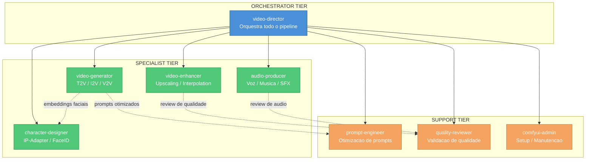

---

## Fluxo de Interacao entre Agentes

Sequencia detalhada de como os agentes interagem durante a criacao de um video:

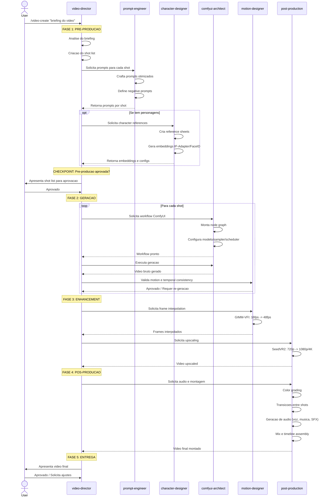

---

## Pipeline de Producao de Video

Visao macro do pipeline completo, desde o input do usuario ate a entrega final:

```mermaid
flowchart LR
    subgraph INPUT["INPUT"]
        B["Briefing / Script"]
        R["Referencias visuais"]
        C["Config: modelo,<br/>resolucao, fps"]
    end

    subgraph PREFLIGHT["PRE-FLIGHT"]
        PF1["Verificar ComfyUI"]
        PF2["Verificar modelos"]
        PF3["Verificar VRAM"]
        PF4["Coletar parametros"]
    end

    subgraph PHASE1["FASE 1: PRE-PRODUCAO"]
        P1A["Analise de briefing"]
        P1B["Shot list"]
        P1C["Prompts por shot"]
        P1D["Character refs"]
    end

    subgraph PHASE2["FASE 2: GERACAO"]
        P2A["Montar workflow<br/>ComfyUI"]
        P2B["T2V / I2V / V2V"]
        P2C["Validar<br/>consistencia"]
        P2D{{"Qualidade<br/>OK?"}}
        P2E["Re-gerar"]
    end

    subgraph PHASE3["FASE 3: ENHANCEMENT"]
        P3A["Frame interpolation<br/>GIMM-VFI"]
        P3B["Upscaling<br/>SeedVR2"]
        P3C["Correcao de<br/>artefatos"]
    end

    subgraph PHASE4["FASE 4: POS-PRODUCAO"]
        P4A["Color grading"]
        P4B["Transicoes"]
        P4C["Audio: Voz<br/>ElevenLabs"]
        P4D["Audio: Musica<br/>Suno / Udio"]
        P4E["Audio: SFX<br/>ElevenLabs"]
        P4F["Mix final"]
    end

    subgraph OUTPUT["OUTPUT"]
        O1["Video final<br/>renderizado"]
        O2["Assets individuais<br/>(shots, audio)"]
    end

    INPUT --> PREFLIGHT
    PREFLIGHT --> PHASE1
    PHASE1 --> PHASE2
    P2A --> P2B --> P2C --> P2D
    P2D -->|"Sim"| PHASE3
    P2D -->|"Nao"| P2E --> P2A
    PHASE3 --> PHASE4
    PHASE4 --> OUTPUT
```

---

## Fases do Workflow wf-create-video

Detalhamento das fases com checkpoints e gates:

```mermaid
flowchart TB
    START(["Inicio: /video-create"]) --> PF

    subgraph PF["PRE-FLIGHT (Blocking)"]
        PF1["Verificar ComfyUI @ 127.0.0.1:8188"]
        PF2["Verificar custom nodes instalados"]
        PF3["Verificar modelo de video disponivel"]
        PF4["Verificar espaco em disco >= 50GB"]
        PF5["Verificar VRAM >= 12GB"]
        PF6["Coletar parametros do projeto"]
    end

    PF --> CP0{{"CP_PRE_FLIGHT<br/>Ambiente OK?"}}
    CP0 -->|"Falha"| SETUP["Executar wf-setup-environment"]
    SETUP --> PF
    CP0 -->|"OK"| PH1

    subgraph PH1["FASE 1: PRE-PRODUCAO"]
        direction TB
        PH1A["Analise do briefing"]
        PH1B["Geracao de script (se necessario)"]
        PH1C["Decomposicao em shots"]
        PH1D["Prompt engineering por shot"]
        PH1E["Character setup (se necessario)"]
        PH1A --> PH1B --> PH1C --> PH1D --> PH1E
    end

    PH1 --> CP1{{"CP_PHASE_1<br/>Pre-producao completa?"}}
    CP1 -->|"Aprovado"| PH2
    CP1 -->|"Ajustar"| PH1

    subgraph PH2["FASE 2: GERACAO"]
        direction TB
        PH2A["Selecao de modelo por shot"]
        PH2B["Montagem de workflow ComfyUI"]
        PH2C["Execucao da geracao"]
        PH2D["Validacao de qualidade"]
        PH2E["Verificacao de consistencia"]
        PH2A --> PH2B --> PH2C --> PH2D --> PH2E
    end

    PH2 --> CP2{{"CP_PHASE_2<br/>Geracao OK?"}}
    CP2 -->|"Aprovado"| PH3
    CP2 -->|"Re-gerar"| PH2

    subgraph PH3["FASE 3: ENHANCEMENT"]
        direction TB
        PH3A["Frame interpolation (GIMM-VFI)"]
        PH3B["Upscaling (SeedVR2)"]
        PH3C["Correcao de artefatos"]
        PH3A --> PH3B --> PH3C
    end

    PH3 --> CP3{{"CP_PHASE_3<br/>Enhancement OK?"}}
    CP3 -->|"Aprovado"| PH4
    CP3 -->|"Ajustar"| PH3

    subgraph PH4["FASE 4: POS-PRODUCAO"]
        direction TB
        PH4A["Color grading e correcao"]
        PH4B["Transicoes entre shots"]
        PH4C["Geracao de audio"]
        PH4D["Sincronizacao audio/video"]
        PH4E["Mix final"]
        PH4A --> PH4B --> PH4C --> PH4D --> PH4E
    end

    PH4 --> CP4{{"CP_PHASE_4<br/>Audio OK?"}}
    CP4 -->|"Aprovado"| PH5
    CP4 -->|"Ajustar"| PH4

    subgraph PH5["FASE 5: ENTREGA"]
        direction TB
        PH5A["Timeline assembly"]
        PH5B["Render final"]
        PH5C["Exportacao"]
        PH5A --> PH5B --> PH5C
    end

    PH5 --> CP5{{"CP_PHASE_5<br/>Final aprovado?"}}
    CP5 -->|"Aprovado"| FIM(["Video entregue"])
    CP5 -->|"Ajustar"| PH4

    style START fill:#4a90d9,color:#fff
    style FIM fill:#50c878,color:#fff
```

---

## Fluxo de Dados entre Agentes

O que cada agente produz e consome:

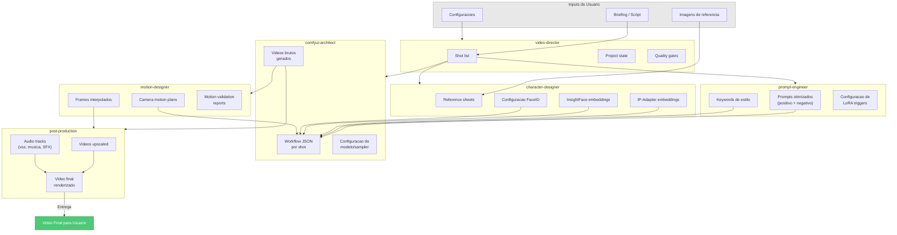

---

## Arvore de Decisao de Modelos

Como o squad seleciona o modelo ideal baseado em VRAM e objetivo:

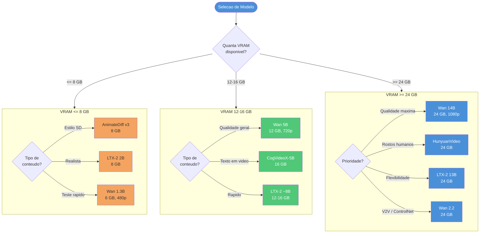

---

## Workflow de Setup do Ambiente

Fluxo do `wf-setup-environment`:

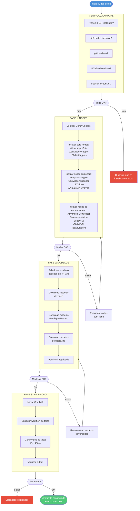

---

## Pipeline de Consistencia de Personagens

Detalhamento do fluxo de consistencia facial entre shots:

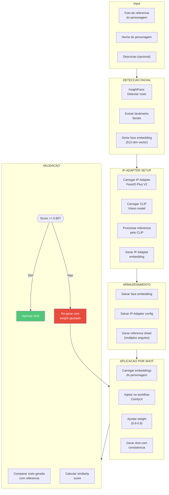

---

## Pipeline de Enhancement

Fluxo detalhado do processo de melhoria de video:

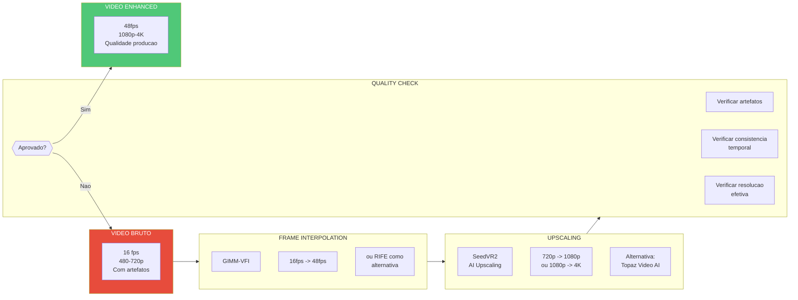

---

## Modos de Execucao

Comparacao visual dos tres modos de execucao:

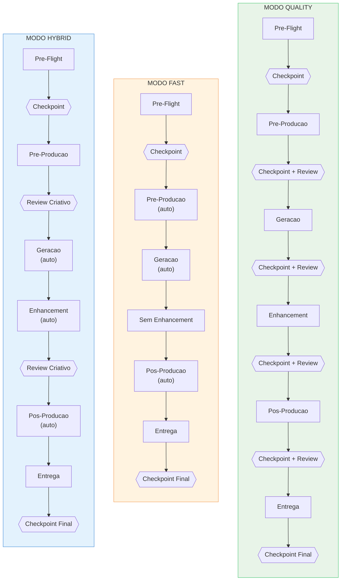

---

## Diagrama de Infraestrutura

Componentes tecnicos e suas conexoes:

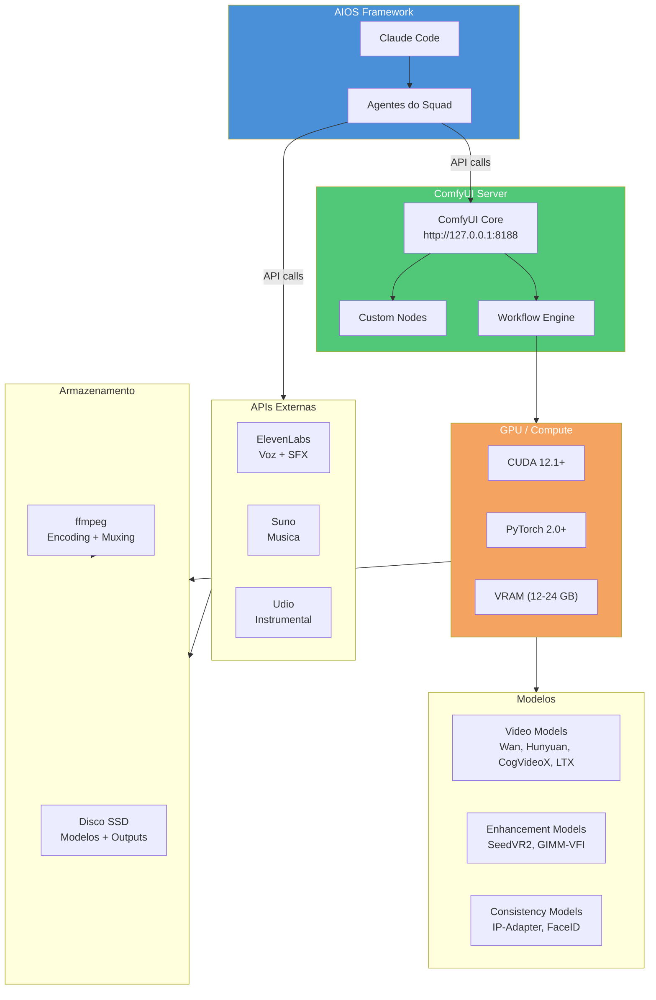

---

## Notas sobre os Diagramas

### Como visualizar

Estes diagramas usam a sintaxe **Mermaid**. Para visualiza-los:

1. **VS Code:** Instale a extensao "Markdown Preview Mermaid Support"
2. **GitHub/GitLab:** Renderizam Mermaid automaticamente em arquivos .md
3. **Online:** Cole o codigo em [mermaid.live](https://mermaid.live/)
4. **Obsidian:** Suporte nativo a Mermaid

### Convencoes de cores

| Cor | Significado |
|-----|-------------|
| Azul (#4a90d9) | Orchestrator / decisoes principais |
| Verde (#50c878) | Specialists / sucesso / outputs |
| Laranja (#f4a460) | Support / warning / processo |
| Vermelho (#e74c3c) | Falha / requer atencao |
| Cinza (#e8e8e8) | Inputs do usuario |

---

*Video Creation Squad - AIOS v1.0.0*
*Documentacao atualizada em Fevereiro 2026*
